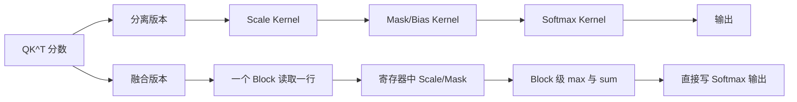

## 主教程

先读 [Making Deep Learning Go Brrrr From First Principles](https://horace.io/brrr_intro.html)，它从带宽、Kernel launch、融合和重计算解释“为什么优化”，图多且不要求读者先会 profiler。再读 [Triton Fused Softmax Tutorial](https://triton-lang.org/main/getting-started/tutorials/02-fused-softmax.html)，看“加载、mask、规约、写回”如何真正放进一个融合 Kernel。

需要接入 PyTorch 时再做 [PyTorch C++/CUDA Extension Tutorial](https://pytorch.org/tutorials/advanced/cpp_extension.html)。本文只补充 Attention 中 `scale + mask + softmax` 的边界、RTX 3060 可复现实验和 Nsight 验证。

Softmax 本身通常不是最慢的算子，真正的问题是它经常和缩放、Mask、Bias、Dropout 等操作连续出现。如果每一步都把中间结果写回 HBM，再由下一个 Kernel 读回来，GPU 会花很多时间搬数据，而不是做计算。

本文把一个常见的 Attention 子步骤写成两个版本：先执行 `scale -> mask -> softmax` 的分离版本，再把这些操作放进同一个 Kernel。你会看到融合的边界在哪里、什么时候融合反而会降低性能，以及如何用 Nsight Systems 和 Nsight Compute 验证收益。

<!-- more -->

## 📑 目录

- [1. 先定义问题：哪些操作值得融合](#1-先定义问题哪些操作值得融合)
- [2. 分离实现的内存流量](#2-分离实现的内存流量)
- [3. 融合的正确性边界](#3-融合的正确性边界)
- [4. 一个可读的 CUDA 融合 Kernel](#4-一个可读的-cuda-融合-kernel)
- [5. 从 CUDA Kernel 到 PyTorch 调用](#5-从-cuda-kernel-到-pytorch-调用)
- [6. 如何测量融合是否真的更快](#6-如何测量融合是否真的更快)
- [7. 融合的代价与工程取舍](#7-融合的代价与工程取舍)
- [8. 动手实验](#8-动手实验)
- [总结](#-总结)
- [参考资料](#-参考资料)

## 1. 先定义问题：哪些操作值得融合

设输入是形状为 `[rows, cols]` 的注意力分数。对每一行，我们要计算：

$$
y_i = \operatorname{softmax}(s_i \cdot \alpha + b_i + m_i)
$$

其中 `alpha` 是缩放因子，`b` 是可选 Bias，`m` 是 Mask：可见位置为 `0`，不可见位置为 `-inf`。

最容易融合的是**读写边界相同、没有跨元素依赖的逐元素操作**：

```text
scale -> add bias -> apply mask -> activation
```

Softmax 稍微特殊一些：它需要先对整行求最大值和指数和。因此不能把每个元素完全独立地处理，但可以让一个 Block 负责一行，在同一个 Block 内完成规约和写出。这样中间的 `scaled_scores` 不必落到全局内存。



### 1.1 为什么启动次数也重要

一次 Kernel 启动包含 CPU 调用、参数准备、GPU 调度等固定开销。对大矩阵来说，固定开销可能被计算隐藏；对 Decode 阶段这种单 token、小矩阵场景，启动开销可能和计算本身同一个数量级。

如果三个 Kernel 都读取并写出一个 `rows × cols` 的 FP16 张量，最少会产生：

| 版本 | 全局内存中的中间张量 | 典型启动次数 |
| --- | --- | --- |
| 分离 | `scaled`、`masked`、`output` | 3 |
| 融合 | 只有最终 `output` | 1 |

融合并不改变数学 FLOPs，但减少了中间张量的读写和调度次数。Softmax 仍然需要读取输入两次或三次，取决于使用 Safe Softmax 还是 Online Softmax；融合的目标是让这些读取都在一个 Kernel 内完成。

## 2. 分离实现的内存流量

下面的 PyTorch 代码清楚，但每一个表达式都可能产生一个临时张量：

```python
import torch

def separate_scale_mask_softmax(scores, scale, mask):
    scaled = scores * scale
    masked = torch.where(mask, scaled, torch.tensor(float("-inf"), device=scores.device))
    return torch.softmax(masked, dim=-1)
```

当 `scores` 是 `[B, H, Q, K]` 时，`scaled` 和 `masked` 都可能是 `B × H × Q × K` 大小。以 FP16、`B=1, H=32, Q=K=4096` 为例，一个中间张量约为 1 GB；即使框架复用了存储，也需要在不同 Kernel 之间读写这块内存。

这里有两个容易混淆的点：

1. **临时张量不一定真的分配一次新显存。** PyTorch 的 allocator 和编译器可能复用内存，但数据依然可能要经过 HBM。
2. **原地操作不等于融合。** `scores.mul_(scale)` 只是改变了一个 Kernel 或别名关系，后面的 softmax 仍然可能是另一个 Kernel。

使用 `torch.profiler` 或 Nsight Systems 可以确认实际情况，而不是根据 Python 代码猜测。

## 3. 融合的正确性边界

### 3.1 先做 Mask，再求最大值

被屏蔽的位置必须在求最大值和求和之前变成 `-inf`。如果先求最大值再 Mask，未来 token 可能参与到最大值中，导致整行的指数缩放错误。

正确顺序是：

```text
读取 x
  -> 转成计算精度
  -> 乘 scale、加 bias
  -> 对不可见位置写入 -inf
  -> 求 max
  -> exp(x - max) 并求和
  -> 写出
```

### 3.2 累加使用 FP32

输入和输出可以是 FP16/BF16，但行最大值、指数和以及归一化最好使用 FP32。否则长序列或分布尖锐时，`sum` 的舍入误差会明显增大。

### 3.3 融合不能跨越任意依赖

适合融合的操作通常满足下面至少一项：

- 相邻操作都以同一个元素或同一行作为处理单位；
- 中间张量不会被其他分支复用；
- 融合后寄存器和共享内存仍然能容纳工作集；
- 融合后的 Kernel 仍然有足够多的独立 Block。

如果一个中间结果需要被多个后续算子读取，强行融合可能导致重复计算，或者让 Kernel 过大而降低 Occupancy。

## 4. 一个可读的 CUDA 融合 Kernel

下面的示例假设一个 Block 处理一行，使用共享内存做两次规约。它的重点是展示融合边界，而不是取代生产环境中的 CUB、cuDNN 或 FlashAttention 实现。

```cuda
#include <cuda_runtime.h>
#include <math.h>

__device__ float block_max(float value, float* shared) {
    int tid = threadIdx.x;
    shared[tid] = value;
    __syncthreads();
    for (int stride = blockDim.x / 2; stride > 0; stride >>= 1) {
        if (tid < stride) {
            shared[tid] = fmaxf(shared[tid], shared[tid + stride]);
        }
        __syncthreads();
    }
    return shared[0];
}

__device__ float block_sum(float value, float* shared) {
    int tid = threadIdx.x;
    shared[tid] = value;
    __syncthreads();
    for (int stride = blockDim.x / 2; stride > 0; stride >>= 1) {
        if (tid < stride) {
            shared[tid] += shared[tid + stride];
        }
        __syncthreads();
    }
    return shared[0];
}

// 一个 Block 处理一行，融合 scale、causal mask 和 softmax。
// rows: 行数；cols: 每行元素数；scale: 1/sqrt(head_dim)
__global__ void fused_scale_causal_softmax(
    const float* __restrict__ input,
    float* __restrict__ output,
    int rows,
    int cols,
    float scale) {
    extern __shared__ float shared[];

    const int row = blockIdx.x;
    const int tid = threadIdx.x;
    if (row >= rows) return;

    const float* x = input + static_cast<size_t>(row) * cols;
    float* y = output + static_cast<size_t>(row) * cols;

    float local_max = -CUDART_INF_F;
    for (int col = tid; col < cols; col += blockDim.x) {
        // causal attention 中，列号大于行号的位置不可见。
        float value = row >= col ? x[col] * scale : -CUDART_INF_F;
        local_max = fmaxf(local_max, value);
    }
    const float max_value = block_max(local_max, shared);
    __syncthreads();

    float local_sum = 0.0f;
    for (int col = tid; col < cols; col += blockDim.x) {
        float value = row >= col ? x[col] * scale : -CUDART_INF_F;
        local_sum += expf(value - max_value);
    }
    const float sum = block_sum(local_sum, shared);
    __syncthreads();

    const float inv_sum = 1.0f / sum;
    for (int col = tid; col < cols; col += blockDim.x) {
        float value = row >= col ? x[col] * scale : -CUDART_INF_F;
        y[col] = expf(value - max_value) * inv_sum;
    }
}
```

调用时需要保证 `blockDim.x` 是 2 的幂，并且共享内存大小至少为 `blockDim.x * sizeof(float)`：

```cpp
int threads = 256;
size_t shared_bytes = threads * sizeof(float);
fused_scale_causal_softmax<<<rows, threads, shared_bytes>>>(
    input, output, rows, cols, 1.0f / sqrtf(head_dim));
```

这个版本还有三个可以继续优化的地方：

1. 用 Warp Shuffle 替换大部分共享内存规约；
2. 将每个元素的 `value` 暂存在寄存器，减少第三遍重新计算 Scale 和 Mask；
3. 对 `cols` 允许的形状使用 `float4` 或半精度向量化加载。

它们分别对应前面 Softmax 小节中的优化，以及后续 FlashAttention 的分块思想。

## 5. 从 CUDA Kernel 到 PyTorch 调用

如果要让 PyTorch 使用自定义 Kernel，最小的工程路径是 C++/CUDA extension。先把 CUDA Kernel 放入 `fused_softmax_kernel.cu`，再用 `torch.utils.cpp_extension.load` 编译：

```python
from torch.utils.cpp_extension import load

fused_softmax = load(
    name="fused_softmax",
    sources=["fused_softmax.cpp", "fused_softmax_kernel.cu"],
    extra_cuda_cflags=["-O3", "--use_fast_math"],
    verbose=True,
)

scores = torch.randn(1024, 1024, device="cuda", dtype=torch.float32)
out = fused_softmax.forward(scores, 1.0 / (128 ** 0.5))
```

学习阶段建议先把 Python 参考实现和 CUDA 实现放在同一个测试脚本中：

```python
reference = torch.softmax(
    torch.tril(scores) * (1.0 / (128 ** 0.5)) +
    torch.triu(torch.full_like(scores, float("-inf")), diagonal=1),
    dim=-1,
)
torch.testing.assert_close(out, reference, rtol=1e-4, atol=1e-5)
```

真实项目中还需要：

- 检查输入 stride，而不是假设张量 contiguous；
- 对空行、全为 `-inf` 的行定义清楚的行为；
- 使用 `C10_CUDA_KERNEL_LAUNCH_CHECK()` 捕获异步错误；
- 为 FP16、BF16、FP32 和不同 Compute Capability 分别测试。

## 6. 如何测量融合是否真的更快

只看 Python 端的 `time.time()` 很容易得到错误结论。至少要使用 CUDA Event，并在计时前预热：

```python
def bench(fn, *args, warmup=20, iters=100):
    for _ in range(warmup):
        fn(*args)
    torch.cuda.synchronize()

    start = torch.cuda.Event(enable_timing=True)
    end = torch.cuda.Event(enable_timing=True)
    start.record()
    for _ in range(iters):
        fn(*args)
    end.record()
    end.synchronize()
    return start.elapsed_time(end) / iters
```

比较时至少记录四项：

| 指标 | 说明 |
| --- | --- |
| Kernel 数量 | Nsight Systems 时间线上是否从 3 个减少到 1 个 |
| 总延迟 | 包括 Kernel launch 和同步后的端到端时间 |
| HBM 流量 | Nsight Compute 中的 DRAM bytes / throughput |
| 数值误差 | 相对于 PyTorch FP32 参考实现的最大绝对误差 |

如果输入很大，带宽下降但延迟没有下降，可能是融合后寄存器压力变大；如果输入很小，带宽指标不高但端到端时间明显下降，通常是消除了启动空隙。

## 7. 融合的代价与工程取舍

### 7.1 寄存器压力

一个 Kernel 里同时保存更多中间值，会增加每线程寄存器数。寄存器过多可能让一个 SM 同时驻留的 Block 变少，甚至发生寄存器 spill，把本应在寄存器中的数据写到 local memory。

在 Nsight Compute 中重点看：

- `Launch Statistics` 中的 registers per thread；
- `Occupancy` 中由寄存器限制的 active warps；
- local load/store 是否异常增加。

### 7.2 融合不是越多越好

下面三种情况应谨慎融合：

1. 中间结果被多个分支复用，融合会导致重复计算；
2. 操作包含复杂分支，融合后 Warp 分歧显著增加；
3. 输入形状经常变化，单个“大而全”的 Kernel 不能覆盖所有形状。

### 7.3 与编译器自动融合的关系

`torch.compile`、Triton、TensorRT 等系统会根据计算图尝试自动融合。手写 CUDA 适合少数关键热点和稳定形状；自动融合适合快速迭代和形状变化多的模型。第 7 章会专门介绍如何判断应该交给编译器，还是保留手写 Kernel。

## 8. 动手实验

建议在带 NVIDIA GPU 的 Linux 机器上完成，依次做以下实验：

1. 写出 `scale -> mask -> softmax` 的 PyTorch 参考版本。
2. 用 `torch.profiler` 确认分离版本实际产生了哪些 CUDA Kernel。
3. 编译上面的融合 Kernel，先只验证 `rows=4, cols=8` 的结果。
4. 用随机输入覆盖 `cols=127、128、129`，检查越界和 Mask。
5. 用 CUDA Event 比较 `[4096, 4096]`、`[4096, 128]`、`[1, 4096]` 三种形状。
6. 用 Nsight Compute 检查融合后寄存器和 Occupancy 是否恶化。

一个合格的实验记录应该包含：GPU 型号、CUDA/PyTorch 版本、dtype、输入形状、正确性误差、平均延迟和 profiler 截图或报告路径。不要只记录“快了多少”，还要说明收益来自减少启动次数、减少 HBM 流量，还是仅仅来自不同的实现细节。

### 8.1 远端 CUDA 实验记录

下面的最小程序已经在项目中的 `experiments/cuda/chapter5_fused_softmax.cu` 实测。实验机器是 `dh`（用户环境中的 `sshdh`）：NVIDIA GeForce RTX 3060 12 GB、驱动 570.211.01、CUDA Toolkit 12.8。编译命令：

```bash
/usr/local/cuda/bin/nvcc -O3 -lineinfo -arch=sm_86 \
  experiments/cuda/chapter5_fused_softmax.cu \
  -o /tmp/chapter5_fused_softmax
```

每个版本先预热 10 次，再用 CUDA Event 统计 50 次；输入是 FP32，线程数为 256，因果 Mask 和 `1/sqrt(128)` Scale 在融合 Kernel 内完成：

| rows × cols | 分离版本（ms） | 融合版本（ms） | 加速 | max abs error |
| --- | ---: | ---: | ---: | ---: |
| 2048 × 1024 | 0.1083 | 0.0585 | 1.853× | `2.98e-8` |
| 4096 × 1024 | 0.2137 | 0.1159 | 1.844× | `2.98e-8` |
| 1024 × 4096 | 0.2506 | 0.0640 | 3.915× | `4.47e-8` |
| 1 × 4096 | 0.0091 | 0.0054 | 1.671× | `0` |

<figure class="source-figure">
  
  <figcaption>RTX 3060、CUDA 12.8、FP32、256 threads 的 CUDA Event 实测。柱顶为单次平均延迟，加速比只适用于本实现和这些 shape；生成脚本位于 <code>experiments/cuda/plot_chapter5_results.py</code>。</figcaption>
</figure>

对 `16 × 31` 的非 2 的幂边界输入运行 `compute-sanitizer --tool memcheck`，结果为 `ERROR SUMMARY: 0 errors`。Nsight Systems 2024.6.2 的 `cuda_gpu_kern_sum` 报告显示，在 `1024 × 4096` 运行中，分离版本的 `scale_mask_kernel` 平均约 `58.5 us`、`softmax_kernel` 平均约 `191.2 us`，融合 Kernel 平均约 `63.8 us`。这个对比说明收益主要来自少一次全局中间张量读写和少一次 Kernel launch；它只是 RTX 3060 上这个实现和 shape 的实验结果，不能外推到其他 GPU。

<figure class="source-figure">
  
  <figcaption>同一实验的 Nsight Systems 2024.6.2 <code>cuda_gpu_kern_sum</code> 导出结果。分离路径需要顺序执行两个 Kernel；融合路径只执行一个 Kernel。</figcaption>
</figure>

## 总结

- 融合的核心是让中间值停留在寄存器或共享内存，而不是让它们反复经过 HBM。
- Softmax 可以和 Scale、Bias、Mask 放进同一个按行处理的 Kernel，但必须在 Mask 后再做 max/sum 规约。
- 以 FP32 保存统计量是数值稳定性的底线；输入输出使用低精度不代表内部累加也应使用低精度。
- 融合后必须重新检查寄存器、Occupancy、Warp 分歧和动态形状覆盖范围。
- 正确的验证顺序是：参考实现 → 数值对齐 → CUDA Event → Systems → Compute。

## 参考资料

- [NVIDIA CUDA C++ Programming Guide：Cooperative Groups and synchronization](https://docs.nvidia.com/cuda/cuda-c-programming-guide/)
- [NVIDIA CUDA C++ Best Practices Guide：Memory Optimizations](https://docs.nvidia.com/cuda/cuda-c-best-practices-guide/index.html#memory-optimizations)
- [PyTorch C++/CUDA Extension Tutorial](https://pytorch.org/tutorials/advanced/cpp_extension.html)
- [PyTorch Profiler Recipe](https://pytorch.org/tutorials/recipes/recipes/profiler_recipe.html)
- [Triton Fused Softmax Tutorial](https://triton-lang.org/main/getting-started/tutorials/02-fused-softmax.html)
- [FlashAttention：Fast and Memory-Efficient Exact Attention](https://arxiv.org/abs/2205.14135)
