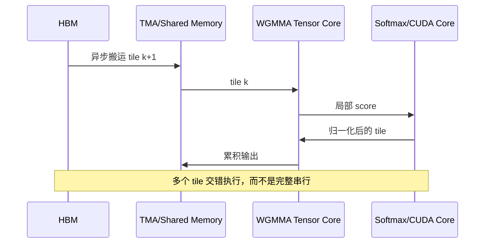

FlashAttention-1 解决了“不要把完整的注意力矩阵写回 HBM”，FlashAttention-2 又重新安排了 Q/K/V 的并行划分。到了 Hopper（H100）这一代，瓶颈进一步变成：如何同时喂饱 Tensor Core、异步搬运单元和特殊函数单元。

FlashAttention-3 的重点不是更换 Attention 数学公式，而是让不同硬件流水线重叠工作：一组 Warp 负责搬运和准备数据，另一组 Warp 驱动 WGMMA 计算，Softmax 等非矩阵乘操作穿插在矩阵乘的空隙中。理解这个思路，比记住某一版 Kernel 的具体线程编号更重要。

<!-- more -->

## 📑 目录

- [1. 从 V2 到 V3：为什么还需要优化](#1-从-v2-到-v3为什么还需要优化)
- [2. Hopper 提供了哪些新能力](#2-hopper-提供了哪些新能力)
- [3. FlashAttention-3 的软件流水线](#3-flashattention-3-的软件流水线)
- [4. FP8 与低精度累加](#4-fp8-与低精度累加)
- [5. 前向计算的伪代码](#5-前向计算的伪代码)
- [6. 反向传播与不规则工作负载](#6-反向传播与不规则工作负载)
- [7. 如何运行官方实现并做对比](#7-如何运行官方实现并做对比)
- [8. 常见误区](#8-常见误区)
- [总结](#-总结)
- [参考资料](#-参考资料)

## 1. 从 V2 到 V3：为什么还需要优化

FlashAttention-2 已经让 Attention 的主要矩阵乘进入 Tensor Core，但一个 Attention tile 不只有 GEMM：

```text
读取 Q/K/V -> QK^T -> max/sum/exp -> 重新缩放 -> P @ V -> 写回
```

`QK^T` 和 `P @ V` 可以使用 Tensor Core；行最大值、指数、归一化和边界判断则更多使用 CUDA Core 或特殊函数单元。如果这些阶段严格串行，Tensor Core 会在 Softmax 阶段等待，Softmax 也会在数据搬运阶段等待。



V3 的优化目标可以概括为三点：

1. 让数据搬运和 Tensor Core 计算重叠；
2. 让非 GEMM 操作填充矩阵乘的空隙；
3. 在 FP8 等低精度路径中控制缩放和误差。

## 2. Hopper 提供了哪些新能力

### 2.1 TMA：把多维搬运交给硬件

Tensor Memory Accelerator（TMA）可以根据预先描述的 Tensor Map，在 Global Memory 和 Shared Memory 之间异步搬运多维 tile。与每个线程手动计算地址相比，TMA 能减少地址计算和线程参与量，也更容易和计算阶段重叠。

初学时先记住这条边界：

- CUDA `cp.async` 适合线程组搬运连续的若干字节；
- TMA 适合 Hopper 上描述好的多维张量切片；
- 两者都需要显式的同步协议，不能把“异步”理解成自动保证数据已到位。

典型流程是：

```text
创建 Tensor Map
  -> producer warp 发起 TMA copy
  -> consumer warp 等待 mbarrier
  -> consumer 读取 shared-memory tile
```

### 2.2 WGMMA：四个 Warp 协作使用 Tensor Core

WGMMA（Warpgroup MMA）由一个 Warpgroup（通常为 4 个 Warp，即 128 个线程）协作完成矩阵乘加。它能处理更大的 tile，并且可以让输入来自寄存器或共享内存。

这和 CUDA 中一个线程执行一个标量 `a*b+c` 完全不同：线程只是协作协议的一部分，真正的矩阵乘由 Tensor Core 完成。使用 WGMMA 时要同时考虑：

- tile 的 M/N/K 形状是否满足指令约束；
- shared memory 的布局是否是 WGMMA 需要的 swizzle；
- 计算期间 producer 是否会覆盖 consumer 还没读完的数据。

### 2.3 Warp Specialization

V2 中不同 Warp 通常承担相似的计算工作；V3 更强调角色分工：

| Warp 角色 | 工作 |
| --- | --- |
| Producer | 发起 TMA、维护 barrier、准备下一块 K/V |
| MMA consumer | 发出 WGMMA，累积矩阵乘结果 |
| Softmax/epilogue | 执行 max、exp、缩放和输出转换 |

角色分工可以提高流水线重叠度，但也增加了同步、shared memory 布局和调试复杂度。不要在没有 profile 证据时照搬 Warp Specialization；小矩阵或短序列可能反而受同步开销影响。

## 3. FlashAttention-3 的软件流水线

### 3.1 双缓冲的基本结构

最容易理解的是两个 shared-memory buffer：`buffer[0]` 正在计算，`buffer[1]` 同时接收下一个 tile。

```text
时间 t0: load K0/V0 -> buffer0
时间 t1: WGMMA(buffer0)     + load K1/V1 -> buffer1
时间 t2: WGMMA(buffer1)     + load K2/V2 -> buffer0
时间 t3: WGMMA(buffer0)     + load K3/V3 -> buffer1
```

如果搬运时间和计算时间接近，稳态吞吐由两者中的较大者决定，而不是简单相加。若搬运远慢于计算，增加更多 Tensor Core 并不能解决问题；若计算远慢于搬运，则应检查 Tensor Core 是否真的被使用。

### 3.2 数据依赖和 barrier

每个 buffer 至少需要两个状态：

1. producer 已经写完，consumer 可以读取；
2. consumer 已经读完，producer 可以复用。

概念伪代码如下：

```cuda
for (int tile = 0; tile < num_tiles; ++tile) {
    int current = tile & 1;
    int next = current ^ 1;

    if (is_producer_warp()) {
        wait_until_buffer_free(next);
        tma_async_copy(kv[next], global_kv[tile + 1]);
        arrive_copy_done(next);
    }

    wait_until_copy_done(current);
    if (is_mma_warp()) {
        wgmma_async_wait(current);
        launch_wgmma(q, kv[current], accum);
    }

    if (is_epilogue_warp()) {
        update_online_softmax(accum, stats);
    }
    arrive_buffer_free(current);
}
```

这里的函数名是为了表达依赖关系，不是可以直接编译的 API。真正实现会使用 Hopper 的 barrier、TMA 和 WGMMA 指令或对应封装。

### 3.3 为什么 Softmax 可以和 WGMMA 重叠

注意力分数是按 tile 产生的。拿到一个 `QK^T` tile 后，可以立即计算它的行最大值和指数和，再把归一化后的结果送入 `P @ V`。与此同时，下一块 K/V 仍然可以被搬运。

Online Softmax 的状态仍然是每行的 `(m, l, O)`：

$$
m' = \max(m, \tilde m),\quad
l' = e^{m-m'}l + \sum_j e^{s_j-m'},
$$

$$
O' = e^{m-m'}O + \sum_j e^{s_j-m'}V_j.
$$

最终输出为 `O / l`。V3 改变的是这几个更新的调度和硬件执行方式，不是这个递推的数学定义。

## 4. FP8 与低精度累加

FP8 能降低数据搬运量，并提高 Tensor Core 理论吞吐，但它的动态范围和精度都比 FP16/BF16 小。Attention 中最敏感的是 `QK^T` 的分数和 Softmax 统计量。

### 4.1 分块缩放

不要直接把任意 FP16 张量强制转为 FP8。常见做法是为一个张量或一个 tile 保存 scale：

$$
x_{fp8} = \operatorname{cast}(x / s),\quad x \approx s \cdot x_{fp8}.
$$

`s` 可以按 tensor、channel 或 tile 计算。缩放粒度越细，量化误差通常越小，但保存和加载 scale 的成本也会增加。

### 4.2 Softmax 统计量不要用 FP8

即使 Q/K 使用 FP8，行最大值、`l` 和最终归一化也应至少使用 FP32。一个实用的混合精度策略是：

| 数据 | 建议类型 |
| --- | --- |
| Q/K/V tile | FP8 或 BF16/FP16 |
| WGMMA 累加器 | FP16/FP32，按实现支持选择 |
| `m`、`l`、缩放因子 | FP32 |
| 输出 O | BF16/FP16，必要时 FP32 |

### 4.3 误差验证

不要只比较平均误差。至少记录：

```python
max_abs = (out - reference).abs().max()
max_rel = ((out - reference).abs() / reference.abs().clamp_min(1e-6)).max()
```

对极长序列、全为负的大分数、接近重复的 logits 和 causal mask 边界分别测试。低精度 Attention 最容易在这些输入上暴露问题。

## 5. 前向计算的伪代码

下面的伪代码将 V2 的数学流程和 V3 的流水线放在一起。它刻意省略了寄存器布局和指令细节，适合在阅读官方实现前建立整体结构：

```python
def flash_attention_v3_forward(Q, K, V, block_m, block_n, scale):
    for q_start in parallel_q_tiles(Q, block_m):
        q = load_q_tile(Q, q_start)
        out = zeros((block_m, Q.head_dim), dtype=float32)
        m = full((block_m,), -inf, dtype=float32)
        l = zeros((block_m,), dtype=float32)

        # producer/consumer pipeline: 计算 tile j 时预取 j+1
        for k_start in pipelined_range(0, K.seqlen, block_n):
            k, v = async_load_kv_tile(K, V, k_start)
            scores = wgmma(q, transpose(k)) * scale
            scores = apply_causal_mask(scores, q_start, k_start)

            tile_m = row_max(scores)
            new_m = maximum(m, tile_m)
            alpha = exp(m - new_m)
            p = exp(scores - new_m[:, None])
            tile_l = row_sum(p)

            out = alpha[:, None] * out + p @ v
            l = alpha * l + tile_l
            m = new_m

        store(out / l[:, None], q_start)
```

实现时不能真的在 Python 循环中逐 tile 同步；上述代码只用于对应数学对象：`async_load` 对应 TMA，`wgmma` 对应 Hopper Tensor Core，`pipelined_range` 对应双缓冲和 barrier。

## 6. 反向传播与不规则工作负载

FlashAttention 的反向传播需要重新计算局部注意力分数，以避免保存完整的 `S` 或 `P`。V3 的前向流水线思想可以复用，但反向需要更多的梯度读写和归约。

实际性能还会受到以下因素影响：

- 序列长度不是 tile 大小的整数倍；
- `head_dim` 不满足 Tensor Core 的常用形状；
- causal mask 让最后一个对角 tile 只有部分元素有效；
- batch/head 数较少，无法提供足够的 Q tile 并行度；
- FP8 scale 的计算和加载成为新的开销。

因此论文中的峰值 TFLOPS 不能直接当成业务延迟。必须用自己的 batch、序列长度、head_dim、dtype 和 causal 设置重新测量。

## 7. 如何运行官方实现并做对比

官方仓库提供了 Hopper/H100 相关的 FlashAttention-3 beta 实现。建议在一台 H100 上使用独立环境：

```bash
git clone https://github.com/Dao-AILab/flash-attention.git
cd flash-attention/hopper
python -m venv .venv
source .venv/bin/activate
pip install --upgrade pip
pip install -r requirements.txt
```

先跑官方测试，确认 CUDA、PyTorch 和 GPU 架构匹配，再运行 benchmark。实验记录至少包含：

| 项目 | 示例 |
| --- | --- |
| GPU | H100 SXM 80 GB |
| dtype | BF16 / FP8 |
| batch、heads | `1, 32` |
| seqlen、head_dim | `4096, 128` |
| causal | `True/False` |
| 指标 | 平均延迟、TFLOPS、显存峰值、误差 |

没有 H100 时，不要把 A100 上的结果称为 FlashAttention-3 性能验证。可以在 A100 上复现 V2，重点学习 IO、并行度和结果校验流程。

## 8. 常见误区

### 8.1 “用了 TMA 就一定更快”

TMA 只解决一种搬运和同步问题。若 tile 很小、并行度不足或计算量太少，TMA 的描述和 barrier 成本可能超过收益。

### 8.2 “FP8 只要 cast 一下就行”

FP8 必须配合合理的 scale、累加精度和误差检查。只在入口处 cast，不能保证最终 Attention 的数值质量。

### 8.3 “论文 TFLOPS 可以直接复现”

峰值数字与 GPU 型号、时钟、CUDA 版本、编译参数、shape 和 benchmark 协议紧密相关。比较时要保证同一输入和同一统计窗口。

### 8.4 “V3 是另一种 Attention 算法”

V3 仍然计算精确 Attention；它的核心贡献是把 Hopper 硬件的异步搬运、矩阵乘和非 GEMM 操作安排得更好。

## 总结

- FlashAttention-3 的关键是流水线和硬件协作，而不是改变 Attention 的数学结果。
- TMA 负责高效的多维异步搬运，WGMMA 负责 Warpgroup 级 Tensor Core 矩阵乘，Warp Specialization 负责让不同阶段并行。
- 双缓冲和 barrier 解决“下一块什么时候可读、当前块什么时候可复用”的生命周期问题。
- FP8 要配合分块 scale 和 FP32 统计量；性能与精度必须同时验证。
- 没有 H100 时可以学习算法和流水线，但不要把 A100 的结果冒充 V3 硬件实验。

## 参考资料

- [FlashAttention-3：Fast and Accurate Attention with Asynchrony and Low-precision](https://arxiv.org/abs/2407.08691)
- [FlashAttention 官方仓库 Hopper 实现](https://github.com/Dao-AILab/flash-attention/tree/main/hopper)
- [NVIDIA Hopper Architecture In-Depth](https://resources.nvidia.com/en-us-tensor-core)
- [NVIDIA CUDA C++ Programming Guide：Asynchronous SIMT Programming](https://docs.nvidia.com/cuda/cuda-c-programming-guide/)
- [NVIDIA CUDA C++ Programming Guide：Tensor Memory Accelerator](https://docs.nvidia.com/cuda/cuda-c-programming-guide/index.html#tensor-memory-accelerator)
- [NVIDIA Hopper H100 Tensor Core GPU Architecture](https://resources.nvidia.com/en-us-tensor-core/nvidia-tensor-core-gpu-datasheet)
- [FlashAttention-2：Faster Attention with Better Parallelism](https://arxiv.org/abs/2307.08691)
