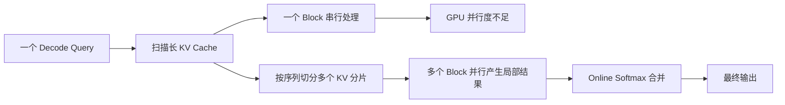

FlashAttention-1/2 主要解决 Prefill：一次输入包含很多 Query，矩阵乘能够提供足够的并行度。Decode 阶段不一样，每个请求每一步通常只生成一个 token，Query 的长度接近 1，而历史 KV Cache 可能已经很长。

如果让一个 Block 顺序扫描整段 KV Cache，GPU 上只有很少的工作可做；如果同时服务多个请求，又会遇到请求长度不同、KV Cache 碎片和动态 Batch 的问题。本文把这两个问题拆开：Flash-Decoding 解决“一个 Query 如何并行读长 KV Cache”，PagedAttention 解决“动态请求如何管理和寻址 KV Cache”。

<!-- more -->

## 📑 目录

- [1. Decode 阶段的瓶颈](#1-decode-阶段的瓶颈)
- [2. Flash-Decoding 的三步结构](#2-flash-decoding-的三步结构)
- [3. 部分结果如何合并](#3-部分结果如何合并)
- [4. PagedAttention 的分页模型](#4-pagedattention-的分页模型)
- [5. GPU Kernel 中的页表寻址](#5-gpu-kernel-中的页表寻址)
- [6. 连续 KV Cache 与分页 KV Cache 对比](#6-连续-kv-cache-与分页-kv-cache-对比)
- [7. 动手实验](#7-动手实验)
- [8. 常见错误](#8-常见错误)
- [总结](#-总结)
- [参考资料](#-参考资料)

## 1. Decode 阶段的瓶颈

对单个 Query，Attention 可以写成：

$$
o = \operatorname{softmax}(qK^T)V
$$

`q` 的形状大约是 `[1, head_dim]`，`K/V` 的形状是 `[sequence_length, head_dim]`。序列越来越长时，主要成本是读取 KV Cache 和计算一行与所有 Key 的点积。



可以用一个简单的估算判断问题是否明显：如果可用 SM 数远大于同时处理的请求数和 Head 数，而每个请求的 Decode Attention 只启动一个 Block，那么大量 SM 没有工作。此时继续增加单个 Block 的线程数通常不能弥补并行度不足。

## 2. Flash-Decoding 的三步结构

Flash-Decoding 沿 KV 序列维度切分工作。设 KV Cache 长度为 `L`，切成 `P` 个分片，每个分片独立计算：

### 第一步：并行计算局部分数

每个分片的 Block 读取自己的 `K_p` 和 `V_p`，计算 `q @ K_p^T`，并在本地维护 Online Softmax 状态：

$$
(m_p, l_p, o_p) = \operatorname{online\_attention}(q, K_p, V_p)
$$

这里的 `o_p` 是未归一化的加权和，不是最终概率输出。

### 第二步：保存局部统计量

每个分片写出：

- 局部最大值 `m_p`；
- 基于该最大值的指数和 `l_p`；
- 未归一化输出 `o_p`。

这些数据的大小约为 `P × (2 + head_dim)`，比保存完整的 `[1, L]` 分数小很多。

### 第三步：归约合并

另一个 Kernel 或归约阶段读取所有分片，用 Online Softmax 的结合规则合并：

$$
m = \max(m_a, m_b)
$$

$$
l = l_a e^{m_a-m} + l_b e^{m_b-m}
$$

$$
o = o_a e^{m_a-m} + o_b e^{m_b-m}
$$

最后输出 `o / l`。合并阶段的工作量随分片数增长，但通常远小于扫描完整 KV Cache 的代价。

## 3. 部分结果如何合并

### 3.1 为什么不能直接平均局部输出

局部输出 `o_p / l_p` 的归一化分母只覆盖一个分片。直接平均会让短分片和长分片拥有相同权重，也会忽略不同分片的最大值。

一个两分片例子：

```python
def merge_online(a_m, a_l, a_o, b_m, b_l, b_o):
    m = max(a_m, b_m)
    a_scale = exp(a_m - m)
    b_scale = exp(b_m - m)
    l = a_scale * a_l + b_scale * b_l
    o = a_scale * a_o + b_scale * b_o
    return m, l, o
```

这和 5.2 的 Online Softmax 规约是同一个合并操作，因此可以用树形规约并行完成。

### 3.2 分片数量的选择

分片越多，第一阶段并行度越高，但第二阶段的局部结果读写和归约开销也越大。实际实现通常根据：

- KV Cache 长度；
- batch 中请求数；
- head 数和 head_dim；
- 当前 GPU 的 SM 数；
- 是否处于 prefill/decode 混合批次；

动态选择分片数。不要把“固定切成 4 片”当成普适配置。

## 4. PagedAttention 的分页模型

连续 KV Cache 的问题不是算子本身，而是服务系统中的请求生命周期：不同请求在不同时间到达，生成长度也不同。如果每个请求都预留一大段连续显存，会产生内部碎片；请求结束后留下的空洞又难以复用。

PagedAttention 借鉴虚拟内存，把每个序列的 KV Cache 切成固定大小的 Block：

```text
逻辑序列 token:  [0 ... block_size-1] [block_size ... 2*block_size-1] ...
                         |                         |
                         v                         v
block_table:          physical 7                physical 2
                         |                         |
                         v                         v
KV Cache 池:       [物理 block 7] ... [物理 block 2] ...
```

请求只保存一个 `block_table`，记录逻辑块到物理块的映射。追加 token 时，如果当前逻辑块已满，就从全局池申请新的物理块；请求结束后，物理块回收到池中。

### 4.1 分页带来的收益

- 物理 KV Cache 不要求每个请求连续；
- 不同请求可以按 Block 粒度共享和回收显存；
- Prefix Cache 可以让多个请求指向相同的只读物理块；
- 动态 Batch 可以在请求加入和退出时更新 Block Table，而不搬迁整段 KV。

### 4.2 分页的代价

- 每次读取 KV 都多一次 block table 查找；
- 物理块不连续时，内存访问局部性可能变差；
- Block size 会影响内部碎片和 kernel 的向量化访问；
- 共享 prefix 时必须正确处理引用计数和写时复制。

## 5. GPU Kernel 中的页表寻址

下面是一个简化的 CUDA 风格伪代码。实际 vLLM kernel 会按 head、token、warp 和数据类型进行更细致的向量化：

```cuda
// block_table: [num_logical_blocks]
// k_cache/v_cache: [num_physical_blocks, block_size, num_kv_heads, head_dim]
__device__ float load_k(
    const half* k_cache,
    const int* block_table,
    int logical_token,
    int kv_head,
    int dim,
    int block_size,
    int num_kv_heads,
    int head_dim) {
    int logical_block = logical_token / block_size;
    int offset_in_block = logical_token % block_size;
    int physical_block = block_table[logical_block];

    size_t index = (((size_t)physical_block * block_size + offset_in_block)
                    * num_kv_heads + kv_head) * head_dim + dim;
    return __half2float(k_cache[index]);
}
```

Kernel 中的核心循环可以表达为：

```cuda
for (int logical_token = 0; logical_token < seq_len; ++logical_token) {
    float score = dot(q, load_k_vector(block_table, logical_token));
    update_online_softmax(score,
                          load_v_vector(block_table, logical_token));
}
```

需要特别注意 GQA/MQA：Query Head 数可能大于 KV Head 数，多个 Query Head 会共享同一个 KV Head。`kv_head` 不能直接使用 `query_head`，而应通过 head mapping 计算。

## 6. 连续 KV Cache 与分页 KV Cache 对比

| 维度 | 连续 KV Cache | PagedAttention |
| --- | --- | --- |
| 分配 | 每个请求一段连续空间 | 从全局 Block 池按块申请 |
| 长度变化 | 可能需要搬迁或预留上限 | 追加新 Block |
| 碎片 | 容易有内部/外部碎片 | 主要是最后一个 Block 的内部碎片 |
| 地址计算 | 直接线性寻址 | 通过 Block Table 映射 |
| Prefix 共享 | 需要额外复制或特殊布局 | 物理 Block 共享，配合引用计数 |
| 算子复杂度 | 简单 | 多一次间接寻址和边界处理 |

服务端选择时不要只看 Kernel 的单请求延迟，还要看在高并发和不同长度混合时的显存利用率、排队时间和请求完成率。

## 7. 动手实验

### 实验 A：Flash-Decoding 合并正确性

1. 使用 PyTorch 计算完整 KV Cache 的 Attention 作为参考。
2. 将 `K/V` 沿序列维度切成 2、4、8 个分片。
3. 每个分片计算 `(m_p, l_p, o_p)`。
4. 使用上面的 `merge_online` 做树形合并。
5. 比较最终输出和参考结果的 `max_abs_error`。

### 实验 B：分片数量与延迟

固定 `head_dim=128`，测试 `seq_len=2K、8K、32K`，分片数取 `1、2、4、8、16`。同时记录：

- 第一阶段扫描耗时；
- 归约耗时；
- 端到端 Decode Attention 延迟；
- 读写字节数和 SM 利用率。

### 实验 C：PagedAttention 地址验证

用一个很小的 Block Pool（例如 4 个物理块、每块 4 个 token），手工构造：

```text
逻辑块 0 -> 物理块 2
逻辑块 1 -> 物理块 0
逻辑块 2 -> 物理块 3
```

让 Kernel 输出每个逻辑 token 实际读取的物理地址，再和 CPU 端的映射结果逐项比较。先验证地址，再测性能；否则错误的映射也可能产生“看起来合理”的浮点结果。

### 实验 D：使用 vLLM/FlashInfer 做系统级对比

在相同模型、相同 prompt 长度、相同生成长度和相同并发下，对比连续 KV 与分页实现的：

- TTFT（Time To First Token）；
- TPOT（Time Per Output Token）；
- P50/P95 延迟；
- 最大可同时服务请求数；
- KV Cache 显存占用。

## 8. 常见错误

### 8.1 把 Flash-Decoding 当成 FlashAttention V2 的简单切片

Decode 的 Query 维度很小，瓶颈是 KV 读取并行度；Prefill 的 Query tile 很大，瓶颈和并行策略不同。两者可以共享 Online Softmax 数学，但不能直接套同一组 tile 配置。

### 8.2 合并局部结果时忘记最大值修正

直接相加 `l` 或直接平均 `o/l` 都是不正确的。只要两个分片的局部最大值不同，就必须使用 `exp(m_p - m)` 修正。

### 8.3 Block Table 的长度和 padding

最后一个逻辑 Block 通常没有填满。读取时必须同时检查逻辑 token 是否小于真实 `seq_len`，不能只检查物理 Block 是否存在。

### 8.4 忽略 KV Head 映射

在 GQA/MQA 模型中，Query Head 和 KV Head 数量不同。错误地用 Query Head 索引 KV Cache 会导致结果错位，而且不一定触发越界。

## 总结

- Flash-Decoding 沿 KV 序列维度拆分工作，用局部 `(m, l, o)` 和 Online Softmax 合并结果，解决单 Query 并行度不足。
- PagedAttention 把 KV Cache 从连续分配改成固定 Block + Block Table，重点解决动态请求的显存碎片和复用。
- 两者都依赖正确的边界处理、FP32 统计量和严格的 CPU/GPU 对齐测试。
- 评估 Serving 系统时要同时看延迟、吞吐、显存利用率和并发容量，而不能只看单个 Kernel 的时间。

## 参考资料

- [Flash-Decoding for long-context inference - Stanford CRFM](https://crfm.stanford.edu/2023/10/12/flashdecoding.html)
- [Flash-Decoding++：Faster and More Efficient Long Context Inference](https://arxiv.org/abs/2311.01282)
- [vLLM：Efficient Memory Management for Large Language Model Serving with PagedAttention](https://arxiv.org/abs/2309.06180)
- [vLLM Paged Attention Docs](https://docs.vllm.ai/en/latest/design/paged_attention.html)
- [vLLM 官方仓库 paged_attention.cu](https://github.com/vllm-project/vllm/tree/main/csrc/attention)
- [FlashInfer 官方文档](https://docs.flashinfer.ai/)
- [FlashInfer：Efficient and Customizable Attention Engine](https://arxiv.org/abs/2501.01005)
