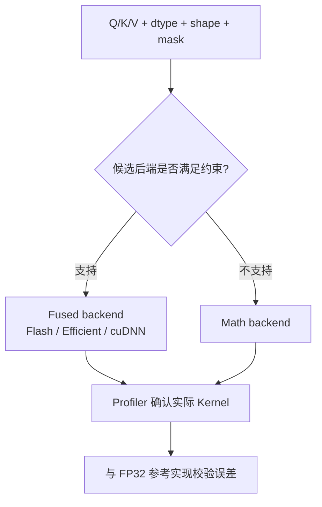

## 主教程

先读 [PyTorch Transformer Building Blocks](https://docs.pytorch.org/tutorials/intermediate/transformer_building_blocks.html)，从基础 Attention 逐步理解 padding、causal、嵌套张量和 SDPA 的工程上下文；再做 [PyTorch CUDA SDPA Tutorial](https://docs.pytorch.org/tutorials/intermediate/scaled_dot_product_attention_tutorial.html)，练习 backend 选择和 benchmark。

遇到具体约束时查 [SDPA API](https://docs.pytorch.org/docs/stable/generated/torch.nn.functional.scaled_dot_product_attention.html) 和 [PyTorch Attention backends 文档](https://docs.pytorch.org/docs/stable/nn.attention.html)。本文只补充如何固定后端、记录实际选择并做数值回归，不把“请求了 Flash backend”误写成“运行时一定使用 Flash kernel”。



手写 FlashAttention 之前，先用 PyTorch 的 `scaled_dot_product_attention`（SDPA）建立一个可信基线通常更高效。它把 Attention 的数学接口固定下来，再根据输入的 dtype、shape、设备、mask 和 causal 设置选择可用实现。

这篇文章的重点不是背 backend 名字，而是学会回答两个问题：结果是否和参考实现一致？当前运行到底走了哪个实现？只有这两个问题都回答清楚，后面的 CUDA/Triton 优化才有意义。

<!-- more -->

## 📑 目录

- [1. SDPA 的数学接口](#1-sdpa-的数学接口)
- [2. 建立参考实现](#2-建立参考实现)
- [3. 可用后端与约束](#3-可用后端与约束)
- [4. 显式选择和排查后端](#4-显式选择和排查后端)
- [5. Mask、Dropout 与 GQA 的注意点](#5-maskdropout-与-gqa-的注意点)
- [6. 正确性与性能基线](#6-正确性与性能基线)
- [7. 从 SDPA 走向自定义 Kernel](#7-从-sdpa-走向自定义-kernel)
- [8. 动手实验](#8-动手实验)
- [总结](#-总结)
- [参考资料](#-参考资料)

## 1. SDPA 的数学接口

给定 `Q、K、V`，SDPA 计算：

$$
\operatorname{Attention}(Q,K,V)=
\operatorname{softmax}\left(\frac{QK^T}{\sqrt{d}} + M\right)V
$$

PyTorch 常用布局是 `[batch, heads, sequence, head_dim]`：

```python
import torch
import torch.nn.functional as F

B, H, Q_len, K_len, D = 1, 8, 128, 256, 64
q = torch.randn(B, H, Q_len, D, device="cuda", dtype=torch.float16)
k = torch.randn(B, H, K_len, D, device="cuda", dtype=torch.float16)
v = torch.randn(B, H, K_len, D, device="cuda", dtype=torch.float16)

out = F.scaled_dot_product_attention(
    q, k, v,
    attn_mask=None,
    dropout_p=0.0,
    is_causal=False,
)
```

训练时如果需要 dropout，要显式传入非零 `dropout_p`；不要把模块的 `training` 状态当成 SDPA 自动判断的依据。推理时通常传 `dropout_p=0.0`。

## 2. 建立参考实现

先写一个小尺寸、容易检查的数学参考：

```python
def attention_reference(q, k, v, scale=None, causal=False):
    d = q.size(-1)
    scale = (d ** -0.5) if scale is None else scale
    scores = torch.matmul(q.float(), k.float().transpose(-2, -1)) * scale
    if causal:
        q_len, k_len = scores.shape[-2:]
        q_pos = torch.arange(q_len, device=q.device)[:, None]
        k_pos = torch.arange(k_len, device=q.device)[None, :]
        scores = scores.masked_fill(k_pos > q_pos, float("-inf"))
    probs = torch.softmax(scores, dim=-1)
    return torch.matmul(probs, v.float()).to(q.dtype)

expected = attention_reference(q, k, v, causal=True)
actual = F.scaled_dot_product_attention(q, k, v, is_causal=True, dropout_p=0.0)
torch.testing.assert_close(actual, expected, rtol=2e-3, atol=2e-3)
```

参考实现使用 FP32 中间张量，结果不必和低精度快速 Kernel 的每一位完全一致，但应在合理容差内。

## 3. 可用后端与约束

PyTorch 会在满足条件时选择更快的实现，常见分类是：

| 后端 | 特点 | 适合场景 |
| --- | --- | --- |
| Flash Attention | 融合、IO-aware、通常需要较严格的 shape/dtype 条件 | GPU 上的常规训练和推理 |
| Memory-Efficient Attention | 不物化完整注意力矩阵，约束通常比 math 少一部分 | 长序列或不满足 Flash 的场景 |
| Math/C++ | 通用参考路径，计算中通常使用更高精度 | 调试、CPU、后端不支持时 |

具体可用实现会随 PyTorch 和 GPU 版本变化。不能只看 API 名称就断定使用了 FlashAttention，必须用日志、backend context 或 profiler 验证。

## 4. 显式选择和排查后端

可以在实验中临时限制 backend：

```python
from torch.nn.attention import SDPBackend, sdpa_kernel

with sdpa_kernel(SDPBackend.FLASH_ATTENTION):
    flash_out = F.scaled_dot_product_attention(
        q, k, v, dropout_p=0.0, is_causal=False
    )
```

如果当前输入不满足该 backend 的约束，PyTorch 会给出警告或报错。这比让系统静默回退到 math backend 更容易发现问题。

调试步骤：

1. 先运行默认 SDPA，记录结果和延迟；
2. 分别强制 Flash、Memory-Efficient 和 Math（以当前 PyTorch 暴露的枚举为准）；
3. 对比结果容差和 profiler 中的 Kernel 名称；
4. 改变一个条件：dtype、head_dim、mask、causal、GQA，观察哪个条件触发回退。

## 5. Mask、Dropout 与 GQA 的注意点

### 5.1 `is_causal` 与 `attn_mask`

`is_causal=True` 和显式上三角 `attn_mask` 都是在表达因果约束，但不要在同一次调用中无意地重复或冲突。需要自定义局部窗口、prefix mask 或稀疏模式时，使用符合 API 约定的 mask，并单独验证其语义。

### 5.2 Dropout

SDPA 的 dropout 参数是函数级参数。推理时必须传 `dropout_p=0.0`，否则即使外部 Module 处于 eval，也可能产生随机丢弃。

### 5.3 GQA/MQA

当 Query Head 数量大于 KV Head 数量时，可以使用 `enable_gqa=True`（是否可用取决于版本和 backend）。先检查输入的 head 数约束，再和手动重复 KV Head 的参考实现对齐。

## 6. 正确性与性能基线

### 6.1 形状矩阵

最少覆盖以下组合：

| B | Hq/Hkv | Q/K 长度 | D | causal |
| --- | --- | --- | --- | --- |
| 1 | 8/8 | 128/128 | 64 | false/true |
| 1 | 32/8 | 1/4096 | 128 | true |
| 4 | 16/16 | 2048/2048 | 128 | false |
| 2 | 8/8 | 127/257 | 96 | false |

### 6.2 计时

```python
def bench_attention(fn, warmup=20, iters=100):
    for _ in range(warmup):
        fn()
    torch.cuda.synchronize()
    start = torch.cuda.Event(enable_timing=True)
    end = torch.cuda.Event(enable_timing=True)
    start.record()
    for _ in range(iters):
        fn()
    end.record()
    end.synchronize()
    return start.elapsed_time(end) / iters

ms = bench_attention(lambda: F.scaled_dot_product_attention(
    q, k, v, dropout_p=0.0, is_causal=False
))
print(f"SDPA: {ms:.3f} ms")
```

对 Decode 场景还要记录 KV Cache 布局和请求长度；对训练场景要区分前向、反向和显存峰值。

## 7. 从 SDPA 走向自定义 Kernel

SDPA 是很好的工程基线。只有在 profiler 证明以下问题存在时，才需要继续手写：

- SDPA 不支持你的 mask、布局或融合需求；
- 某个固定 shape 的热点需要更特殊的 tile；
- 需要将 scale、bias、量化或 KV Cache 访问和 Attention 合并；
- 需要研究 FlashAttention/FlashInfer 等实现的底层机制。

自定义 Kernel 应保持同一个参考函数，比较：

```text
参考：attention_reference
基线：PyTorch SDPA
优化：Triton/CUDA/FlashAttention/FlashInfer
```

这样可以区分是算法错误、后端选择问题，还是单纯的性能差异。

## 8. 动手实验

1. 用 `attention_reference` 和 SDPA 对齐 4 组 shape。
2. 用 `sdpa_kernel` 强制不同 backend，记录哪些输入条件导致回退。
3. 在 `Q_len=1、K_len=4096` 上比较 math、SDPA 和第 6.4 节的 Flash-Decoding 思路。
4. 使用 PyTorch Profiler 记录 Kernel 名称、CUDA 时间和显存读写。
5. 让 `dropout_p` 在训练/推理脚本中分别取 `0.1` 和 `0.0`，验证输出的确定性。
6. 把 GQA 的 `Hq/Hkv=4` 作为边界输入，检查 head mapping 和结果误差。

## 总结

- SDPA 是 Attention 优化的可信基线，不应直接跳过。
- backend 选择由输入约束和版本实现决定，必须通过 context、日志或 profiler 验证。
- `is_causal`、mask、dropout、GQA 都会改变可用后端和结果语义。
- 先用 FP32 参考实现校验，再比较 SDPA 和自定义 Kernel 的性能。
- 只有在测量确认存在热点或功能缺口时，才需要继续维护手写 CUDA/Triton 实现。

## 参考资料

- [PyTorch scaled_dot_product_attention API](https://docs.pytorch.org/docs/stable/generated/torch.nn.functional.scaled_dot_product_attention.html)
- [PyTorch SDPA implementations](https://docs.pytorch.org/docs/stable/nn.attention.html)
- [PyTorch CUDA SDPA tutorial](https://pytorch.org/tutorials/intermediate/scaled_dot_product_attention_tutorial.html)
- [FlashAttention 官方仓库](https://github.com/Dao-AILab/flash-attention)
- [NVIDIA cuDNN Attention Operations](https://docs.nvidia.com/deeplearning/cudnn/latest/operations/Attention.html)
