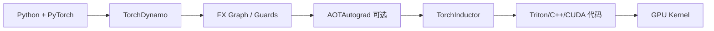

`torch.compile` 的价值不在于给函数加一个装饰器，而在于把一段 Python/PyTorch 程序变成编译器可以优化的计算图。编译器可能融合逐元素操作、选择 Triton Kernel、复用缓存，并在形状稳定时减少 Python 和 Kernel launch 开销。

它也有明确边界：任意 Python 副作用、不可追踪的第三方调用、频繁变化的形状和数据相关控制流，都可能造成 Graph Break。本文用最小实验把“能编译”“编译成功但变慢”和“发生 Graph Break”分开讲清楚。

<!-- more -->

## 📑 目录

- [1. 一次编译调用经历了什么](#1-一次编译调用经历了什么)
- [2. 第一个可测量的例子](#2-第一个可测量的例子)
- [3. 选择 mode、backend 与 dynamic](#3-选择-modebackend-与-dynamic)
- [4. Graph Break 是什么](#4-graph-break-是什么)
- [5. 定位 Graph Break](#5-定位-graph-break)
- [6. 正确比较编译前后性能](#6-正确比较编译前后性能)
- [7. 自定义 Kernel 与 torch.compile 的边界](#7-自定义-kernel-与-torchcompile-的边界)
- [8. 动手实验](#8-动手实验)
- [总结](#-总结)
- [参考资料](#-参考资料)

## 1. 一次编译调用经历了什么

PyTorch 2.x 的常见链路可以简化为：



- **TorchDynamo** 从 Python 字节码层捕获可追踪的张量操作，并为输入形状、dtype、设备等条件生成 guards。
- **AOTAutograd** 在训练场景下把前向和反向图交给编译器处理。
- **TorchInductor** 对图做融合、调度和代码生成；CUDA 场景中经常生成 Triton Kernel 或调用已有库。
- **Guards** 用来判断下一次调用是否仍然适用当前编译结果。Guard 不满足时，可能重新编译或回退。

第一次调用通常包含图捕获和编译，后续调用才是稳定路径。因此“第一次很慢”不是 Kernel 性能结论。

## 2. 第一个可测量的例子

先写一个包含多个逐元素操作的函数：

```python
import torch

def fused_mlp_activation(x, weight, bias):
    y = x @ weight.T + bias
    return torch.nn.functional.gelu(y)

compiled = torch.compile(fused_mlp_activation, backend="inductor")

x = torch.randn(4096, 4096, device="cuda", dtype=torch.float16)
w = torch.randn(4096, 4096, device="cuda", dtype=torch.float16)
b = torch.randn(4096, device="cuda", dtype=torch.float16)

eager_out = fused_mlp_activation(x, w, b)
compiled_out = compiled(x, w, b)
torch.testing.assert_close(compiled_out, eager_out, rtol=1e-2, atol=1e-2)
```

不要直接把 `compiled(x, w, b)` 的第一次耗时和 eager 一次调用比较。使用 CUDA Event 预热：

```python
def cuda_ms(fn, warmup=10, iters=50):
    for _ in range(warmup):
        fn()
    torch.cuda.synchronize()
    start = torch.cuda.Event(enable_timing=True)
    end = torch.cuda.Event(enable_timing=True)
    start.record()
    for _ in range(iters):
        fn()
    end.record()
    end.synchronize()
    return start.elapsed_time(end) / iters

print("eager:", cuda_ms(lambda: fused_mlp_activation(x, w, b)))
print("compiled:", cuda_ms(lambda: compiled(x, w, b)))
```

对比时同时测：

- 首次调用时间；
- 预热后的平均 CUDA 时间；
- kernel 数量和每个 kernel 的时间；
- 峰值显存；
- 不同输入形状下是否触发重新编译。

## 3. 选择 mode、backend 与 dynamic

### 3.1 `mode`

常见模式包括：

```python
compiled = torch.compile(fn, mode="default")
compiled = torch.compile(fn, mode="reduce-overhead")
compiled = torch.compile(fn, mode="max-autotune")
```

- `default` 适合先验证正确性和基本收益；
- `reduce-overhead` 会尝试减少 Python/框架开销，适合小 Batch 或反复调用的场景；
- `max-autotune` 可能花更多编译时间搜索配置，适合形状稳定、运行次数很多的热点。

模式不是性能等级。必须在自己的服务或训练 step 上测量。

### 3.2 `backend`

```python
torch.compile(fn, backend="inductor")
torch.compile(fn, backend="eager")
```

`eager` 可以作为调试或图捕获对照；GPU 生产路径通常使用 `inductor`。第三方 backend 的支持范围和版本兼容性应以对应项目文档为准。

### 3.3 `dynamic`

```python
compiled = torch.compile(fn, dynamic=True)
```

动态形状可以减少因 shape 变化引发的重新编译，但可能让编译器难以做静态 tile 和内存规划。若服务请求长度变化很大，应该比较：

| 方案 | 优点 | 代价 |
| --- | --- | --- |
| 固定/分桶 shape | 编译器优化空间大 | 需要 padding 或多个缓存 |
| `dynamic=True` | 减少重新编译 | Kernel 可能更保守 |
| 手动 padding + mask | 行为可控 | 有填充计算 |

## 4. Graph Break 是什么

Graph Break 表示编译器在函数中间无法继续捕获，于是先运行一段图，再回到 Python，之后可能重新开始下一段图：

```python
def bad_fn(x):
    y = x * 2
    print(y.shape)          # Python 副作用，可能触发 break
    return y + 1
```

这不一定是错误。它的代价取决于 break 是否位于热点循环中，以及 break 前后的操作是否还能分别融合。最危险的是在每个 token、每个 batch 或每次迭代都触发一次。

常见来源：

- `print`、文件写入、全局变量修改等副作用；
- 用 Tensor 值决定 Python `if/for`；
- 不支持的第三方 Python/C++ 扩展；
- 频繁变化的 dtype、device 或 shape；
- 在编译函数中调用依赖 Python 对象身份的逻辑。

## 5. 定位 Graph Break

先打开日志：

```bash
TORCH_LOGS="graph_breaks,recompiles" python train.py
```

也可以在 Python 中查看解释信息：

```python
explain = torch._dynamo.explain(fused_mlp_activation)(x, w, b)
print(explain.graph_count)
print(explain.graph_break_count)
print(explain.break_reasons)
```

为了让问题尽快暴露，调试阶段可以使用 `fullgraph=True`：

```python
strict = torch.compile(fn, fullgraph=True)
```

此时遇到不能捕获的操作通常会直接报错，而不是悄悄拆成多个图。修复顺序建议是：

1. 读 break reason，确认是哪个 Python 操作导致；
2. 把日志、统计和调试输出移到编译函数外；
3. 把数据相关控制流改成张量操作，如 `torch.where`；
4. 对无法编译的边界使用 `torch.compiler.disable` 或自定义算子；
5. 重新 profile，确认图数量和 Kernel 数量真的下降。

## 6. 正确比较编译前后性能

### 6.1 预热与同步

CUDA 操作是异步的。下面的计时方式容易把 CPU 发起时间当成 GPU 完成时间：

```python
start = time.perf_counter()
fn(x)
print(time.perf_counter() - start)  # 不可靠
```

应使用 CUDA Event 或在测量前后同步。还要把编译时间和稳态时间分开报告。

### 6.2 用 Profiler 看融合结果

```python
with torch.profiler.profile(
    activities=[
        torch.profiler.ProfilerActivity.CPU,
        torch.profiler.ProfilerActivity.CUDA,
    ],
    record_shapes=True,
    profile_memory=True,
) as prof:
    for _ in range(5):
        compiled(x, w, b)

print(prof.key_averages().table(
    sort_by="cuda_time_total", row_limit=20))
```

关注的不是“编译后 Kernel 越少越好”，而是：

- 融合是否减少了中间张量读写；
- 生成的 Kernel 是否出现寄存器 spill；
- matmul 是否仍然调用高效的库 Kernel；
- 首次编译成本是否能被长期运行摊平。

## 7. 自定义 Kernel 与 torch.compile 的边界

### 7.1 适合交给 Inductor

- 逐元素函数、简单归约和常见广播；
- 计算图稳定、shape 变化有限的模型子图；
- 需要快速验证和减少 Python 调度开销的场景。

### 7.2 适合自定义 Triton/CUDA

- 你已经用 Nsight 证明某个 Kernel 是主要瓶颈；
- 需要特定的内存布局、异步拷贝或硬件指令；
- 算子包含编译器无法推断的跨 Block 协作；
- 需要对 API、dtype 或缓存行为作明确承诺。

自定义算子可以作为编译图的边界，但要为它提供正确的 schema、Autograd 规则和 fake/meta 实现，否则会影响后续图捕获和 shape 推断。

### 7.3 “编译成功但变慢”的排查

按顺序检查：

1. 是否把首次编译时间计入平均值；
2. 是否因为动态 shape 产生多个版本；
3. 是否出现 Graph Break 或 recompilation；
4. 是否过度融合导致寄存器数和 local memory 增加；
5. 是否把本应调用 cuBLAS/cuDNN 的大矩阵乘拆成了较慢的自生成 Kernel。

## 8. 动手实验

1. 对 `x * 2 + 1` 分别测 eager、`torch.compile` 和手写 Triton。
2. 在编译函数中加入 `print(x.shape)`，用 `fullgraph=True` 观察报错。
3. 把 Python `if x.sum() > 0` 改写成 `torch.where`，比较 Graph Break 数量。
4. 对固定 shape 和动态 shape 分别运行 100 次，记录首次编译、重编译次数和稳态延迟。
5. 在 `max-autotune` 下比较编译时间与 1000 次调用的累计时间，判断是否值得。
6. 用 PyTorch Profiler 和 Nsight Systems 检查编译前后 Kernel 数、GPU idle gap 和显存流量。

## 总结

- `torch.compile` 是一条从 Python 图到 GPU Kernel 的编译链，不是单纯的运行时加速开关。
- 首次编译、稳态执行、重新编译和 Graph Break 必须分开测量。
- `TORCH_LOGS="graph_breaks,recompiles"`、`torch._dynamo.explain` 和 `fullgraph=True` 是最实用的排查入口。
- 编译器的默认融合适合快速迭代；性能热点经过 profiler 证明后，再考虑 Triton/CUDA 特化。
- “Kernel 数少”不是终点，必须同时看寄存器、local memory、带宽、Tensor Core 和端到端延迟。

## 参考资料

- [PyTorch torch.compiler 总览](https://docs.pytorch.org/docs/stable/torch.compiler.html)
- [TorchDynamo Core Concepts](https://docs.pytorch.org/docs/stable/compile/programming_model.dynamo_core_concepts.html)
- [torch.compile Troubleshooting](https://docs.pytorch.org/docs/stable/torch.compiler_troubleshooting.html)
- [TorchInductor Profiling](https://docs.pytorch.org/docs/stable/torch.compiler_inductor_profiling.html)
- [PyTorch `torch.compile` Tutorial](https://pytorch.org/tutorials/intermediate/torch_compile_tutorial.html)
- [Triton 官方教程](https://triton-lang.org/main/getting-started/tutorials/)
