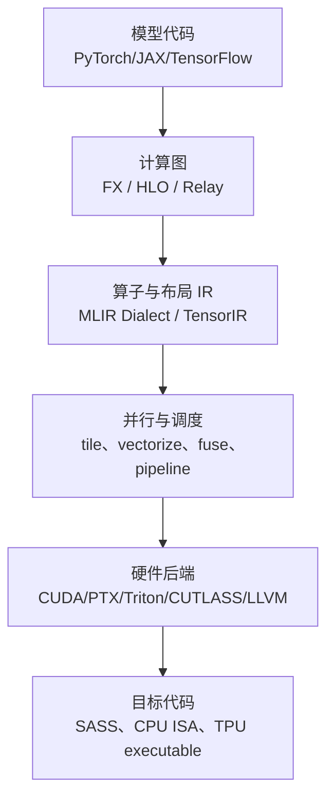

“AI 编译器”经常被当成一个工具名，实际上它是一条分层的编译流水线：上层表示模型和算子语义，中间层表达布局、并行和内存，后端再生成某种硬件能执行的代码。Triton、TorchInductor、TVM 和 XLA 解决的问题有重叠，但它们所处的层次和默认场景不同。

这一节不试图让初学者一次学会所有编译器，而是建立三个判断：我现在看到的表示是什么？这一层能做什么优化？什么时候应该换工具？

<!-- more -->

## 📑 目录

- [1. 从模型图到机器码的分层](#1-从模型图到机器码的分层)
- [2. MLIR：承载多层 IR 的基础设施](#2-mlir承载多层-ir-的基础设施)
- [3. TVM 与 TensorIR](#3-tvm-与-tensorir)
- [4. XLA 与 HLO](#4-xla-与-hlo)
- [5. 它们和 Triton、Inductor 的关系](#5-它们和-tritoninductor-的关系)
- [6. 按项目约束做选型](#6-按项目约束做选型)
- [7. 一个通用的编译器实验方法](#7-一个通用的编译器实验方法)
- [8. 动手实验](#8-动手实验)
- [总结](#-总结)
- [参考资料](#-参考资料)

## 1. 从模型图到机器码的分层

把一次推理或训练计算拆成几层，可以得到下面的视图：



每一层回答的问题不同：

| 层 | 典型问题 | 代表工具 |
| --- | --- | --- |
| 模型图 | 哪些算子能消除或融合？ | FX、HLO、Dynamo |
| 算子 IR | 张量形状、布局和数据依赖是什么？ | MLIR、TensorIR、StableHLO |
| 调度 | tile 多大、并行多少、是否流水化？ | TVM schedule、Inductor、Triton |
| 代码生成 | 用哪种指令和内存层级？ | LLVM、PTX、CUTLASS、WGMMA |
| 运行时 | 如何分配、同步、执行和缓存？ | CUDA Runtime、XLA runtime、设备 Runtime |

因此“TVM 和 Triton 谁更好”不是一个完整问题。应该先说明你要控制的是整图、算子调度、硬件后端，还是线上运行时。

## 2. MLIR：承载多层 IR 的基础设施

MLIR 的核心不是一个固定的“AI 算法优化器”，而是一套构建可组合编译器的基础设施。它允许不同项目定义自己的 Dialect，并通过逐步 Lowering 把高层语义转换为更接近硬件的表示。

一个抽象的 Lowering 过程可能是：

```text
tensor.matmul
  -> linalg.matmul
  -> vector.contract
  -> gpu.launch / gpu.shuffle
  -> nvvm.mma / llvm
  -> PTX
```

每次 Lowering 都应该尽量保留当前层仍然需要的信息。过早变成线性的低级指令后，编译器就很难再做整图融合或布局优化。

### 2.1 认识 Dialect、Pass 和 Conversion

- **Dialect**：一组有共同语义和类型系统的操作、类型与属性。
- **Pass**：遍历 IR，做分析或变换，如常量折叠、融合、布局转换。
- **Conversion**：把一个 Dialect 中的操作合法地转成另一个 Dialect。
- **Lowering**：通常指从高层到低层的多次转换，不是一次“编译成机器码”。

对算子工程师来说，最有用的阅读方法是：先看输入 IR，再看某个 Pass 如何改变形状/布局，最后看目标代码。不要一开始就钻进所有 MLIR 基础设施代码。

## 3. TVM 与 TensorIR

Apache TVM 的教学主线通常是：给定一个张量计算，使用 TensorIR 表达计算和调度，再通过搜索或手工调度找到适合目标硬件的实现。

### 3.1 计算和调度分离

矩阵乘的数学定义和线程块划分是两件事。伪代码可以写成：

```python
# 计算定义：C[i, j] = sum(A[i, k] * B[k, j] for k)
def matmul(A, B):
    return te.compute(
        (M, N),
        lambda i, j: te.sum(A[i, k] * B[k, j], axis=k),
    )

# 调度：绑定 block/thread，缓存到 shared/register，沿 K 轴分块
sch = te.create_schedule(matmul.op)
sch[C].tile(i, j, block_m, block_n)
sch[C].bind(...)
```

实际 TVM API 会随 TensorIR/Relax 版本演进，但“先写计算，再写 schedule”的思想是稳定的。调度器可以搜索不同 tile、线程数、向量化和缓存组合。

### 3.2 TVM 适合什么

- 需要跨 CUDA、CPU、GPU、NPU 等硬件生成代码；
- 有较明确的算子集合和部署形状；
- 愿意建立调度模板、测量数据库或自动调优流程；
- 需要把模型编译成独立的部署 artifact。

它的代价是编译系统和调度空间较大。只想写一个 PyTorch 内的自定义 Softmax 时，先用 Triton 更快；当算子要覆盖多个硬件后，TVM 的抽象价值才更明显。

## 4. XLA 与 HLO

XLA 的入口通常是一个更高层的计算图，经过 HLO（High Level Optimizer）分析和变换后，生成目标设备代码。JAX、TensorFlow 和一些其他前端可以把程序转换为 StableHLO/HLO，再交给 XLA 或兼容后端。

### 4.1 XLA 重点优化什么

- 整图常量传播和死代码消除；
- 算子融合和布局传播；
- 静态 shape 下的内存规划；
- 设备间通信和集体操作调度；
- 针对 GPU、TPU、CPU 的后端代码生成。

和 Triton 直接写一个 Kernel 的视角不同，XLA 更关注一个程序图如何整体执行。若某个热点算子需要特殊布局或自定义指令，可以通过 Custom Call 或后端扩展把它接入，但那已经是更高的工程成本。

### 4.2 HLO 中的形状意识

编译器能否做出好优化，经常取决于形状信息是否稳定。动态 batch、动态序列长度和数据依赖的分支会减少静态规划空间。即使 XLA 能处理动态 shape，也不表示每种 shape 都会生成同样高效的 Kernel。

## 5. 它们和 Triton、Inductor 的关系

| 工具 | 默认抽象层 | 典型输入 | 更擅长的场景 |
| --- | --- | --- | --- |
| Triton | 单个 Block-level Kernel | Python + 张量指针 | 快速开发自定义 GPU 算子 |
| TorchInductor | PyTorch 图到后端代码 | FX/ATen 图 | PyTorch 整图编译和自动融合 |
| TVM | 张量计算 + schedule | TensorIR/Relax | 跨硬件算子和模型部署 |
| XLA | 整体计算图 | HLO/StableHLO | JAX/TPU/静态图优化 |
| MLIR | 可组合 IR 基础设施 | 多种 Dialect | 构建和连接编译器流水线 |

它们可以组合，而不是只能互斥选择。例如 TorchInductor 可以生成 Triton Kernel；TVM 可以通过 MLIR/LLVM 连接后端；XLA 可以通过 StableHLO 接入不同编译器生态。

### 5.1 一个实际的选择问题

假设你要优化 Transformer：

1. 已经在 PyTorch 中，热点是 Bias + GELU + residual：先尝试 `torch.compile`，观察 Inductor 融合。
2. 热点是一个规则的自定义 Softmax：用 Triton 写最小 Kernel，并进行 shape autotune。
3. 同一模型要部署在 NVIDIA GPU 和另一种加速器：考虑 TVM/MLIR 或厂商提供的编译链。
4. 主要使用 JAX/TPU，问题是整图布局和通信：先从 XLA/HLO 分析，而不是直接写 CUDA。

## 6. 按项目约束做选型

把选型写成一张约束表，比背工具名称更可靠：

| 约束 | 倾向选择 | 原因 |
| --- | --- | --- |
| 只支持 NVIDIA、热点稳定 | CUDA/CUTLASS 或 Triton | 可以直接利用 CUDA 生态 |
| 需要和 PyTorch 快速迭代 | Triton + `torch.compile` | Python API 与自动微分集成好 |
| 需要跨硬件 | TVM/MLIR/厂商编译器 | 后端抽象和代码生成更重要 |
| JAX/TPU 整图优化 | XLA | HLO 和 TPU 后端成熟 |
| 需要极致硬件特化 | CUDA/CUTLASS/内嵌 PTX | 可控制 layout、异步管线和指令 |
| shape 经常变化 | 运行时分桶、动态编译或多版本缓存 | 需要权衡编译次数和静态优化 |

还要把团队维护能力写进决策：一个只由单人维护的超低级 Kernel，未必比性能略低但能被编译器持续更新的实现更适合长期生产。

## 7. 一个通用的编译器实验方法

无论使用哪个工具，都可以沿用同一套实验记录：

1. **固定基线**：记录模型、shape、dtype、GPU、驱动、框架和 commit。
2. **保留参考实现**：用 PyTorch eager 或 CPU 版本做正确性基准。
3. **观察 IR**：确认算子是否被融合、布局是否变化、是否出现 graph break。
4. **观察目标代码**：确认是否生成预期的 Triton/PTX/库调用。
5. **测量稳态**：排除首次编译、缓存建立和数据加载。
6. **测量端到端**：单 Kernel 变快不代表模型 step 或服务延迟变快。
7. **测试形状集合**：至少包含常见形状、边界形状和动态 shape。


## 8. 动手实验

1. 取 `y = x * 2 + 1`，分别用 PyTorch eager、`torch.compile` 和 Triton 实现。
2. 对一个 row-wise Softmax，记录 Triton 的 `BLOCK_SIZE` 与 Inductor 生成 Kernel 的差异。
3. 在 TVM 文档的 TensorIR 教程中调节 tile 和线程绑定，记录不同 schedule 的性能。
4. 使用 OpenXLA 的 HLO 示例，找出一个 fusion 变换，并说明它省去了哪次读写。
5. 为同一算子制作“准确性、编译时间、稳态延迟、端到端收益、维护成本”五列决策表。

## 总结

- AI 编译器是分层流水线；模型图、算子 IR、调度和机器码解决不同问题。
- MLIR 是构建多层编译器的基础设施，TVM 更突出计算/调度分离，XLA 更突出整图 HLO 优化。
- Triton 和 TorchInductor 适合 PyTorch/NVIDIA 快速迭代，但并不覆盖所有硬件特化和跨平台需求。
- 工具选型要由硬件、shape 稳定性、性能目标、部署生态和维护成本共同决定。
- 无论使用什么编译器，都要保留参考实现、查看中间表示、测量编译成本和端到端收益。

## 参考资料

- [MLIR 官方文档](https://mlir.llvm.org/docs/)
- [MLIR Toy Tutorial](https://mlir.llvm.org/docs/Tutorials/Toy/)
- [Apache TVM 官方文档](https://tvm.apache.org/docs/)
- [TVM TensorIR 教程](https://tvm.apache.org/docs/deep_dive/tensor_ir/tutorials/tutorial.html)
- [OpenXLA / XLA 官方文档](https://openxla.org/xla)
- [StableHLO 官方文档](https://openxla.org/stablehlo)
- [PyTorch torch.compiler](https://docs.pytorch.org/docs/stable/torch.compiler.html)
- [Triton 官方教程](https://triton-lang.org/main/getting-started/tutorials/)
