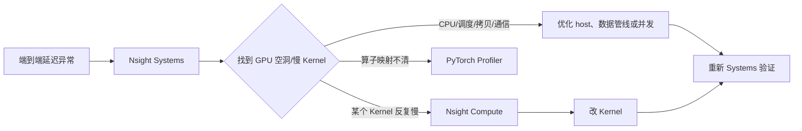

## 主教程

先读 NVIDIA 的 [Three Things You Need to Know About Nsight Systems](https://developer.nvidia.com/blog/three-things-you-need-to-know-about-nsight-systems/)，建立系统级时间线和采集边界；再读 [Understanding Overhead and Latency in Nsight Systems](https://developer.nvidia.com/blog/understanding-the-visualization-of-overhead-and-latency-in-nsight-systems/)，用真实 timeline 学会区分 launch latency、GPU idle 和 profiler overhead。需要分析拷贝时继续读 [Optimizing CUDA Memory Transfers](https://developer.nvidia.com/blog/optimizing-cuda-memory-transfers-with-nsight-systems/)。

本文只把这些文档组织成一个初学者可执行的流程：先抓时间线，再按 GPU 空洞、拷贝、通信和 launch gap 分类，最后决定是否下钻 Nsight Compute。

Nsight Systems 适合回答一个宏观问题：**这一段时间里，CPU 和 GPU 到底各自在做什么？** 它不是用来查看某条指令或某个 shared-memory bank conflict 的工具；它先帮助你找到慢的 iteration、GPU 空洞、数据拷贝和通信等待，再把具体热点交给 Nsight Compute。

本文从一个最小 PyTorch 训练循环开始，给出 CLI 采集、NVTX 标记、时间线阅读和问题归类方法。

<!-- more -->

## 📑 目录

- [1. Systems 和 Compute 的分工](#1-systems-和-compute-的分工)
- [2. 准备一个可分析的程序](#2-准备一个可分析的程序)
- [3. 用 CLI 抓取时间线](#3-用-cli-抓取时间线)
- [4. 给业务阶段加 NVTX 标记](#4-给业务阶段加-nvtx-标记)
- [5. 阅读时间线的固定顺序](#5-阅读时间线的固定顺序)
- [6. GPU Idle Gap 的分类](#6-gpu-idle-gap-的分类)
- [7. 控制采集范围和开销](#7-控制采集范围和开销)
- [8. 动手实验](#8-动手实验)
- [总结](#-总结)
- [参考资料](#-参考资料)

## 1. Systems 和 Compute 的分工

| 工具 | 观察范围 | 适合回答的问题 |
| --- | --- | --- |
| Nsight Systems | CPU/GPU 全链路时间线 | GPU 为什么空闲？哪个阶段在等待？Kernel 是否被频繁启动？ |
| Nsight Compute | 单个 Kernel 的硬件指标 | 这个 Kernel 是带宽瓶颈、计算瓶颈还是同步瓶颈？ |
| PyTorch Profiler | Python/ATen/CUDA operator | 哪个模型算子占总时间？编译前后 Kernel 数量怎样变化？ |



## 2. 准备一个可分析的程序

下面的程序故意分出数据准备、前向、反向和优化器步骤：

```python
import torch

model = torch.nn.Sequential(
    torch.nn.Linear(4096, 4096),
    torch.nn.GELU(),
    torch.nn.Linear(4096, 4096),
).cuda()
optimizer = torch.optim.AdamW(model.parameters(), lr=1e-4)

for step in range(20):
    with torch.cuda.nvtx.range("data"):
        x = torch.randn(32, 4096, device="cuda")
        target = torch.randn(32, 4096, device="cuda")

    with torch.cuda.nvtx.range("forward"):
        y = model(x)
        loss = (y - target).square().mean()

    with torch.cuda.nvtx.range("backward"):
        loss.backward()

    with torch.cuda.nvtx.range("optimizer"):
        optimizer.step()
        optimizer.zero_grad(set_to_none=True)
```

CUDA 是异步执行的，因此为了让 trace 中的阶段边界更可信，应在实验结束或阶段交界处按需同步。但不要在每个算子后无脑 `torch.cuda.synchronize()`，那会改变真实的并发行为。标记阶段用于定位，最终结论仍要结合 CUDA API 和 GPU stream。

## 3. 用 CLI 抓取时间线

最小命令：

```bash
nsys profile \
  --trace=cuda,nvtx,osrt \
  --sample=none \
  --capture-range=nvtx \
  --output=nsys_train \
  python train_one_iter.py
```

如果程序没有使用 NVTX capture range，可以先去掉 `--capture-range=nvtx`，让 Nsight Systems 从进程启动开始采集。长程序建议使用起止范围或限制 duration：

```bash
nsys profile \
  --trace=cuda,nvtx,osrt \
  --duration=30 \
  --output=nsys_30s \
  python serve_or_train.py
```

常见输出是 `.nsys-rep` 报告。用 GUI 打开后，优先查看：

- CPU Threads / CUDA API；
- CUDA HW、GPU Context、CUDA Kernels；
- Memory Operations；
- NVTX ranges；
- 多 GPU 时的 NCCL/通信轨道。

CLI 参数会随 Nsight Systems 版本变化，运行目标机上的 `nsys --help`，并以对应版本 User Guide 为准。

## 4. 给业务阶段加 NVTX 标记

### 4.1 Python 端标记

```python
from torch.cuda import nvtx

nvtx.range_push("prefill")
try:
    output = model(input_ids)
finally:
    nvtx.range_pop()
```

使用 `try/finally` 确保异常路径也能闭合 range。服务系统可以进一步标记：

```text
request_parse
tokenize
prefill
decode_step
kv_cache_copy
postprocess
```

### 4.2 C++/CUDA 端标记

```cpp
#include <nvtx3/nvToolsExt.h>

nvtxRangePushA("fused_softmax");
fused_scale_causal_softmax<<<grid, block, smem>>>(...);
cudaError_t status = cudaGetLastError();
nvtxRangePop();
```

标记名要稳定、短小、包含必要的 shape 信息。不要把完整请求文本或敏感数据写入 trace；trace 文件本身可能包含输入规模、路径和设备信息。

## 5. 阅读时间线的固定顺序

### 第一步：先看 GPU 是否持续有工作

如果 GPU timeline 大量空白，不要先打开某个 Kernel 的细节。先找到空白前后的 CPU 线程和 CUDA API：

- CPU 没有发起新的 Kernel：可能是数据加载、Python 调度或同步阻塞；
- CPU 在调用 `cudaMemcpy`：可能是 Host/Device 数据传输；
- 其他 Stream 正在等待事件：可能是依赖或错误的同步；
- NCCL 长时间占用：可能是通信或负载不均衡。

### 第二步：看 Kernel 是否碎片化

大量极短 Kernel 之间有明显间距，常见原因是：

- 小算子没有融合；
- Python/框架每次循环都启动 Kernel；
- CUDA Graph 没有捕获到动态路径；
- 需要的 batch 太小，单个请求没有足够工作。

### 第三步：看 memcpy 是否和计算重叠

如果 memcpy 总是独占 GPU，说明数据管线没有和计算重叠，或者传输方向/同步方式不合理。不要只看拷贝总时间，还要看它是否挡住了关键计算。

### 第四步：用 NVTX 对齐业务阶段

把“prefill 延迟高”定位到具体一段时间后，再对这一段的 Kernel 进行排序。此时才有必要把某个 Kernel 的名字交给 Nsight Compute。

## 6. GPU Idle Gap 的分类

| 时间线现象 | 可能原因 | 下一步 |
| --- | --- | --- |
| CPU 线程长时间运行，GPU 空闲 | 数据预处理、Python 调度、锁 | 看 CPU 调用栈和 NVTX，减少 host 工作或预取 |
| `cudaStreamSynchronize` 很长 | 过早同步或前一 Kernel 很慢 | 去掉不必要同步，转向 Compute 分析前一 Kernel |
| memcpy H2D 占据空档 | 数据未 pinned、拷贝未异步 | 使用 pinned memory、异步拷贝和合适 Stream |
| Kernel 之间只有几十微秒空隙 | launch overhead、小算子过多 | 融合、CUDA Graph、批量化 |
| NCCL 轨道等待 | 通信/计算不重叠或 rank 不均衡 | 检查 collective、Stream 和负载分配 |
| GPU 看似满载但业务延迟高 | 排队、shape 变化、尾延迟 | 按请求/shape 分组看 NVTX 和 P95 |

这些是排查假设，不是自动结论。必须在时间线上找到对应的 API、Kernel 和调用关系。

## 7. 控制采集范围和开销

Profiling 本身会增加开销，尤其是采集过多 API、所有 Kernel 和详细 CPU 栈时。建议：

1. 先用轻量配置抓 5～10 个 iteration；
2. 发现问题后只采集相关阶段；
3. 需要 Kernel 指标时把目标交给 Nsight Compute，而不是在 Systems 中打开所有细节；
4. 多 GPU 训练只在一个可代表的 rank 上先定位，再扩大范围；
5. 记录 profiling 配置和报告生成时间，避免把不同采集开销的结果直接比较。

## 8. 动手实验

1. 在一个包含数据准备、前向、反向的脚本中加入三个 NVTX range。
2. 用 `nsys profile --trace=cuda,nvtx,osrt` 采集 20 个 step。
3. 找到第一个稳定的 iteration，标出 GPU idle gap 的起点和终点。
4. 将空档归类为 CPU、拷贝、同步、通信或 launch overhead，并写出证据。
5. 把三个小逐元素操作融合成一个 Kernel，重新采集并比较 Kernel 数量和空档长度。
6. 将一个热点 Kernel 的名字交给第 8.2 节的 Nsight Compute 做下钻。

### 本项目实测示例

第 5.3 节的 `scale + causal mask + softmax` 实验在 `sshdh` 的 RTX 3060 上采集了 Systems 报告。`1024 × 4096` 输入下，分离路径包含平均 `58.5 us` 的 Scale/Mask Kernel 和 `191.2 us` 的 Softmax Kernel；融合路径只留下平均 `63.8 us` 的一个 Kernel。

<figure class="source-figure">
  
  <figcaption>Nsight Systems 2024.6.2 的 <code>cuda_gpu_kern_sum</code> 数据。它适合确认 Kernel 数量和时间分布；正式 benchmark 仍使用 CUDA Event。</figcaption>
</figure>

## 总结

- Nsight Systems 先回答“全链路时间花在哪里”，不要一上来只看某个 Kernel。
- NVTX 是把模型/服务阶段映射到 GPU 时间线的关键工具。
- GPU idle gap 要根据 CPU、CUDA API、memcpy、Stream、通信和 Kernel 轨道来分类。
- 采集范围越大不一定越好；先轻量定位，再对单个 Kernel 做 Nsight Compute 深入分析。
- 每次优化后都要重新抓 Systems，确认端到端空档和业务阶段确实改善。

## 参考资料

- [NVIDIA：Three Things You Need to Know About Nsight Systems](https://developer.nvidia.com/blog/three-things-you-need-to-know-about-nsight-systems/)
- [NVIDIA：Understanding Overhead and Latency](https://developer.nvidia.com/blog/understanding-the-visualization-of-overhead-and-latency-in-nsight-systems/)
- [NVIDIA：Optimizing CUDA Memory Transfers](https://developer.nvidia.com/blog/optimizing-cuda-memory-transfers-with-nsight-systems/)
- [NVIDIA Getting Started with Nsight Systems](https://developer.nvidia.com/nsight-systems/get-started)
- [NVIDIA CUDA Developer Tools Tutorial Center](https://developer.nvidia.com/tools-tutorials)
- [NVIDIA Nsight Systems User Guide](https://docs.nvidia.com/nsight-systems/UserGuide/index.html)
- [Nsight Systems CLI Reference](https://docs.nvidia.com/nsight-systems/UserGuide/index.html#cli-options)
- [NVIDIA NVTX Documentation](https://nvidia.github.io/NVTX/)
- [PyTorch CUDA NVTX API](https://docs.pytorch.org/docs/stable/generated/torch.cuda.nvtx.html)
- [CUDA Best Practices：Performance Measurement](https://docs.nvidia.com/cuda/cuda-c-best-practices-guide/index.html#performance-metrics)
