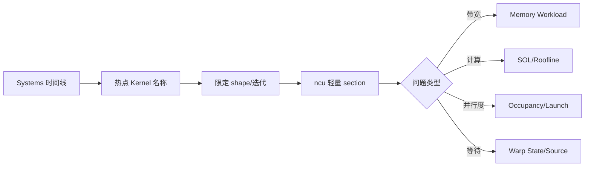

Nsight Compute（`ncu`）用于“下钻”：给定一个已经由 Nsight Systems 或 PyTorch Profiler 找到的热点 Kernel，解释它为什么慢。它不会替你决定优化方案；它提供硬件计数器、源代码关联、Occupancy、Speed of Light 和 Roofline 等证据。

初学时最容易犯的错误是一次打开所有指标，然后在几百个数字中找一个看起来高的百分比。正确做法是先提出一个问题：这是带宽瓶颈、计算瓶颈、并行度瓶颈还是同步/访存延迟瓶颈？再选择最小的 metric set。

<!-- more -->

## 📑 目录

- [1. 先选对 Kernel](#1-先选对-kernel)
- [2. 最小采集命令](#2-最小采集命令)
- [3. Launch Statistics 与 Occupancy](#3-launch-statistics-与-occupancy)
- [4. Speed of Light 和 Roofline](#4-speed-of-light-和-roofline)
- [5. Memory Workload 与 Warp Stall](#5-memory-workload-与-warp-stall)
- [6. 源代码关联和两个版本对比](#6-源代码关联和两个版本对比)
- [7. 如何把指标转成行动](#7-如何把指标转成行动)
- [8. 动手实验](#8-动手实验)
- [总结](#-总结)
- [参考资料](#-参考资料)

## 1. 先选对 Kernel

不要直接对整个训练脚本执行 `ncu --set full`。先用 Systems 或 PyTorch Profiler 找到：

- 名称稳定；
- 调用次数足够；
- 占总 GPU 时间较高；
- shape 和输入 dtype 代表真实场景；
- 可以通过输入过滤或 `--kernel-name` 单独采集。



## 2. 最小采集命令

先用默认的基础 section：

```bash
ncu --set basic \
    --kernel-name-base function \
    --launch-skip 10 \
    --launch-count 1 \
    -o softmax_basic \
    python benchmark_softmax.py
```

只看 Kernel 名称包含 `softmax` 的函数：

```bash
ncu --set basic \
    --kernel-name-base function \
    --kernel-name 'regex:.*softmax.*' \
    --launch-count 1 \
    -o softmax_basic \
    python benchmark_softmax.py
```

需要更完整信息时再使用：

```bash
ncu --set full \
    --kernel-name-base function \
    --launch-count 1 \
    -o softmax_full \
    python benchmark_softmax.py
```

CLI 选项和 section 名称会随版本更新。遇到“不支持的选项”时先运行 `ncu --help` 和 `ncu --query-metrics`，不要从旧文章复制命令后盲目重试。

## 3. Launch Statistics 与 Occupancy

### 3.1 Launch Statistics

先记录这些事实：

| 事实 | 说明 |
| --- | --- |
| grid/block size | 总共有多少 Block，每个 Block 多少线程 |
| registers per thread | 每线程寄存器使用量 |
| shared memory per block | 每个 Block 占用的共享内存 |
| static/dynamic smem | 共享内存来自编译期还是 launch 参数 |
| achieved occupancy | 运行时实际活跃 Warp 比例 |

这些资源共同决定一个 SM 同时能放多少个 Block。一个简单的估算是：

$$
\text{resident blocks} = \min(\text{register limit},\text{shared-memory limit},\text{thread limit},\text{block limit})
$$

### 3.2 Occupancy 不是越高越好

Occupancy 的作用是提供足够的 Warp 来隐藏内存和流水线延迟。若 Kernel 已经充分利用 Tensor Core 或带宽，继续增加活跃 Warp 不一定会加速；为了提高 Occupancy 而降低 tile 复用，反而可能增加 HBM 流量。

用 Occupancy 解释性能时要问：

- 是否因为寄存器太多只剩一个 Block/SM？
- 是否因为共享内存 tile 太大限制了 resident blocks？
- 活跃 Warp 少时，是否同时看到长 scoreboard stall？
- 改小 Block 后，是否真的减少 stall，而不是只提高了一个百分比？

## 4. Speed of Light 和 Roofline

### 4.1 SOL 的读法

Speed of Light 页面会把 Kernel 的计算、内存、Tensor Core 等吞吐与硬件峰值比较。它提供“接近哪个资源上限”的线索，但不能单独证明瓶颈。

一个常见判断：

| 观察 | 倾向结论 | 下一步 |
| --- | --- | --- |
| Memory Throughput 高，SM Throughput 低 | 可能 memory-bound | 检查合并访存、重复读写、tile 复用 |
| SM Throughput 高，Memory Throughput 低 | 可能 compute-bound | 检查指令、向量化、Tensor Core 使用 |
| 两者都低 | 可能 launch、依赖、分歧或并行度问题 | 看 Occupancy、Warp State、Systems |
| Tensor Core 利用率低但目标应为 GEMM | 矩阵形状/布局/类型不匹配 | 检查库选择、dtype、tile 和编译代码 |

### 4.2 Roofline

Roofline 把算术强度 `FLOPs / bytes` 和可达到的计算/带宽上限联系起来。Softmax 和 Reduce 通常算术强度低，优先优化数据读取；GEMM 的算术强度高，更需要关注 Tensor Core 和 tile 复用。

不要把 Roofline 的线当作实际可达峰值。时钟、占用、边界、数据布局、缓存命中和指令混合都会降低可达值。

## 5. Memory Workload 与 Warp Stall

### 5.1 Memory Workload

关注：

- global load/store 是否合并；
- L1/L2 命中率；
- DRAM throughput 和请求数量；
- shared memory bank conflict；
- local memory load/store（可能意味着寄存器 spill）。

以 Reduce 为例：如果全局内存读取已经接近理论带宽，而共享内存冲突很低，继续减少几条加法指令通常没有明显收益。相反，如果每个元素被多次从 HBM 读取，就应先减少扫描次数或增加片上复用。

### 5.2 Warp Stall

Warp 在某个周期不能发射下一条指令，并不等于 GPU 完全空闲。需要看 stall 的类型：

| Stall 类型（概念） | 常见原因 |
| --- | --- |
| Long Scoreboard | 等待较慢的 global/local memory 结果 |
| MIO Throttle | load/store、shared memory 或特殊存储单元压力大 |
| Barrier | `__syncthreads`、pipeline barrier 或 Warp 协作等待 |
| Math/Dependency | 指令链过长或前一条结果尚未就绪 |
| Not Selected | 有 Warp 可运行，但调度器本周期选择了其他 Warp |

指标名称随 GPU 和 Nsight Compute 版本变化，报告中的规则描述比某个硬编码 metric 名更可靠。

## 6. 源代码关联和两个版本对比

### 6.1 Source 页面

启用 `-lineinfo` 编译选项可以让 Nsight Compute 把指令和源代码行对应起来：

```bash
nvcc -O3 -lineinfo -arch=sm_80 softmax.cu -o softmax
```

然后在 Source 页面观察：

- 哪几行加载最慢；
- `expf`、规约和同步占多少指令；
- 编译器是否生成向量化或预期的矩阵指令；
- 是否有 local memory 访问。

### 6.2 对比两个版本

```bash
ncu --set basic -o reduce_v1 reduce_v1_report python bench.py --version v1
ncu --set basic -o reduce_v2 reduce_v2_report python bench.py --version v2
ncu --import reduce_v1_report.ncu-rep reduce_v2_report.ncu-rep
```

对比时必须固定：GPU、时钟、shape、dtype、编译选项、warmup 和采集的 launch。只改变一个优化点，例如“共享内存规约 → Warp Shuffle”，否则无法把收益归因到具体改动。

## 7. 如何把指标转成行动

### 场景 A：Memory Throughput 低，Long Scoreboard 高

可能是非合并访存、访问跨度大或并行度不足。检查线程到元素的映射、stride、Block 数和 L2 命中率。不要直接增加线程数，先确认访问地址是否连续。

### 场景 B：Memory Throughput 高但 Kernel 仍慢

可能已经接近带宽上限，也可能是重复读取过多。用有效带宽估算理论下限，再比较实际传输字节数；如果字节数本身过大，应从算法或融合层面减少读写。

### 场景 C：寄存器很多、Occupancy 低、local store 出现

可能是过度展开、过大的 tile 或融合过多。尝试减少临时值、拆分 Kernel 或调整 block/tile；拆分后要用 Systems 确认 launch 开销没有抵消收益。

### 场景 D：Tensor Core 没有被使用

检查 dtype、矩阵维度、布局和调用的库路径。`float` 标量乘法不会自动变成 Tensor Core GEMM；需要满足相应硬件指令和库的输入约束。

## 8. 动手实验

1. 对第 3 章 Reduce 的三个版本分别采集 `basic` 报告。
2. 记录 block size、寄存器、shared memory、Occupancy 和 DRAM throughput。
3. 对 V1 的合并访存和 V2 的 Warp Shuffle 各提出一个可验证假设。
4. 用 `--set full` 只采集一个 launch，查看 Memory Workload、SOL 和 Source。
5. 故意把连续读取改成 stride 访问，观察 DRAM throughput、L2 命中和 stall 的变化。
6. 对第 5.3 节融合 Softmax 比较寄存器压力、launch 数量和端到端延迟。

## 总结

- Nsight Compute 的第一步是选对代表性 Kernel，第二步才是采集指标。
- Occupancy 是延迟隐藏资源，不是单独的性能目标。
- SOL、Roofline、Memory Workload 和 Warp Stall 应结合起来解释，而不是用单个百分比下结论。
- 两个版本对比时必须固定 shape、dtype、编译选项、warmup 和采集 launch。
- 每个指标都应转成一个可验证的修改假设，再回到 Systems 和端到端测试闭环。

## 参考资料

- [NVIDIA Nsight Compute Profiling Guide](https://docs.nvidia.com/nsight-compute/ProfilingGuide/index.html)
- [Nsight Compute CLI Documentation](https://docs.nvidia.com/nsight-compute/NsightComputeCli/index.html)
- [Nsight Compute Sections and Rules](https://docs.nvidia.com/nsight-compute/ProfilingGuide/index.html#sections-and-rules)
- [CUDA Best Practices：Performance Metrics](https://docs.nvidia.com/cuda/cuda-c-best-practices-guide/index.html#performance-metrics)
- [CUDA Best Practices：Occupancy](https://docs.nvidia.com/cuda/cuda-c-best-practices-guide/index.html#occupancy)
- [CUDA C++ Programming Guide：Execution Model](https://docs.nvidia.com/cuda/cuda-programming-guide/05-appendices/cuda-cpp-execution-model.html)
