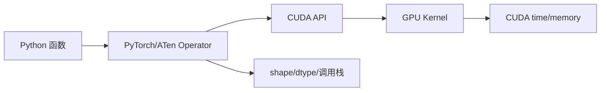

## 主教程

先做 [PyTorch Profiler Recipe](https://docs.pytorch.org/tutorials/recipes/recipes/profiler_recipe.html)，它从 CUDA 活动和 `key_averages` 表开始；再做 [Profiling your PyTorch Module](https://docs.pytorch.org/tutorials/beginner/profiler.html)，练习预热、内存分析和时间优化。TensorBoard 的基础使用单独参考 [How to use TensorBoard with PyTorch](https://docs.pytorch.org/tutorials/recipes/recipes/tensorboard_with_pytorch.html)。

具体字段和版本差异查 [PyTorch Profiler API](https://docs.pytorch.org/docs/stable/profiler.html)。本文只补充如何把 Python/ATen 算子和 Nsight Systems/Compute 的 Kernel 证据接起来，以及 profiler 开销对结果的影响。

PyTorch Profiler 位于模型代码和 GPU 工具之间：它知道一个 CUDA Kernel 是由哪个 PyTorch/ATen 算子触发的，也能输出 CPU、CUDA、shape、显存和调用栈信息。它适合回答“模型中的哪个算子值得下钻”，但不适合替代 Nsight Compute 解释硬件流水线。

本文用一个小模型展示稳定窗口采集、算子表排序、TensorBoard trace 和常见误读。

<!-- more -->

## 📑 目录

- [1. Profiler 能告诉你什么](#1-profiler-能告诉你什么)
- [2. 第一个 profile](#2-第一个-profile)
- [3. 为什么需要 schedule](#3-为什么需要-schedule)
- [4. 用 record_function 标注阶段](#4-用-record_function-标注阶段)
- [5. 读 key_averages 表](#5-读-key_averages-表)
- [6. 导出 TensorBoard Trace](#6-导出-tensorboard-trace)
- [7. profile torch.compile 前后](#7-profile-torchcompile-前后)
- [8. 采集开销与常见误区](#8-采集开销与常见误区)
- [9. 动手实验](#9-动手实验)
- [总结](#-总结)
- [参考资料](#-参考资料)

## 1. Profiler 能告诉你什么



Profiler 常用字段：

| 字段 | 含义 | 注意事项 |
| --- | --- | --- |
| `self_cpu_time_total` | 当前 operator 自身 CPU 时间 | 不包含子调用 |
| `cpu_time_total` | CPU 端总时间 | 可能等待异步 CUDA 完成 |
| `self_cuda_time_total` | 直接对应 CUDA 活动的时间 | 依赖采集活动和版本 |
| `cuda_time_total` | 子活动合计 | 适合排序热点 |
| `count` | 调用次数 | 小 Kernel 高调用次数可能造成 launch 开销 |
| `input_shapes` | 记录的输入形状 | 会增加采集开销 |
| `cuda_memory_usage` | 关联的显存变化 | 不是完整峰值显存报告 |

## 2. 第一个 profile

```python
import torch

model = torch.nn.Sequential(
    torch.nn.Linear(4096, 4096),
    torch.nn.GELU(),
    torch.nn.Linear(4096, 4096),
).cuda()
x = torch.randn(32, 4096, device="cuda")

with torch.profiler.profile(
    activities=[
        torch.profiler.ProfilerActivity.CPU,
        torch.profiler.ProfilerActivity.CUDA,
    ],
    record_shapes=True,
    profile_memory=True,
    with_stack=True,
) as prof:
    for _ in range(5):
        y = model(x)
        loss = y.square().mean()
        loss.backward()
        model.zero_grad(set_to_none=True)

print(prof.key_averages().table(
    sort_by="cuda_time_total",
    row_limit=20,
))
```

如果这是第一次运行，前几次可能包含 CUDA context、库初始化或编译。实际比较时应使用 schedule，并先做 warmup。

## 3. 为什么需要 schedule

`torch.profiler.schedule(wait, warmup, active, repeat)` 把采集分成等待、预热、稳定采集和重复窗口：

```python
schedule = torch.profiler.schedule(
    wait=2,
    warmup=2,
    active=4,
    repeat=2,
)

with torch.profiler.profile(
    activities=[
        torch.profiler.ProfilerActivity.CPU,
        torch.profiler.ProfilerActivity.CUDA,
    ],
    schedule=schedule,
    on_trace_ready=lambda p: p.export_chrome_trace(
        f"trace_{p.step_num}.json"
    ),
) as prof:
    for step in range(16):
        train_one_step()
        prof.step()
```

`prof.step()` 必须在训练循环中显式调用，否则 schedule 不会按预期推进。等待和预热阶段仍然运行模型，但不保存完整 trace，可降低开销。

## 4. 用 record_function 标注阶段

```python
from torch.profiler import record_function

def train_one_step(model, batch):
    with record_function("data_to_device"):
        x, target = batch
        x = x.cuda(non_blocking=True)
        target = target.cuda(non_blocking=True)

    with record_function("forward"):
        output = model(x)
        loss = torch.nn.functional.cross_entropy(output, target)

    with record_function("backward"):
        loss.backward()

    with record_function("optimizer"):
        optimizer.step()
        optimizer.zero_grad(set_to_none=True)
```

这些标记会出现在 Chrome Trace 和 TensorBoard 中，帮助把 `aten::mm`、`aten::softmax` 等算子归类到业务阶段。标记名称应使用稳定的阶段名，不要把用户输入或请求 ID 直接写进 trace。

## 5. 读 key_averages 表

按 CUDA 总时间排序是最常用的第一步：

```python
print(prof.key_averages().table(
    sort_by="cuda_time_total",
    row_limit=30,
    max_name_column_width=80,
))
```

读表顺序建议是：

1. 看总时间最高的 operator；
2. 看 `count`，判断是一个大 Kernel 还是大量小 Kernel；
3. 展开调用栈，确认它属于模型的哪个阶段；
4. 看输入 shape/dtype，确认是否代表目标场景；
5. 把具体 CUDA Kernel 名称和调用次数交给 Nsight Systems/Compute。

### 5.1 “self CUDA time” 不等于端到端算子延迟

CUDA 操作通常异步发起。一个 CPU operator 的 `cpu_time_total` 可能很短，但后续同步处可能承担真正等待。Profiler 的时间线可以帮助看出依赖关系；端到端延迟仍需用 CUDA Event 或服务压测验证。

### 5.2 `aten::` 算子和实际 Kernel

一个 `aten::linear` 可能调用多个 CUDA Kernel 或 cuBLAS；一个 fused Kernel 也可能由多个 ATen 操作共同触发。不要只根据算子名称推断内核数量，要展开 trace 或查看 CUDA Kernel 轨道。

## 6. 导出 TensorBoard Trace

```python
from torch.profiler import tensorboard_trace_handler

with torch.profiler.profile(
    activities=[
        torch.profiler.ProfilerActivity.CPU,
        torch.profiler.ProfilerActivity.CUDA,
    ],
    schedule=torch.profiler.schedule(wait=2, warmup=2, active=4),
    on_trace_ready=tensorboard_trace_handler("./tb_profile"),
    record_shapes=True,
    profile_memory=True,
) as prof:
    for step in range(8):
        train_one_step(model, batch)
        prof.step()
```

启动 TensorBoard：

```bash
tensorboard --logdir ./tb_profile --port 6006
```

优先查看：

- Operator view：算子耗时和调用次数；
- Trace view：CPU thread、CUDA stream、Kernel 和 NVTX；
- Memory view：显存分配与释放趋势；
- Module view：模型模块对时间的贡献。

## 7. profile torch.compile 前后

编译模型时要把编译阶段和稳定执行阶段分开：

```python
eager_model = model
compiled_model = torch.compile(model, backend="inductor")

# 首次调用用于触发编译，不纳入稳态报告
compiled_model(example_input)
torch.cuda.synchronize()

with torch.profiler.profile(
    activities=[
        torch.profiler.ProfilerActivity.CPU,
        torch.profiler.ProfilerActivity.CUDA,
    ],
    record_shapes=True,
) as prof:
    for _ in range(5):
        compiled_model(example_input)
```

重点比较：

- `aten` 算子和生成的 Triton Kernel 数量；
- 中间张量是否减少；
- 首次编译时间和稳态时间；
- 输入 shape 变化是否触发重新编译；
- 生成 Kernel 的寄存器和带宽指标。

## 8. 采集开销与常见误区

### 8.1 采集全部信息

`record_shapes=True`、`with_stack=True`、`profile_memory=True` 同时打开会显著增加开销。初步定位只打开 CPU/CUDA activities；需要明确问题时再逐项增加信息。

### 8.2 没有 warmup

没有 warmup 时，CUDA context、cuBLAS autotune、编译缓存和内存分配会污染结果。报告中要写明 warmup 步数和 active 窗口。

### 8.3 只看平均值

Profiler 适合找热点和理解执行关系，不是高并发服务的 P95/P99 压测工具。线上尾延迟应使用专门压测工具，必要时用 Systems 采样一段代表性请求。

### 8.4 把 profiler trace 当作敏感日志

trace 可能包含模块名、文件路径、shape、设备信息和自定义标记。共享报告前应检查并清理敏感内容。

## 9. 动手实验

1. 对一个包含 Linear、GELU 和 Softmax 的小模型采集 `key_averages`。
2. 使用 `schedule(wait=2, warmup=2, active=4)` 导出 TensorBoard trace。
3. 添加 `record_function("forward")`、`"backward"` 和 `"optimizer"`，在时间线中定位每个阶段。
4. 将 `torch.compile` 引入同一脚本，分别记录首次和稳态 profile。
5. 根据 operator 表选择一个 Kernel，转到 8.1/8.2 做系统和硬件级分析。
6. 对同一模型修改 batch 或 sequence length，观察热点排序是否改变。

## 总结

- PyTorch Profiler 连接模型算子和 CUDA Kernel，是选择热点的第一层工具。
- 使用 schedule、warmup 和 `prof.step()` 才能得到稳定窗口。
- `record_function` 让业务阶段和 operator/Kernels 对齐，减少读 trace 的猜测。
- 首次编译、异步执行、采集开销和 shape 变化都可能让结果失真。
- Profiler 找到“哪个算子值得优化”后，再用 Nsight Systems/Compute 解释“为什么慢”。

## 参考资料

- [PyTorch Profiler API](https://docs.pytorch.org/docs/stable/profiler.html)
- [PyTorch Profiler Recipe](https://docs.pytorch.org/tutorials/recipes/recipes/profiler_recipe.html)
- [Profiling your PyTorch Module](https://docs.pytorch.org/tutorials/beginner/profiler.html)
- [How to use TensorBoard with PyTorch](https://docs.pytorch.org/tutorials/recipes/recipes/tensorboard_with_pytorch.html)
- [PyTorch `record_function`](https://docs.pytorch.org/docs/stable/generated/torch.autograd.profiler.record_function.html)
- [PyTorch Inductor Profiling](https://docs.pytorch.org/docs/stable/torch.compiler_inductor_profiling.html)
- [NVIDIA Nsight Systems User Guide](https://docs.nvidia.com/nsight-systems/UserGuide/index.html)
