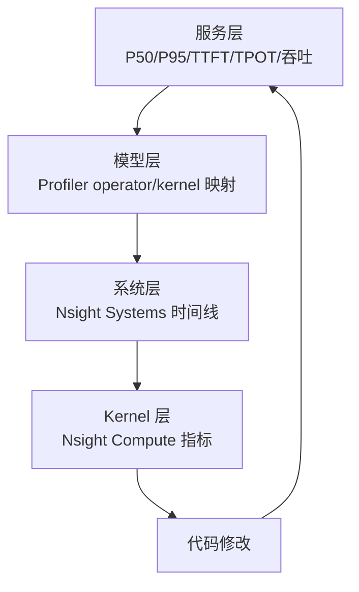

## 主教程

这类“从服务指标一路定位到 Kernel”的完整教程没有一篇官方文章可以独立覆盖。建议按顺序组合阅读：[NVIDIA LLM Benchmarking Fundamentals](https://developer.nvidia.com/blog/llm-benchmarking-fundamental-concepts/) 定义延迟、吞吐和负载；[PyTorch Profiler Recipe](https://docs.pytorch.org/tutorials/recipes/recipes/profiler_recipe.html) 找模型算子；[Understanding Overhead and Latency in Nsight Systems](https://developer.nvidia.com/blog/understanding-the-visualization-of-overhead-and-latency-in-nsight-systems/) 识别 CPU/GPU 空洞；最后用 [Using Nsight Compute to Inspect your Kernels](https://developer.nvidia.com/blog/using-nsight-compute-to-inspect-your-kernels/) 下钻热点 Kernel。

本文只补充这些资料之间缺失的连接：如何保存请求级证据、怎样决定下一层工具，以及如何把修改后的结果重新回收到端到端 SLO。

性能优化最容易失败的原因不是不会写 Kernel，而是没有把问题范围逐步缩小：看到服务延迟升高就直接改 CUDA，看到一个 Kernel 变慢就直接增加线程。一个可靠的流程应该从用户可感知的指标开始，逐层定位到模型算子、时间线和硬件计数器，修改后再回到端到端指标验证。

本文给出一条可以复用的闭环：**定义协议 → 建立基线 → Systems 找阶段 → Profiler 找算子 → Compute 找瓶颈 → 修改 → 回归**。

<!-- more -->

## 📑 目录

- [1. 先定义性能问题](#1-先定义性能问题)
- [2. 四层观测模型](#2-四层观测模型)
- [3. 固定 Benchmark 协议](#3-固定-benchmark-协议)
- [4. 从服务到 Kernel 的诊断流程](#4-从服务到-kernel-的诊断流程)
- [5. 一个可复用的计时脚本](#5-一个可复用的计时脚本)
- [6. 建立性能回归门禁](#6-建立性能回归门禁)
- [7. 典型案例：融合 Softmax 后为什么没有变快](#7-典型案例融合-softmax-后为什么没有变快)
- [8. 动手实验](#8-动手实验)
- [总结](#-总结)
- [参考资料](#-参考资料)

## 1. 先定义性能问题

“慢了”至少可能表示四件不同的事：

| 现象 | 应测的指标 |
| --- | --- |
| 单请求响应变慢 | P50/P95/P99 latency、TTFT、TPOT |
| 吞吐下降 | requests/s、tokens/s、GPU utilization |
| GPU 利用率下降 | GPU 空洞、CPU launch gap、数据拷贝、通信等待 |
| 显存不足/并发降低 | peak memory、KV Cache 使用量、allocator 碎片 |

先写出可验收的目标，例如：

```text
固定模型、GPU、输入分布和并发后，P95 TPOT 从 28 ms 降到 24 ms，
且最大显存不增加 5%，正确性误差不超过 rtol=1e-3/atol=1e-3。
```

没有这种协议，单次 `ncu` 变快也无法说明服务真的改善。

## 2. 四层观测模型



四层的职责：

1. **服务层**确认用户是否感受到收益；
2. **模型层**找到哪个算子贡献了时间；
3. **系统层**判断 GPU 是否等待 CPU、拷贝或通信；
4. **Kernel 层**解释某个热点是 Memory、Compute、Occupancy 还是同步问题。

任何一层都不能代替另一层。例如 GPU utilization 95% 不能证明延迟好，可能只是低效 Kernel 长时间占满 GPU；单个 Kernel 变快也不能证明队列和尾延迟改善。

## 3. 固定 Benchmark 协议

### 3.1 环境

记录：

- GPU 型号、数量、时钟策略；
- Driver、CUDA、PyTorch、Triton、FlashAttention 版本；
- commit、编译参数和环境变量；
- CPU、内存、NUMA 和容器镜像。

### 3.2 输入

固定或分桶记录：

- batch/concurrency；
- prompt length、generation length；
- dtype、head_dim、causal、mask；
- 随机种子和数据来源。

### 3.3 计时

- 首次编译和 warmup 不纳入稳态平均；
- CUDA Event 计 Kernel/设备时间，墙钟计端到端；
- 至少重复 30 次，报告平均、P50、P95 和 P99；
- 采集 profiler 时单独记录采集开销。

### 3.4 正确性

```python
torch.testing.assert_close(
    optimized,
    reference,
    rtol=1e-3,
    atol=1e-3,
)
assert not torch.isnan(optimized).any()
```

对 Attention、Softmax 和低精度 Kernel 还要覆盖极端值、mask 边界、空/短序列和不同 head mapping。

## 4. 从服务到 Kernel 的诊断流程

### Step 1：复现端到端问题

使用固定请求集或固定训练 step，确认延迟回归稳定存在。先排除网络、数据加载和其他租户噪声。

### Step 2：Profiler 找 operator

用 PyTorch Profiler 的 `key_averages` 和 trace，确认耗时上升来自哪个模型阶段，以及是大 Kernel 变慢还是小 Kernel 数量增多。

### Step 3：Systems 看全链路

给目标阶段加 NVTX，使用 Nsight Systems 检查：

- CPU 是否及时发起 Kernel；
- Kernel 之间是否有空隙；
- H2D/D2H 拷贝是否阻塞；
- 多 Stream、NCCL 或 CUDA Graph 是否按预期工作。

### Step 4：Compute 下钻

只对代表性热点 Kernel 采集 NCU，回答一个具体问题：

- DRAM 吞吐是否接近上限？
- Tensor Core 是否被使用？
- 寄存器/共享内存是否限制 Occupancy？
- Long Scoreboard、Barrier 或 MIO Throttle 是否突出？

### Step 5：修改并做反事实验证

一次只改变一个关键因素，例如：

- 合并访存映射；
- 规约从 shared memory 改成 Warp Shuffle；
- 融合 Scale/Mask/Softmax；
- 调整 tile、Warp 数或数据类型。

修改后要用同一协议复测，并解释指标如何变化。若只看到延迟变化而没有可解释的硬件证据，先不要合并。

## 5. 一个可复用的计时脚本

```python
import statistics
import time
import torch

def benchmark(fn, warmup=20, iters=100):
    for _ in range(warmup):
        fn()
    torch.cuda.synchronize()

    samples = []
    for _ in range(iters):
        start = torch.cuda.Event(enable_timing=True)
        end = torch.cuda.Event(enable_timing=True)
        start.record()
        fn()
        end.record()
        end.synchronize()
        samples.append(start.elapsed_time(end))

    samples.sort()
    p50 = samples[len(samples) // 2]
    p95 = samples[int(len(samples) * 0.95) - 1]
    return {
        "mean_ms": statistics.mean(samples),
        "p50_ms": p50,
        "p95_ms": p95,
        "min_ms": samples[0],
        "max_ms": samples[-1],
    }
```

对服务端请求还要把排队时间、tokenizer、网络和后处理放入墙钟测量，不能只用 Kernel Event 代表用户延迟。

## 6. 建立性能回归门禁

### 6.1 结果格式

建议每次 benchmark 输出结构化 JSON：

```json
{
  "commit": "abc123",
  "gpu": "NVIDIA A100-SXM4-80GB",
  "cuda": "12.4",
  "shape": [4096, 4096],
  "dtype": "float16",
  "reference": {"p50_ms": 1.82, "p95_ms": 1.91},
  "optimized": {"p50_ms": 1.37, "p95_ms": 1.44},
  "max_abs_error": 0.0008
}
```

### 6.2 门禁规则

门禁不要只设置一个绝对毫秒数，因为不同 GPU 和 CI 机器会有噪声。可采用：

- 正确性必须通过；
- P95 不能回退超过 5%；
- 显存峰值不能增加超过 5%；
- 对关键 Kernel，DRAM/SM 指标不能出现未解释的显著退化；
- 编译时间和缓存大小不超过项目预算。

当结果处于噪声范围时，自动重跑并报告置信区间或多次中位数，不要因为一次测量就阻断提交。

## 7. 典型案例：融合 Softmax 后为什么没有变快

假设第 5.3 节的融合版本只比三个分离 Kernel 快 2%，但 NCU 显示：

1. 寄存器从 48 增加到 128；
2. resident blocks 从 4 降到 1；
3. local store 出现；
4. DRAM bytes 的确减少，但长 scoreboard 变高。

这说明融合省了中间读写，却因为寄存器 spill 和 Occupancy 下降付出了更大代价。可尝试：

- 减小每线程保存的临时值；
- 使用 Warp Shuffle 和分块写回；
- 对短列数和长列数使用不同 Kernel；
- 让编译器/库实现处理通用 shape，只保留固定热点的特化版本。

修改后必须回到服务层，确认 P95 和吞吐真的改善，而不是只让单个 Kernel 的 DRAM bytes 变少。

## 8. 动手实验

1. 选第 5.1 的 Softmax V1/V2/V4，建立统一 benchmark 协议。
2. 用 PyTorch Profiler 找到实际调用的 Kernel。
3. 用 Nsight Systems 判断是否存在 CPU launch gap。
4. 用 Nsight Compute 对 V1 和 V4 各采集一个 launch。
5. 根据指标提出一个优化假设并修改代码。
6. 重新跑正确性、Kernel 时间、端到端时间和显存峰值。
7. 生成 JSON 结果，模拟一次性能回归检查。

## 总结

- 性能诊断应从服务指标逐层收敛到 Kernel，而不是直接猜 CUDA 优化。
- Benchmark 协议必须固定环境、shape、dtype、warmup、同步和正确性容差。
- Systems 负责找时间线问题，Profiler 负责算子映射，Compute 负责硬件瓶颈。
- 一次只改变一个关键因素，并用指标解释收益或回退。
- 最终优化结果要回到端到端 P95、吞吐、显存和正确性，而不是停留在单个 Kernel 报告。

## 参考资料

- [NVIDIA Nsight Systems User Guide](https://docs.nvidia.com/nsight-systems/UserGuide/index.html)
- [NVIDIA Nsight Compute Profiling Guide](https://docs.nvidia.com/nsight-compute/ProfilingGuide/index.html)
- [PyTorch Profiler Recipe](https://pytorch.org/tutorials/recipes/recipes/profiler_recipe.html)
- [CUDA Best Practices：Performance Metrics](https://docs.nvidia.com/cuda/cuda-c-best-practices-guide/index.html#performance-metrics)
- [NVIDIA NVTX Documentation](https://nvidia.github.io/NVTX/)
