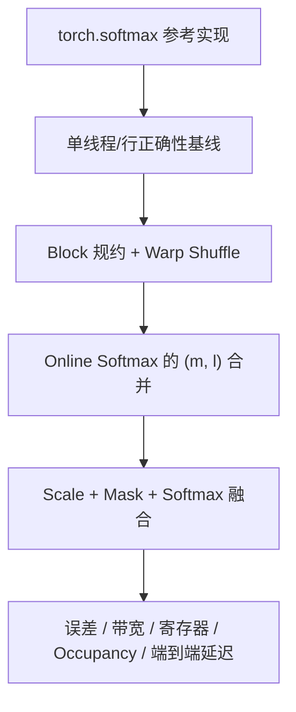

## 本章简介

Softmax 是 Transformer 中最关键的非线性操作之一，也是理解 FlashAttention 的前置知识。本章按“正确性 → 规约 → 扫描次数 → 融合 → 验证”的顺序，把一个看似简单的算子拆成可以测量和优化的 CUDA Kernel。

## 外部教程优先

| 学习目标 | 推荐教程 | 本章补什么 |
| --- | --- | --- |
| 先看完整 Softmax Kernel | [Triton Fused Softmax Tutorial](https://triton-lang.org/main/getting-started/tutorials/02-fused-softmax.html) | 对照到 CUDA Thread/Warp 写法 |
| 理解 Online Softmax | [Lei Mao：Online Safe Softmax](https://leimao.github.io/blog/Online-Safe-Softmax/) | 补 `(m,l)` 合并和 CUDA 规约 |
| 判断是否值得融合 | [Making Deep Learning Go Brrrr](https://horace.io/brrr_intro.html) | 补 `scale + mask + softmax` 实测 |
| 理解访存优化 | [CUDA Best Practices：Memory Optimizations](https://docs.nvidia.com/cuda/cuda-c-best-practices-guide/index.html#memory-optimizations) | 补可运行实验和 Nsight 证据 |

## 学习路径

| 小节 | 你会解决的问题 | 建议产出 |
| --- | --- | --- |
| [5.1 CUDA Softmax 朴素实现优化](./51-cuda-softmax朴素实现优化) | Safe Softmax、Block/Warp 规约和向量化访存怎样逐步优化？ | 朴素、Warp Shuffle、两遍融合四个版本 |
| [5.2 CUDA Online Softmax 实现](./52-cuda-online-softmax实现) | 如何合并 max 与 sum，为什么最终输出通常仍需再次读取？ | `(m, l)` 合并规约 Kernel |
| [5.3 CUDA 算子融合实战](./53-cuda算子融合实战) | Scale、Mask、Softmax 为什么适合融合？融合后为什么可能变慢？ | 融合 Kernel、误差和带宽报告 |

## 本章的核心判断

1. 先用减最大值保证数值稳定，再讨论性能；
2. Softmax 的主要成本通常是内存访问，不是加法本身；
3. Online Softmax 合并的是统计量，不应把“统计量一遍扫描”误写成“输出也只读一遍”；
4. 算子融合减少中间张量读写和 Kernel launch，但可能增加寄存器压力、分支和维护成本；
5. 最终用 PyTorch 参考实现、CUDA Event、Nsight Systems 和 Nsight Compute 逐层验证。

## 动手实验顺序

建议记录 GPU、CUDA、dtype、输入形状、warmup、重复次数和 commit。不要把某一台机器上的带宽百分比当成所有 GPU 都能复现的结论。

## 章节完成标准

- 能解释 FP16/FP32 Softmax 为什么会溢出，以及减最大值为何保持数学等价；
- 能用 Warp Shuffle 完成 max/sum 两级规约，并正确处理部分 Warp；
- 能推导 Online Softmax 的 `(m, l)` 合并公式；
- 能写出一个带 causal mask 的融合 Softmax，并用 PyTorch 参考实现校验；
- 能用 Nsight Compute 解释融合后寄存器、带宽和 Occupancy 的变化。

## 参考资料

- [Online normalizer calculation for softmax](https://arxiv.org/abs/1805.02867)
- [CUDA C++ Programming Guide](https://docs.nvidia.com/cuda/cuda-programming-guide/index.html)
- [CUDA Best Practices：Memory Optimizations](https://docs.nvidia.com/cuda/cuda-c-best-practices-guide/index.html#memory-optimizations)
- [Triton Fused Softmax Tutorial](https://triton-lang.org/main/getting-started/tutorials/02-fused-softmax.html)
