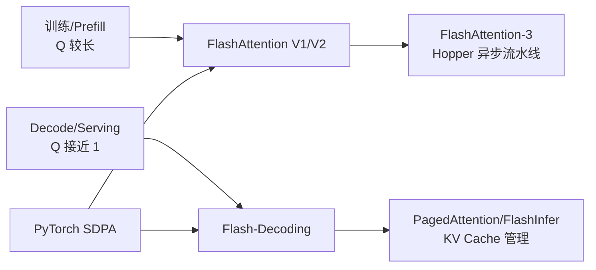

## 本章简介

Attention 是 Transformer 的核心计算，也是 AI Infra 优化的重中之重。本章先用标准 Attention 和 PyTorch SDPA 建立基线，再沿着“训练/Prefill → Hopper 特化 → Decode/Serving”的顺序理解 FlashAttention 和 KV Cache。

## 学习路径

| 小节 | 重点 | 建议产出 |
| --- | --- | --- |
| [6.1 FlashAttention V1](./61-flashattention-v1详解) | IO-aware、Tiling、Online Softmax、反向重计算 | 手算一个小 tile，并实现简化前向 |
| [6.2 FlashAttention V2](./62-flashattention-v2详解) | Q 维度并行、循环顺序、Causal block skip | 对比 V1/V2 的并行划分 |
| [6.3 FlashAttention-3 与 Hopper](./63-flashattention-v3与hopper优化) | TMA、WGMMA、Warp Specialization、FP8 | 在 H100 上跑官方 benchmark |
| [6.4 Flash-Decoding 与 PagedAttention](./64-flash-decoding与pagedattention) | KV 维度切分、局部统计量合并、Block Table | 验证分页地址和分片归约 |
| [6.5 PyTorch SDPA 后端选择](./65-pytorch-sdpa后端选择) | Flash/Memory-Efficient/Math backend 与正确性基线 | 记录不同 shape 的实际后端 |

## 两条必须分开的线

- **训练/Prefill**关注完整 Q tile、IO 复杂度和反向重计算；
- **Decode/Serving**关注单 Query 并行度、KV Cache 布局、请求长度变化和显存复用。

FlashAttention-3 是 Hopper 优化路径，不能把 A100 上的 V1/V2 数据直接外推到 H100。PagedAttention 解决的是 Serving 的 KV Cache 分页访问，也不能和训练阶段的 FlashAttention 混为一个问题。

## 动手实验顺序

1. 用小矩阵实现 `QK^T → scale/mask → softmax → PV`，保存中间张量作为参考。
2. 用 SDPA 对齐参考结果，记录实际 backend 和显存。
3. 用 Triton 复现一个小尺寸 FlashAttention 前向，检查 Online Softmax 合并。
4. 在 A100 上比较 V1/V2；在 H100 上再验证 V3 的 TMA/WGMMA 路径。
5. 用长度为 1 的 Query 测试 Flash-Decoding 分片和局部 `(m, l, o)` 归约。
6. 用乱序 Block Table 验证 PagedAttention 的逻辑到物理映射。

## 复杂度表述

FlashAttention 不应简单宣传为“把 Attention 从 `O(N²)` 变成 `O(N)`”。它仍然计算精确 Attention，主要减少的是中间矩阵的 HBM 读写和显存占用；准确的 IO 复杂度取决于片上存储容量、tile 大小、前向/反向和硬件假设。阅读时以 V1/V2 论文中的公式和假设为准。

## 章节完成标准

- 能解释标准 Attention 中间矩阵为什么造成显存和 IO 压力；
- 能推导 Online Softmax 在 tile 之间如何修正 `m/l/O`；
- 能说清 V1、V2、V3 优化的对象分别是什么；
- 能区分 Prefill Attention、Decode Attention 和 Paged KV Cache；
- 能用 SDPA 作为基线，使用 profiler 确认实际 Kernel 路径和性能。

## 参考资料

- [FlashAttention V1](https://arxiv.org/abs/2205.14135)
- [FlashAttention V2](https://arxiv.org/abs/2307.08691)
- [FlashAttention-3](https://arxiv.org/abs/2407.08691)
- [PyTorch scaled_dot_product_attention](https://docs.pytorch.org/docs/stable/generated/torch.nn.functional.scaled_dot_product_attention.html)
- [vLLM PagedAttention Design](https://docs.vllm.ai/en/stable/design/paged_attention/)
