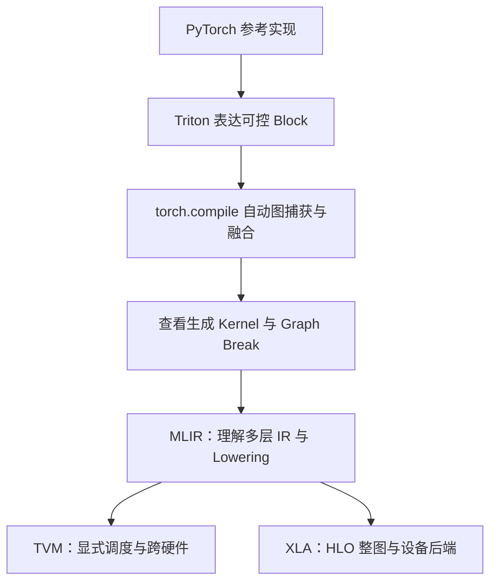

## 本章简介

手写 CUDA Kernel 可以获得很高的性能上限，但开发、调试和跨硬件维护成本也很高。AI 编译器通过更高层的抽象，把图捕获、算子融合、Tile 调度和代码生成的一部分交给编译器。本章从一个 Triton Kernel 开始，继续观察 `torch.compile` 的 Graph Break，最后建立 MLIR、TVM、XLA 的选型视角。

## 外部教程优先

| 学习目标 | 推荐教程 | 本章补什么 |
| --- | --- | --- |
| 写第一个 Triton Kernel | [Vector Addition](https://triton-lang.org/main/getting-started/tutorials/01-vector-add.html) → [Fused Softmax](https://triton-lang.org/main/getting-started/tutorials/02-fused-softmax.html) | 补 CUDA/Triton 对照与错误案例 |
| 学会 `torch.compile` | [PyTorch torch.compile Tutorial](https://pytorch.org/tutorials/intermediate/torch_compile_tutorial.html) | 补 Graph Break、稳态性能和日志 |
| 理解 MLIR | [MLIR Toy Tutorial](https://mlir.llvm.org/docs/Tutorials/Toy/) | 补多层 IR 的阅读方法 |
| 学习 TVM TensorIR | [TensorIR Creation](https://tvm.apache.org/docs/deep_dive/tensor_ir/tutorials/tir_creation.html) → [Transformation](https://tvm.apache.org/docs/deep_dive/tensor_ir/tutorials/tir_transformation.html) | 补调度验证与实验记录 |
| 理解 XLA/StableHLO | [JAX JIT](https://docs.jax.dev/en/latest/jit-compilation.html) → [AOT lowering](https://docs.jax.dev/en/latest/aot.html) | 补 IR 观察与后端边界 |

## 学习路径

| 小节 | 你会解决的问题 | 建议产出 |
| --- | --- | --- |
| [7.1 Triton 编程模型与 Fused Softmax](./71-triton编程模型与fused-softmax) | CUDA Thread 思维如何转为 Block-level program？ | 向量加法、Fused Softmax、shape autotune |
| [7.2 torch.compile 与 Inductor](./72-torchcompile与inductor实战) | 图捕获、融合、Graph Break 和编译缓存怎样观察？ | eager/compiled 对比与 break 日志 |
| [7.3 MLIR：多层 IR 与 Lowering](./73-mlir多层ir与lowering) | Dialect、Pass、Rewrite、Conversion 怎样协作？ | 跑通 Toy 并保存每层 IR |
| [7.4 TVM TensorIR 调度](./74-tvm-tensorir调度) | 计算定义怎样变成目标硬件 schedule？ | 逐步记录 split/bind/cache 变换 |
| [7.5 XLA 与 StableHLO](./75-xla与stablehlo) | JAX 程序怎样进入 HLO 并生成 executable？ | 对比 jaxpr、lowered IR 与 profiler |

## 编译器学习的固定顺序

本章不把“编译成功”当成“性能更好”。每个实验都要同时记录正确性、首次编译时间、稳态延迟、Kernel 数、显存流量和 shape 变化时的重新编译。

## 章节完成标准

- 能用 Triton 写一个带 mask 的逐元素或 Softmax Kernel；
- 能解释 `program_id`、`tl.arange`、`tl.load/store` 和 `num_warps` 的含义；
- 能用 `TORCH_LOGS="graph_breaks,recompiles"` 定位编译图中断；
- 能沿 MLIR Toy 解释 Dialect、Rewrite、Conversion 和逐层 Lowering；
- 能在 TensorIR 中区分计算定义、Block 和目标硬件 schedule；
- 能区分 JAX tracing、StableHLO/HLO 与最终 executable；
- 能根据硬件、shape、部署生态和维护成本做出可解释的工具选择。

## 参考资料

- [Triton 官方 Tutorials](https://triton-lang.org/main/getting-started/tutorials/)
- [PyTorch torch.compiler](https://docs.pytorch.org/docs/stable/torch.compiler.html)
- [MLIR 官方文档](https://mlir.llvm.org/docs/)
- [Apache TVM 官方文档](https://tvm.apache.org/docs/)
- [OpenXLA / XLA](https://openxla.org/xla)
