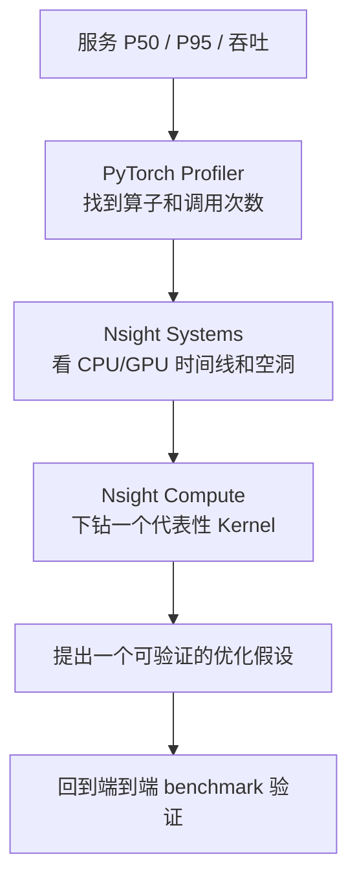

## 本章简介

优化的前提是精准诊断——不会用 Profiler 的优化都是盲猜。本章把 PyTorch Profiler、Nsight Systems 和 Nsight Compute 串成一条从服务指标到 Kernel 指标的闭环。

## 外部教程优先

| 学习目标 | 推荐教程 | 本章补什么 |
| --- | --- | --- |
| 第一次看系统时间线 | [NVIDIA：Understanding Overhead and Latency](https://developer.nvidia.com/blog/understanding-the-visualization-of-overhead-and-latency-in-nsight-systems/) | 补 GPU 空洞分类和 CLI 实验 |
| 第一次分析单个 Kernel | [NVIDIA：Inspect your Kernels](https://developer.nvidia.com/blog/using-nsight-compute-to-inspect-your-kernels/) | 补最小指标集和判断流程 |
| 从模型算子开始定位 | [PyTorch Profiler Recipe](https://docs.pytorch.org/tutorials/recipes/recipes/profiler_recipe.html) | 补到 Nsight 的证据衔接 |
| 跟随视频练习 Nsight | [CUDA Developer Tools Tutorial Center](https://developer.nvidia.com/tools-tutorials) | 补完整诊断闭环与回归门禁 |

## 学习路径

| 小节 | 先回答什么问题 | 建议产出 |
| --- | --- | --- |
| [8.1 Nsight Systems](./81-nsight-systems系统级分析) | CPU、GPU、拷贝、通信和 Kernel 在时间线上如何交错？ | 一份带 NVTX 的 `.nsys-rep` |
| [8.2 Nsight Compute](./82-nsight-compute-kernel级分析) | 某个 Kernel 是 Memory、Compute、Occupancy 还是同步瓶颈？ | 一份可解释的 `.ncu-rep` |
| [8.3 PyTorch Profiler](./83-pytorch-profiler与tensorboard) | 哪个模型算子触发了热点 Kernel？ | `key_averages` 和 TensorBoard trace |
| [8.4 诊断闭环](./84-从服务指标到kernel的诊断闭环) | 修改后端到端指标是否真的改善？ | 固定协议、JSON 结果和回归门禁 |

## 固定的诊断顺序

### 三个工具的边界

- Systems 负责宏观时序，不负责逐指令解释；
- Compute 负责单 Kernel 硬件计数器，不负责判断哪个服务请求最慢；
- PyTorch Profiler 负责 operator 到 Kernel 的映射，不应替代高并发压测。

## 动手实验顺序

1. 在 `sshdh` 上固定 GPU、CUDA、PyTorch、shape、dtype 和 commit。
2. 用 CUDA Event 和端到端墙钟建立基线，先做正确性校验。
3. 用 PyTorch Profiler 选出耗时最高且形状代表性的 Kernel。
4. 用 Nsight Systems 找 GPU idle gap、拷贝、同步和通信等待。
5. 用 Nsight Compute 对一个 Kernel 采集基础 section，再根据问题选择 Memory/SOL/Occupancy/Source。
6. 修改一个因素后复测 P50/P95、显存、Kernel 指标和数值误差。

## 章节完成标准

- 能用 NVTX 把业务阶段标到 Systems 时间线；
- 能从 Profiler 表格找到算子调用次数和 CUDA 时间；
- 能区分 Memory Bound、Compute Bound、低 Occupancy 和 launch gap；
- 能解释至少一种 Warp Stall 与代码结构的关系；
- 能把一次优化写成可复现 benchmark，并设置性能回归门禁。

## 参考资料

- [Nsight Systems User Guide](https://docs.nvidia.com/nsight-systems/UserGuide/index.html)
- [Nsight Compute Profiling Guide](https://docs.nvidia.com/nsight-compute/ProfilingGuide/index.html)
- [PyTorch Profiler Recipe](https://docs.pytorch.org/tutorials/recipes/recipes/profiler_recipe.html)
- [CUDA Best Practices：Performance Metrics](https://docs.nvidia.com/cuda/cuda-c-best-practices-guide/index.html#performance-metrics)
