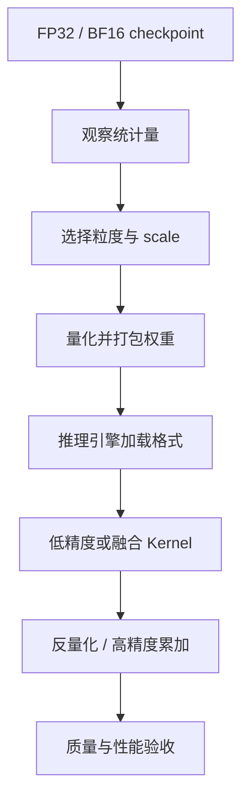
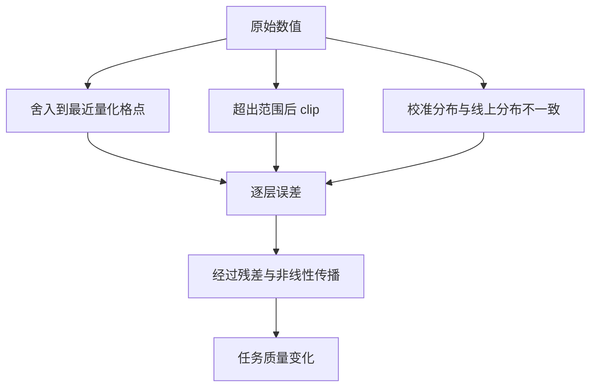
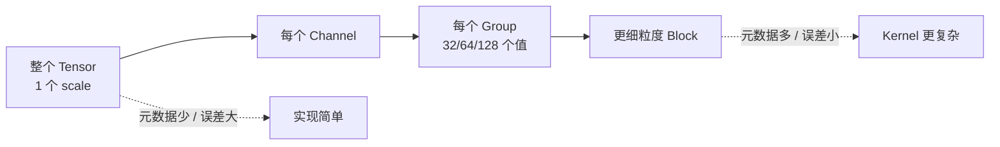

量化的目标不是单纯缩小文件，而是在允许的质量损失内，让权重、激活或缓存使用更少的存储和内存带宽，并尽可能命中硬件的低精度计算单元。

要判断一种量化方案是否有效，必须同时回答三个问题：数值怎样映射、误差怎样控制、运行时是否有匹配的 Kernel。

## 1. 量化在推理链路中的位置



离线工具决定权重怎样分组、scale 如何保存；推理引擎决定格式是否能加载；Kernel 决定低比特数据是否真的减少访存和计算。三者缺一不可。

例如，一个 INT4 checkpoint 如果在运行时先完整还原为 FP16，再调用普通 GEMM，可能减少磁盘大小，却不会获得预期的显存带宽收益。

## 2. 均匀量化的基本公式

### 2.1 对称量化

对浮点值 $x$ 进行 $b$ bit 对称量化，整数范围通常写成：

$$
q_{min}=-(2^{b-1}-1),\qquad q_{max}=2^{b-1}-1
$$

由张量绝对值最大值确定 scale：

$$
s=\frac{\max |x|}{q_{max}}
$$

量化与反量化为：

$$
q=\operatorname{clip}\left(\operatorname{round}\left(\frac{x}{s}\right),q_{min},q_{max}\right),
\qquad \hat{x}=s q
$$

对称量化的零点固定为 0，数据格式和 Kernel 较简单，常用于分布接近零对称的权重。

### 2.2 非对称量化

当数据范围明显偏向一侧时，可以引入 zero-point $z$：

$$
s=\frac{x_{max}-x_{min}}{q_{max}-q_{min}},\qquad
z=\operatorname{round}\left(q_{min}-\frac{x_{min}}{s}\right)
$$

$$
q=\operatorname{clip}(\operatorname{round}(x/s)+z,q_{min},q_{max}),
\qquad \hat{x}=s(q-z)
$$

非对称量化能更充分利用整数区间，但 zero-point 会增加元数据和计算路径复杂度。某些高性能 weight-only Kernel 只支持对称格式，因此“理论误差更小”不一定意味着端到端更好。

## 3. 误差从哪里来



如果 scale 覆盖范围过大，多数普通值只占少量量化格点，舍入误差上升；范围过小又会裁掉 outlier。校准本质上是在这两种误差之间做权衡。

| 范围估计 | 思路 | 适用情况 | 风险 |
|---|---|---|---|
| Min-Max | 覆盖全部观测范围 | 分布稳定、outlier 少 | 对极端值敏感 |
| Percentile | 丢弃极少比例尾部 | 激活有少量尖峰 | 阈值需要验证 |
| MSE | 搜索最小重建误差 | PTQ 校准 | MSE 不等于任务质量 |
| KL Divergence | 匹配量化前后分布 | 分类模型常见 | 对 LLM 未必最优 |

## 4. 量化粒度



| 粒度 | 常见对象 | 优点 | 代价 |
|---|---|---|---|
| Per-tensor | 简单激活量化 | 元数据最少 | 对通道 outlier 敏感 |
| Per-channel | Linear/Conv 权重 | 降低通道间范围差异 | 需要匹配布局与广播 |
| Per-token | 动态激活 | 每个 token 自适应 | 在线计算 scale |
| Per-group | INT4 权重 | 精度与开销平衡 | group size 影响兼容性 |
| Per-block | FP8/FP4 | 适合硬件块浮点 | 依赖新硬件与专用 Kernel |

不要只写“INT4”。完整格式至少还包括对称或非对称、group size、scale 类型、zero-point、权重排列和累加精度。

## 5. 静态与动态量化

**静态量化**在校准阶段确定 scale，推理时直接使用。它减少在线开销，但依赖校准分布能代表生产流量。

**动态量化**在推理时根据当前 token 或 tensor 计算 scale。它更能适应输入变化，却会引入 reduction、同步和额外 Kernel。

对 LLM 的 W8A8，常见组合是权重使用离线 per-channel scale，激活使用在线 per-token scale。是否值得取决于矩阵规模和低精度 GEMM 节省的时间能否覆盖量化开销。

## 6. PTQ 与 QAT

### 6.1 PTQ：训练后量化

PTQ 不修改或只轻微更新原模型参数，通过校准和离线优化生成量化模型。SmoothQuant、GPTQ、AWQ 都属于这一大类。

校准集至少要覆盖语言与领域比例、Prompt 长度、代码/数学/JSON 等特殊格式、System Prompt 和真实模板。几十条随手 Prompt 可以做冒烟测试，不能代表生产质量。

### 6.2 QAT：量化感知训练

QAT 在训练前向中插入 fake quantization，让模型看到舍入和截断误差；反向传播通常使用 Straight-Through Estimator 近似不可导的 round 操作。

QAT 更适合极低 bit、对质量敏感或 PTQ 无法满足门槛的模型。训练使用的伪量化规则必须与实际 Kernel 一致，否则模型适应的是另一种误差。

## 7. 显存账本

对 $N$ 个参数、每个参数 $b$ bit 的权重，本体大小为：

$$
M_{weight}=\frac{N\times b}{8}
$$

实际占用还要增加 scale、zero-point、padding、张量对齐、未量化层、KV Cache、激活、CUDA Graph 和运行时工作区。

| 7B 模型格式 | 权重本体理论值 | 典型额外项 |
|---|---:|---|
| FP16/BF16 | 14 GB | 对齐和未共享权重 |
| INT8 | 7 GB | scale、可能的 FP16 层 |
| INT4 | 3.5 GB | group scale、zero-point、padding |

因此看到一个 4 GB 的 INT4 文件，不能推断服务只需 4 GB GPU 显存。

## 8. 为什么低 bit 可能更慢

1. 每次 GEMM 前单独启动反量化 Kernel；
2. 小矩阵无法填满 Tensor Core；
3. scale 读取和格式转换抵消带宽收益；
4. 目标 GPU 没有对应低精度指令；
5. 框架回退到通用实现；
6. 权重变小后，瓶颈转移到 KV Cache 或调度器。

## 9. 最小校准与验证记录

```python
from dataclasses import dataclass

@dataclass
class QuantRun:
    model_id: str
    quant_format: str
    calibration_hash: str
    engine_version: str
    gpu: str
    ttft_p50_ms: float
    tpot_p50_ms: float
    peak_memory_gb: float
    quality_score: float
```

验证时固定输入集、随机种子、采样参数、并发和输出长度。先保存 FP16/BF16 基线，再比较关键层误差、任务质量、端到端延迟和实际 Kernel。

## 10. 常见误区

- 把模型文件大小当作峰值显存。
- 只测 perplexity，不测业务任务和长输出。
- 只报告 throughput，不报告 TTFT/TPOT 和质量。
- 忽略 tokenizer、chat template 和校准预处理差异。
- 认为相同的 `INT4` 标签代表相同二进制格式。
- 在一种 GPU 上得到收益，就直接外推到所有硬件。

## 小结

量化是一套端到端协议：数值映射定义误差，粒度和校准控制误差，格式和 Kernel 决定性能。后续各节会把这套框架分别应用到激活、权重、KV Cache 和新型浮点格式。

## 阅读路线

- **主教程**：[Hugging Face：Introduction to Quantization](https://huggingface.co/blog/merve/quantization)。从数值表示、scale 讲到 PTQ/QAT 与常见工具，有图和代码，适合第一次学习。
- **官方核对**：[torchao 第一个量化示例](https://docs.pytorch.org/ao/stable/eager_tutorials/first_quantization_example.html) 与 [vLLM Quantization](https://docs.vllm.ai/en/latest/features/quantization/)，用于确认当前 API、格式和硬件支持。
- **深入阅读**：[A White Paper on Neural Network Quantization](https://arxiv.org/abs/2106.08295) 与 [LLM.int8()](https://arxiv.org/abs/2208.07339)，用于追溯误差与离群值方法。
