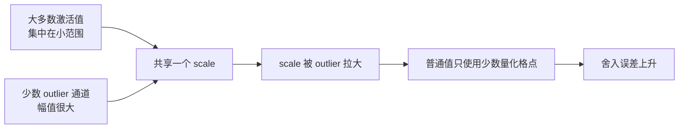
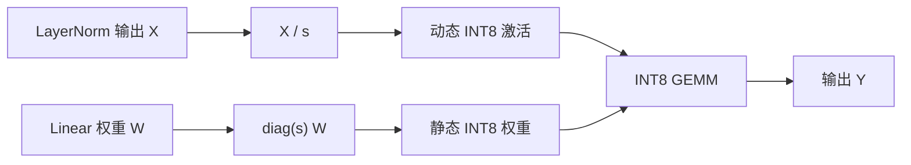
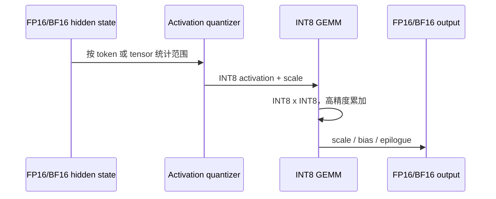

W8A8 表示权重和激活都以 8 bit 表示，并在低精度矩阵乘中计算。与 weight-only 相比，它不仅减少权重读取，还降低激活带宽并能使用 INT8 Tensor Core；难点是 Transformer 激活中的通道级离群值。

## 1. 为什么激活难以量化

权重在离线阶段固定，可以逐通道统计并预先转换布局。激活由输入动态产生，不同 token、层和通道的范围差异很大。



直接裁掉 outlier 可能损害质量；完整覆盖它们又会让普通值的有效精度不足。SmoothQuant 不删除 outlier，而是把动态范围迁移到更容易做细粒度量化的权重上。

## 2. SmoothQuant 的核心直觉

<figure id="smoothquant-intuition" class="source-figure">
  
  <figcaption>SmoothQuant 官方示意：原始激活中的少数 outlier 迫使共享 scale 覆盖很大的范围；平滑后，激活范围收缩，量化难度被迁移到可按通道处理的权重侧。<a href="https://github.com/mit-han-lab/smoothquant/blob/c61476d728e42ae0d8a35e7e78494edcac3237b5/figures/intuition.png">图源</a>（MIT License）</figcaption>
</figure>

对线性层 $Y=XW$，引入正的通道缩放向量 $s$：

$$
Y=XW=(X\operatorname{diag}(s)^{-1})(\operatorname{diag}(s)W)
$$

激活第 $j$ 个通道除以 $s_j$，权重对应输入通道乘以 $s_j$，乘积保持不变。常用构造为：

$$
s_j=\frac{\max(|X_j|)^\alpha}{\max(|W_j|)^{1-\alpha}}
$$

$\alpha\in[0,1]$ 控制量化难度迁移程度：

- $\alpha$ 较小：更多范围留在激活侧；
- $\alpha$ 较大：激活更平滑，但权重通道范围扩大；
- 最优值与模型、层和校准数据有关，论文常用值不是固定答案。

## 3. 等价变换怎样折叠



部署时通常不保留显式除法。对于 LayerNorm 后的 Linear，可以把激活缩放折叠到前一层参数或图变换中，把权重缩放离线写入权重。这样 Runtime 只看到已经平滑的图。

折叠是否成立取决于拓扑。残差分支、并行 QKV、门控 FFN 和共享输入需要一致处理 scale，不能机械地只改一个矩阵。

## 4. W8A8 的运行时数据路径



真正的性能关键是 epilogue 是否融合。理想路径会把 scale、bias、激活函数甚至后续转换合并到一个 Kernel；如果每一步单独启动 Kernel，Decode 小矩阵下开销会非常明显。

## 5. 校准流程

### 5.1 准备代表性数据

校准样本不需要标签，但必须代表线上激活分布。至少记录 tokenizer 和 chat template、语言与领域比例、Prompt 长度、代码/公式/JSON/工具调用比例、随机种子和数据哈希。

### 5.2 收集通道统计量

对待量化 Linear 的输入按通道收集绝对值最大值或稳健百分位数。不要把 Padding token 或预处理错误混入统计。

```python
import torch

@torch.no_grad()
def update_absmax(current: torch.Tensor | None, x: torch.Tensor) -> torch.Tensor:
    channel_max = x.detach().abs().reshape(-1, x.shape[-1]).amax(dim=0)
    return channel_max if current is None else torch.maximum(current, channel_max)
```

示例只展示统计思路。真实工具还要处理张量并行分片、共享层、MoE expert、设备同步和内存释放。

### 5.3 搜索平滑参数

不要只用单层重建 MSE 选 $\alpha$。稳妥流程是先缩小候选范围，再用端到端任务质量决定。可以为不同模块设置不同 $\alpha$，但会增加校准和格式复杂度。

## 6. 静态与动态激活 scale

| 方案 | scale 来源 | 优点 | 代价 |
|---|---|---|---|
| 静态 per-tensor | 校准集预先确定 | 运行时开销最低 | 分布漂移风险高 |
| 静态 per-channel | 校准集按通道确定 | 精度较好 | Kernel 支持受限 |
| 动态 per-token | 每个 token 在线统计 | 适应输入变化 | 多一次 reduction/量化 |
| 动态 per-tensor | 每次算子在线统计 | 实现较通用 | 极端 token 仍主导 scale |

对低并发 Decode，在线统计的固定开销更难摊薄；对大 batch Prefill，INT8 GEMM 的吞吐收益更容易覆盖量化成本。同一模型的两个阶段可能需要不同策略。

## 7. 硬件与 Kernel 条件

W8A8 能否加速主要取决于：

1. GPU 是否有高效 INT8 Tensor Core；
2. 输入维度是否满足对齐要求；
3. 推理引擎是否识别 checkpoint 格式；
4. 是否存在当前形状的 fused GEMM；
5. 累加和输出 dtype 是否符合精度需求；
6. Tensor Parallel 下 scale 是否需要额外通信。

同一个模型在不同 GPU 上可能分别命中 Tensor Core、走次优 Kernel 或完全回退。日志中“成功加载”不足以证明低精度路径已启用。

## 8. 三层质量验证

### 8.1 数值层

- 比较关键层输出的 cosine similarity、最大绝对误差和 MSE；
- 定位第一个误差显著扩大的层；
- 检查 embedding、lm_head 和 LayerNorm 是否保持高精度。

### 8.2 模型层

- 固定文本集比较 perplexity；
- 同时覆盖短输入和长输入；
- 检查 greedy decoding 是否出现重复、空输出或格式损坏。

### 8.3 任务层

- 代码模型运行单元测试；
- 结构化输出验证 JSON Schema；
- RAG 检查引用正确率；
- 工具调用检查函数名和参数；
- 业务任务使用明确的允许回归阈值。

## 9. 性能实验矩阵

| 变量 | 建议取值 |
|---|---|
| Prompt 长度 | 128、1K、8K 或真实分位数 |
| 输出长度 | 32、256、1K |
| 并发 | 1、目标 P50、目标峰值 |
| 指标 | TTFT、TPOT、吞吐、P95/P99、峰值显存 |
| 质量 | 至少一个模型级和一个任务级指标 |

如果量化后能容纳更大 batch，应分别报告“相同 batch 的速度”和“最大 SLO 内吞吐”，不要把容量收益伪装成单请求延迟收益。

## 10. 失败模式与排查

### 10.1 质量突然下降

按顺序检查校准预处理、chat template、异常层、$\alpha$、激活 scale 策略，以及是否错误量化 embedding/lm_head。

### 10.2 显存下降但速度不变

查看 profiler 是否命中 INT8 GEMM，检查 batch/shape 是否太小，以及量化与反量化是否为独立 Kernel。

### 10.3 Prefill 加速、Decode 变慢

这是合理现象：Prefill 矩阵大、计算密集；Decode 矩阵小，更容易受 Kernel launch、scale reduction 和调度开销影响。应分别报告两阶段指标。

### 10.4 多卡结果异常

确认每个 TP rank 的权重分片、scale 分片和布局一致，检查量化工具生成格式与推理引擎的并行加载约定。

## 11. 何时选择 W8A8

适合有成熟 INT8 Tensor Core 与 Kernel、需要同时减少权重和激活带宽、Prefill 或大 batch 占主要成本，并且质量门槛高于 INT4 weight-only 的场景。

如果是低并发小模型、Runtime 只有通用反量化路径、校准数据无法覆盖真实流量，或主要显存瓶颈已经是 KV Cache，则不应因为“8 bit”标签直接选择 W8A8。

## 小结

SmoothQuant 用数学等价变换把激活 outlier 的量化难度迁移到权重侧，为 W8A8 提供了可部署路径。上线仍需把校准、格式、Kernel 和负载一起验证；“模型已转 INT8”只是中间状态。

## 阅读路线

- **主教程**：[MIT HAN Lab：SmoothQuant 视频讲解](https://www.youtube.com/watch?v=U0yvqjdMfr0)。作者用图解释 activation outlier 与量化难度迁移，约 10 分钟。
- **官方核对**：[SmoothQuant Repository](https://github.com/mit-han-lab/smoothquant)、[TensorRT-LLM Precision](https://nvidia.github.io/TensorRT-LLM/reference/precision.html) 与 [vLLM Quantization](https://docs.vllm.ai/en/latest/features/quantization/)。
- **深入阅读**：[SmoothQuant Paper](https://arxiv.org/abs/2211.10438)，用于查看等价变换、校准与原实验。
