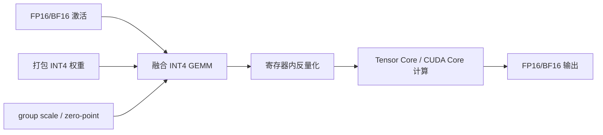
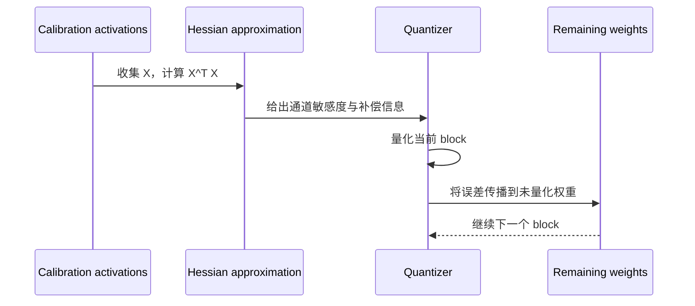
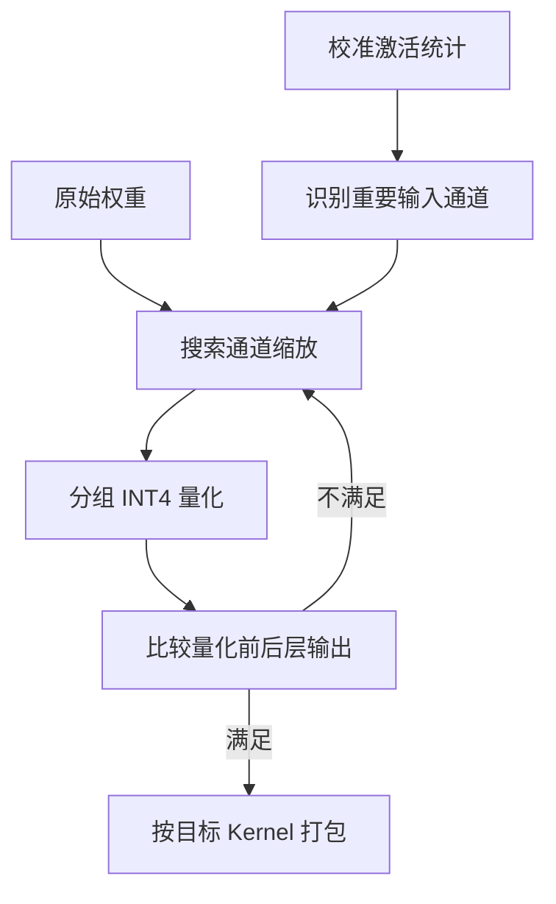
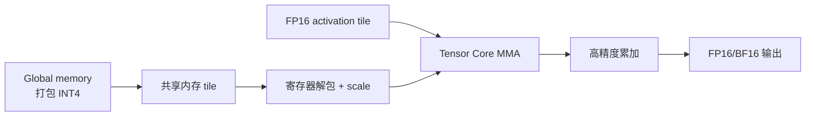

Weight-only 量化只压缩权重，激活仍使用 FP16/BF16。它特别适合 Decode 阶段：每生成一个 token 都要读取大量权重，而矩阵规模又常常不足以进入纯计算受限区，减少权重带宽可以直接改善 TPOT。

## 1. Weight-only 的执行路径

高效实现不会先把整层权重还原为 FP16。INT4 权重被打包存储，Kernel 在寄存器或共享内存中按 tile 解包、应用 scale，并与矩阵乘融合。

## 2. 分组格式与真实大小

若每 $g$ 个权重共享一个 scale，参数量为 $N$，权重本体占用：

$$
M_q=\frac{4N}{8}=\frac{N}{2}\ \text{bytes}
$$

假设 scale 使用 FP16，每组还需要 2 bytes：

$$
M_s=\frac{N}{g}\times 2
$$

若使用非对称量化，还要加 zero-point。实际 checkpoint 还包含 padding、tensor metadata 和未量化层。

| group size | scale 开销 | 误差 | Kernel/格式约束 |
|---:|---|---|---|
| 32 | 高 | 通常较低 | 元数据和访存更多 |
| 64 | 中高 | 较低 | 部分格式常用 |
| 128 | 中 | 常见平衡点 | AWQ/GPTQ 常见 |
| 256+ | 低 | 更容易受 outlier 影响 | 并非所有模型可接受 |

group size 不是独立超参数。它必须与 checkpoint 的排列方式和推理 Kernel 支持一致。

## 3. GPTQ：用二阶信息补偿误差

GPTQ 逐层量化权重，目标是最小化该层输出重建误差。对线性层输入样本 $X$ 和权重 $W$，可以把目标写成：

$$
\min_{\hat{W}} \|XW-X\hat{W}\|_2^2
$$

输入相关的 Hessian 近似为：

$$
H\approx 2X^TX
$$

GPTQ 在量化部分权重后，利用逆 Hessian 信息更新尚未量化的权重，补偿已经引入的输出误差。

### 3.1 act-order 与 dampening

`act-order` 根据输入激活重要性调整量化顺序，常能改善质量，但可能改变权重布局与 Kernel 兼容性。dampening 用于稳定 Hessian 逆或 Cholesky 分解，过小可能数值不稳定，过大则削弱二阶补偿。

### 3.2 GPTQ 的优势与风险

优势是算法成熟、模型仓库丰富、4-bit 质量通常较好。风险包括校准耗时、对数据和超参数敏感，以及不同工具产生的“GPTQ”格式并不一定二进制兼容。

## 4. AWQ：保护激活感知的重要权重

AWQ 的观察是：只有少量权重通道对输出误差格外重要，这种重要性可以从激活幅值中识别。与显式保留稀疏 FP16 权重相比，AWQ 通过等价缩放保护重要通道，更容易保持规则、硬件友好的 INT4 布局。

AWQ 的“activation-aware”并不意味着激活也被量化。激活只用于确定哪些权重需要保护，运行时依然是 INT4 weight + FP16/BF16 activation。

## 5. GPTQ 与 AWQ 如何选择

| 维度 | GPTQ | AWQ |
|---|---|---|
| 核心信号 | Hessian/二阶近似 | 激活幅值与通道缩放 |
| 校准成本 | 通常较高 | 通常较低 |
| 常见 bit | 4 bit，也可其他 | 4 bit 为主 |
| 质量 | 依赖校准与超参数 | 对常见 LLM 稳定 |
| 部署关键 | 格式与 act-order 兼容 | group size 与 AWQ Kernel |

不要只比较算法论文中的 perplexity。应先查看目标推理引擎在目标 GPU 上对哪些格式有优化 Kernel，再在可部署的候选中比较质量。

## 6. Marlin 为什么能加速

Marlin 面向 INT4 weight-only GEMM，通过权重重排、协作加载、双缓冲和融合反量化提高 Tensor Core 利用率。它试图在较广的 batch 形状上接近理想的权重带宽收益。

Kernel 是否有效取决于 K/N 维对齐、group size、GPU 架构、并发和矩阵形状。对极小模型或极小 batch，调度开销仍可能主导。

## 7. 显存收益边界

权重量化只解决权重与部分工作区，以下内存通常不会自动变成 INT4：

- KV Cache；
- 激活与临时 buffer；
- CUDA Graph 捕获的地址池；
- NCCL 通信 buffer；
- tokenizer 和 CPU 侧请求状态；
- 某些保持 FP16 的 embedding、lm_head 或 router。

长上下文、高并发服务中，权重变小后 KV Cache 可能立刻成为新瓶颈。

## 8. 校准与转换检查单

1. 固定原始模型 commit 和 tokenizer；
2. 选择代表性校准集并保存哈希；
3. 明确 bit、group size、对称性和 act-order；
4. 记录量化工具及版本；
5. 转换后运行层级误差与生成冒烟测试；
6. 保存量化配置文件，不只上传权重；
7. 用目标 Runtime 实际加载，确认没有回退。

## 9. 性能验证

至少比较三组结果：

| 组别 | 目的 |
|---|---|
| FP16/BF16，同 batch | 单请求和固定负载加速 |
| INT4，同 batch | 判断 Kernel 本身是否有效 |
| INT4，提高 batch 到相同 SLO 上限 | 判断释放显存后的容量收益 |

同时报告 TTFT、TPOT、吞吐、P95/P99、峰值显存、GPU 功耗和质量。只报告 tokens/s 会掩盖尾延迟回归。

## 10. 常见故障

### 10.1 无法加载 checkpoint

检查 `quantization_config`、权重命名、pack order、group size、zero-point 和推理引擎支持列表。不要通过删除配置字段强行加载。

### 10.2 成功加载但速度更慢

查看日志与 profiler，确认使用了 Marlin/AWQ/GPTQ 优化 Kernel，而不是通用解包路径；再检查矩阵对齐和 batch 是否过小。

### 10.3 输出异常或乱码

先核对 tokenizer/chat template，再比较 FP16 与量化模型的 greedy 输出。若从第一层就偏离，通常是格式或 scale 布局问题；若长序列才恶化，应检查校准覆盖和累积误差。

### 10.4 多卡只在部分 rank 报错

量化权重分片必须与 TP 列/行并行规则一致。确认每个 rank 看到的 packed tensor、scale 和 padding 形状正确。

## 11. 决策建议

选择 GPTQ 或 AWQ 前，先按以下顺序决策：

1. 目标引擎和 GPU 哪种格式有稳定 Kernel；
2. 目标模型是否已有可信的官方或社区 checkpoint；
3. 质量门槛能否满足；
4. 显存瓶颈是否真的是权重；
5. 固定负载下 TPOT 是否改善；
6. 释放的显存能否转化为更高的 SLO 内并发。

## 小结

GPTQ 用二阶信息补偿逐步量化误差，AWQ 用激活统计保护重要权重；二者都必须落到明确的 INT4 分组格式和融合 Kernel。算法名不是性能保证，最终结果由 checkpoint、布局、Kernel、GPU 和负载共同决定。

## 阅读路线

- **主教程**：[NVIDIA：Model Quantization - Concepts, Methods, and Why It Matters](https://developer.nvidia.com/blog/model-quantization-concepts-methods-and-why-it-matters/)。从量化对象与格式讲到 PTQ/QAT，再进入常见算法，适合先建立全貌。
- **实现核对**：[AWQ Repository](https://github.com/mit-han-lab/llm-awq)、[Marlin](https://github.com/IST-DASLab/marlin) 与 [vLLM Quantization](https://docs.vllm.ai/en/latest/features/quantization/)。
- **深入阅读**：[GPTQ](https://arxiv.org/abs/2210.17323) 与 [AWQ](https://arxiv.org/abs/2306.00978) 论文，用于追溯二阶补偿和 activation-aware 设计。
