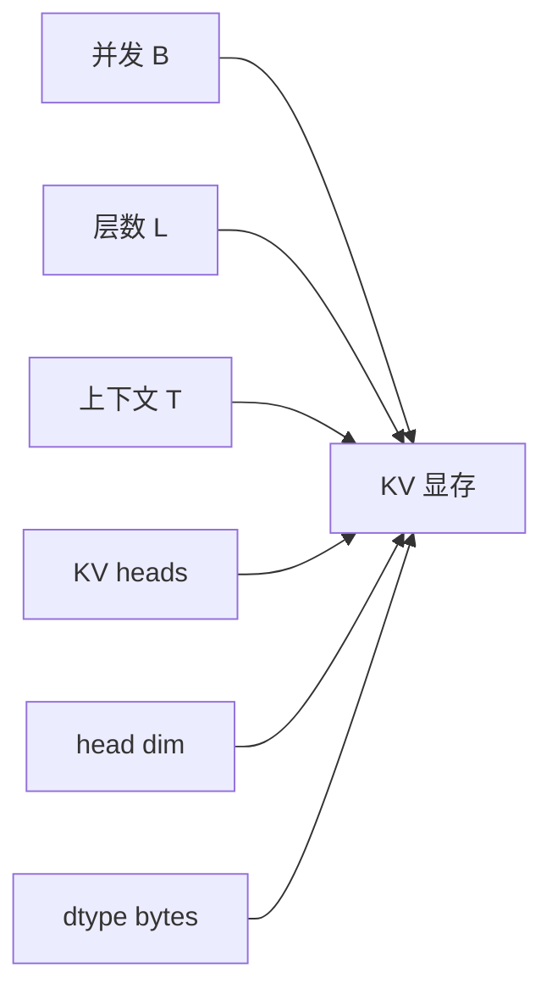
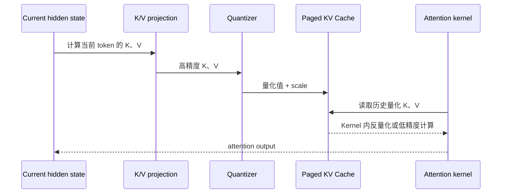
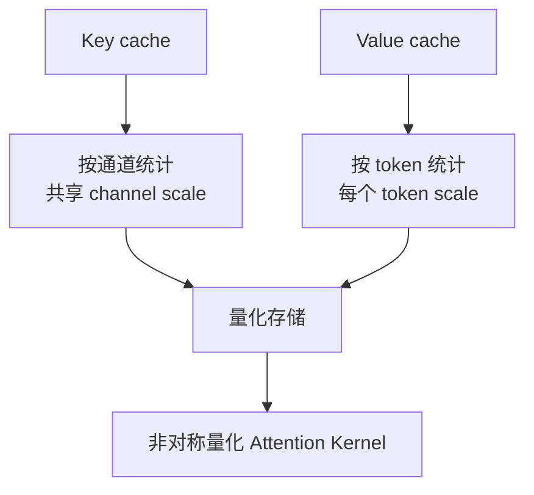
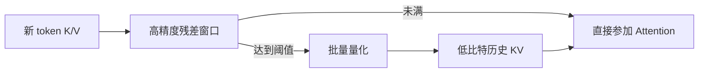

Weight-only 量化降低了模型的固定权重占用，但 KV Cache 会随请求数和上下文长度线性增长。对长上下文或高并发服务，KV 往往比权重更早成为显存瓶颈。

## 1. KV Cache 为什么增长得快

Decoder-only Transformer 每层都要保存历史 token 的 Key 和 Value。对 batch $B$、层数 $L$、缓存 token 数 $T$、KV head 数 $H_{kv}$、head dimension $D$、每元素字节数 $s$：

$$
M_{KV}=2\times B\times L\times T\times H_{kv}\times D\times s
$$

前面的 2 分别代表 K 和 V。若是 MHA，$H_{kv}$ 等于 attention head 数；GQA/MQA 通过减少 KV head 显著降低缓存。



从 FP16/BF16 的 2 bytes 降到 FP8/INT8 的 1 byte，理论上可把 KV 本体减半；降到 4 bit 则可接近四分之一，但 scale、残差窗口和对齐会降低实际比例。

## 2. KV 量化处在 Attention 哪个位置



写入路径每个 token 都要计算 scale 和量化；读取路径在每层、每个 decode step 都会扫描历史 KV。高效实现必须让 Attention Kernel 直接消费量化缓存，避免先生成完整 FP16 副本。

## 3. K 和 V 的分布并不相同

KIVI 的关键观察是，Key 的 outlier 更稳定地集中在特定通道，因此适合 per-channel 量化；Value 的分布更依赖 token，因此适合 per-token 量化。



这不是所有模型和格式的唯一选择，但说明“给整块 KV 一个 scale”通常过于粗糙。量化轴必须与数据分布和 Kernel 内存访问方式一起设计。

## 4. 残差窗口与在线量化

每生成一个 token 就重新打包整个 KV Cache 显然不可行。常见策略是维护一个小的高精度残差窗口：

1. 新 token 的 K/V 先以 FP16/BF16 写入残差 buffer；
2. buffer 达到阈值后，批量统计 scale 并量化；
3. 量化块追加到主 KV Cache；
4. Attention 同时读取量化历史与高精度尾部。



残差窗口越大，近期 token 精度越好、量化频率越低，但显存节省越少。窗口大小是质量、吞吐和内存之间的工程参数。

## 5. Scale 和元数据开销

假设每 $g$ 个元素共享一个 $b_s$ byte scale，量化值为 $b_q$ bit，单个 group 占用约：

$$
M_{group}=g\times\frac{b_q}{8}+b_s
$$

有效 bit 数为：

$$
b_{effective}=b_q+\frac{8b_s}{g}
$$

group size 太小会让 scale 开销明显；太大又增加误差。还要考虑 block 对齐、page padding 和每请求元数据。

## 6. FP8、INT8 与更低 bit

| 格式 | 理论压缩 | 主要优点 | 主要风险 |
|---|---:|---|---|
| FP8 | 2x | 动态范围较好，硬件支持增加 | scale 与格式依赖 GPU |
| INT8 | 2x | 表示和 Kernel 较成熟 | outlier 与 zero-point 处理 |
| INT4 | 4x | 显存收益大 | 质量和反量化成本 |
| 2-bit | 8x | 极端长上下文潜力 | 需要精细粒度与专用实现 |

理论压缩率不等于可用容量。Allocator 预留、块大小和请求长度分布会影响实际可服务 token 数。

## 7. 与 PagedAttention 和 Prefix Cache 的关系

KV dtype 是物理块的属性。量化格式必须与 block size、地址计算和 Attention backend 协同：

- block 内 scale 如何排列；
- 不同请求能否共享量化前缀块；
- copy-on-write 时是否复制 scale；
- swap/offload 是否保持相同格式；
- 不同 Attention backend 是否都支持该 dtype。

如果启用 Prefix Cache，命中与未命中请求必须产生一致的数值语义，否则同一 Prompt 可能因缓存状态不同得到不同结果。

## 8. 质量风险为什么在长上下文更明显

KV 误差会在后续每个 decode step 被重复读取。短 Prompt 测试看不出的问题，可能在长上下文、检索定位和代码补全中积累。

建议覆盖：

- needle-in-a-haystack 和多 needle；
- 长文问答与跨段引用；
- 长代码补全；
- 长对话中的早期约束保持；
- 不同 RoPE scaling 和滑动窗口配置；
- greedy 与实际采样参数。

## 9. 性能与容量验证

建立同一模型、相同权重 dtype 的对照，仅改变 KV dtype：

```yaml
baseline:
  weight_dtype: bf16
  kv_dtype: bf16
candidate:
  weight_dtype: bf16
  kv_dtype: fp8
fixed:
  model_commit: "..."
  engine_version: "..."
  max_model_len: 32768
  prompt_distribution: "dataset hash"
  output_tokens: 256
```

记录：

1. 单请求不同上下文长度的 TTFT/TPOT；
2. 固定 SLO 下最大并发；
3. KV block 实际利用率；
4. 量化写入与反量化 Kernel 时间；
5. 长上下文任务质量；
6. Prefix Cache 命中和未命中结果一致性。

## 10. 常见故障

### 10.1 显存没有接近减半

检查权重、CUDA Graph、工作区和 allocator 预留是否占大头；再确认 KV 实际 dtype，而不是只看启动参数。

### 10.2 TPOT 变慢

可能是 Attention backend 缺少原生量化 KV Kernel，发生独立反量化；也可能是 scale 粒度太细导致额外访存。

### 10.3 长文本质量下降

比较不同层、不同 head 的 KV 范围，尝试更高 bit、更细粒度或增大高精度残差窗口。不要只调 sampling temperature 掩盖数值问题。

### 10.4 Prefix Cache 结果漂移

确认缓存键是否包含影响量化布局或 dtype 的配置，并检查共享块的 scale 元数据是否正确复用。

## 11. 何时优先量化 KV

当权重已经能装入显存，但长上下文或并发受 KV 限制时，KV 量化通常比继续压缩权重更直接。若主要负载是短 Prompt、低并发，KV 占比较小，则收益可能不足以抵消复杂度。

## 小结

KV Cache 量化降低的是“每个缓存 token 的显存斜率”。它需要同时设计 K/V 的量化轴、在线写入、scale 布局、PagedAttention block 和读取 Kernel，并用长上下文任务验证误差，而不是只看空载显存。

## 阅读路线

- **主教程**：[Hugging Face：Unlocking Longer Generation with KV Cache Quantization](https://huggingface.co/blog/kv-cache-quantization)。先解释 KV 内存问题，再给 KIVI 背景、实现与质量/延迟结果。
- **官方核对**：[vLLM Quantized KV Cache](https://docs.vllm.ai/en/latest/features/quantization/quantized_kvcache.html)，用于确认当前 dtype、backend 和限制。
- **深入阅读**：[KIVI](https://arxiv.org/abs/2402.02750) 与 [KVQuant](https://arxiv.org/abs/2401.18079) 论文。两者研究设置与 vLLM FP8 KV 并不相同。
