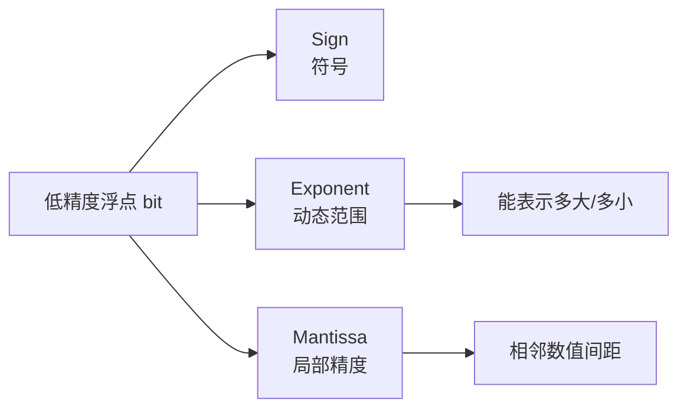
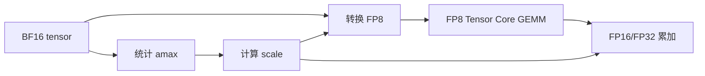
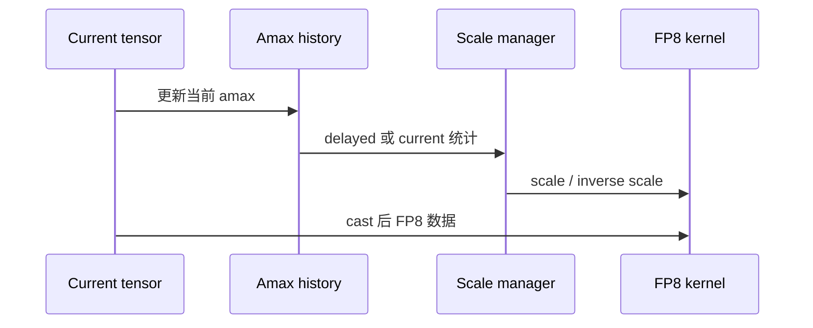
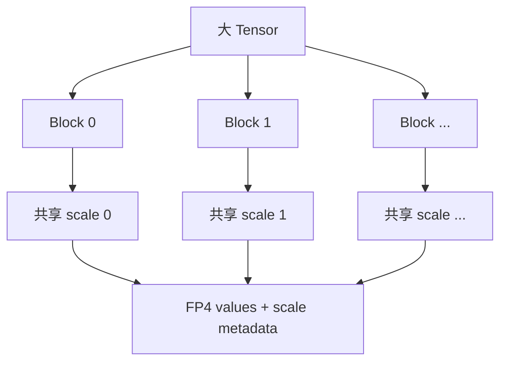

整数格式用 scale 把连续值映射到均匀格点，浮点格式则把 bit 分给符号、指数和尾数。FP8/FP4 的优势是动态范围与硬件矩阵乘，代价是格式、scale 和 GPU 架构强绑定。

## 1. 浮点数的三个部分

指数 bit 越多，动态范围越大；尾数 bit 越多，相近数值的表示越精细。低精度浮点没有一种格式能同时保留二者，因此 E4M3 与 E5M2 面向不同分布。

## 2. E4M3 与 E5M2

| 格式 | 符号 | 指数 | 尾数 | 特点 |
|---|---:|---:|---:|---|
| E4M3 | 1 | 4 | 3 | 精度较高、范围较小，常用于前向权重/激活 |
| E5M2 | 1 | 5 | 2 | 范围更大、精度较低，适合动态范围更大的张量 |

不同标准和硬件对 NaN、Infinity、subnormal 和最大有限值的处理可能不同。部署时必须使用框架与 Kernel 明确支持的具体 dtype，不能只写“FP8”。

## 3. 为什么 FP8 仍需要 scale

即使 FP8 自带指数，其范围与精度仍远小于 BF16/FP16。常见做法是先按张量或通道除以 scale，使值落入 FP8 的有效范围，在 GEMM 输出或累加时再应用 scale。

scale 可以是静态、动态、延迟更新或块级。动态 per-tensor scale 实现简单，但 reduction 可能影响 Decode；更细粒度 scale 精度更好，却增加元数据和 Kernel 复杂度。

## 4. Delayed Scaling 与 Current Scaling

**Delayed scaling** 使用过去若干步的 amax 历史计算当前 scale，减少同步与统计开销，训练场景常见。推理中输入分布突变时，历史 scale 可能滞后。

**Current scaling** 根据当前张量即时计算 scale，适应性更强，但会引入在线 reduction。推理引擎可能通过融合或 shape 特化降低这部分成本。

## 5. FP8 权重、激活和 KV Cache

FP8 可以作用于不同对象：

- **FP8 weight-only**：减少权重带宽，激活保持高精度；
- **FP8 W8A8**：权重与激活都进入 FP8 GEMM；
- **FP8 KV Cache**：降低每 token 缓存占用；
- **FP8 MoE expert**：压缩大量 expert 权重并加速 expert GEMM。

这些方案的瓶颈和质量风险不同，不能因为 dtype 相同就混为一种量化。

## 6. Hopper 上的 FP8 路径

Hopper Tensor Core 原生支持 FP8 矩阵乘。理想路径包括：

1. 权重预先转换并按 Kernel 布局打包；
2. 激活量化与前后算子融合；
3. FP8 输入进入 Tensor Core；
4. 使用更高精度累加；
5. epilogue 应用 scale、bias 和激活函数。

如果在不支持 FP8 Tensor Core 的 GPU 上运行，框架可能报错、回退或执行模拟转换。文件更小不代表计算更快。

## 7. FP4 与块缩放

4 bit 浮点的指数和尾数极少，仅靠单个 tensor scale 很难覆盖 LLM 的范围。NVFP4、MXFP4 等方案通常采用块级 scale：每个小块共享一个更高精度缩放因子。

块越小，越能贴合局部分布，但 scale 占比和访问成本越高。块大小、scale 格式和数据排列必须由硬件与 Kernel 共同定义。

## 8. NVFP4 与 MXFP4 不可只看名字

两者都属于 4 bit 低精度生态，但在值编码、scale 层级、块大小和支持硬件上可能不同。模型转换工具、checkpoint 元数据和推理引擎必须对同一具体格式达成一致。

在 Blackwell 等新硬件上，FP4 的价值来自原生低比特 Tensor Core 和高带宽利用率；在旧 GPU 上把 FP4 还原为 FP16 再计算，通常只能获得存储收益。

## 9. 误差控制

低精度浮点常见的控制手段包括：

- 对敏感层保留 BF16/FP16；
- per-channel 或 per-block scaling；
- 选择更稳健的 amax 统计；
- 对 outlier 做 clipping 或 SmoothQuant；
- 使用更高精度累加；
- 通过 QAT/微调适应 FP4 误差。

Embedding、lm_head、attention score、router 和归一化层的敏感度可能不同，应通过消融实验决定保留层，而不是套用固定名单。

## 10. 硬件支持矩阵

部署前至少核对：

| 层次 | 要确认的内容 |
|---|---|
| GPU | 架构是否有对应 Tensor Core 指令 |
| 驱动/CUDA | 是否支持目标 dtype 与指令路径 |
| 框架 | 能否创建并保存目标格式 |
| 推理引擎 | 能否加载 checkpoint 元数据 |
| Kernel | 当前 shape、TP、MoE 是否覆盖 |
| 通信 | collective 是否接受或会转换 dtype |

## 11. 性能测试为什么要分 Prefill 与 Decode

Prefill 具有较大的 M/N/K，通常更计算密集，更容易体现 FP8/FP4 Tensor Core 吞吐。Decode 的矩阵更小，可能被权重带宽、Kernel launch 和 scale reduction 主导。

因此应分别记录：

- Prefill tokens/s 与 TTFT；
- Decode TPOT 与 tokens/s；
- 固定并发吞吐；
- 高并发 SLO 内 goodput；
- scale/quantize/cast Kernel 占比；
- 峰值显存与功耗。

## 12. 质量验证

除了 perplexity，应覆盖长文本、代码、数学、结构化输出和工具调用。FP4 尤其需要检查复杂推理和罕见 token，因为更粗的局部精度可能放大 logit 排序变化。

比较时固定 tokenizer、prompt template、sampling seed 和停止条件。若使用非确定 Kernel，报告多次运行分布。

## 13. 常见故障

### 13.1 模型能加载但没有加速

检查 profiler 中是否出现 FP8/FP4 GEMM，确认没有在每层前后做昂贵的 cast，并核对矩阵对齐与 GPU 架构。

### 13.2 输出出现 NaN/Inf

检查 scale、amax、溢出、累加 dtype 和异常层。先定位首个产生非有限值的算子，不要直接全局增大 scale。

### 13.3 多卡通信成为瓶颈

低精度 GEMM 加速后，AllReduce/AllGather 占比会上升。需要重新评估 TP 大小、通信融合和网络拓扑。

### 13.4 量化后显存下降不明显

确认是否只有部分 Linear 使用低精度，并拆分权重、KV、工作区、CUDA Graph 与通信 buffer 的占用。

## 小结

FP8/FP4 不是“更小的浮点文件”，而是 scale 策略、数据格式和原生 Tensor Core 的组合。选择格式前先确认硬件与 Kernel，验收时同时看两阶段性能、质量和新的通信瓶颈。

## 阅读路线

- **主教程**：[NVIDIA：Model Quantization - Concepts, Methods, and Why It Matters](https://developer.nvidia.com/blog/model-quantization-concepts-methods-and-why-it-matters/)。先用图和例子理解整数与低精度浮点格式的差异。
- **官方核对**：[Transformer Engine](https://docs.nvidia.com/deeplearning/transformer-engine/user-guide/index.html)、[OCP Microscaling Formats](https://www.opencompute.org/documents/ocp-microscaling-formats-mx-v1-0-spec-final-pdf) 与 [vLLM Quantization](https://docs.vllm.ai/en/latest/features/quantization/)。
- **深入阅读**：[FP8 Formats for Deep Learning](https://arxiv.org/abs/2209.05433)。
