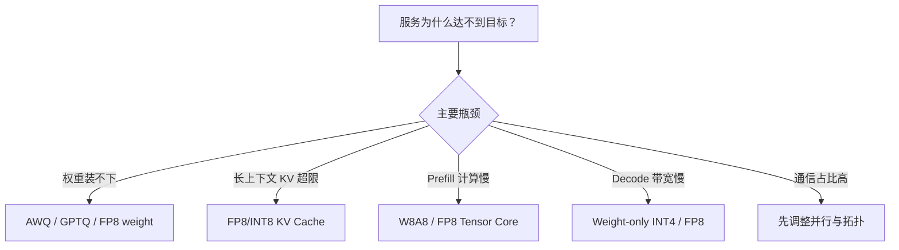
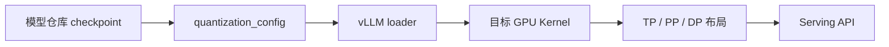
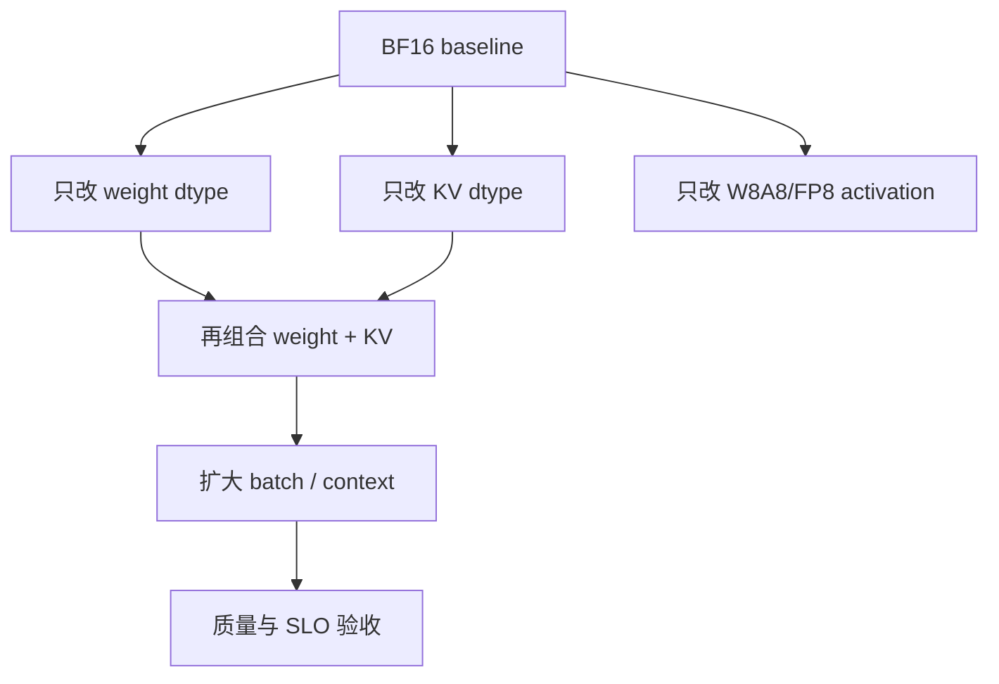
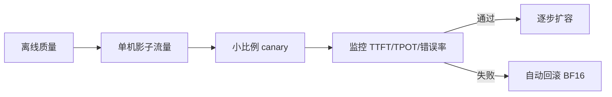

量化选型的正确起点不是“哪种格式最先进”，而是当前系统的瓶颈、质量门槛、硬件支持和目标 SLO。本节把前面的算法知识整理成一套可执行的 vLLM 实验流程。

## 1. 先定位瓶颈



如果瓶颈是网络 AllReduce，继续压权重 bit 数可能几乎没有收益；如果瓶颈是 KV Cache，weight-only 也不会解决长上下文 OOM。

## 2. 建立显存账本

启动服务前先估算：

$$
M_{total}=M_{weights}+M_{KV}+M_{activations}+M_{workspace}+M_{graphs}+M_{communication}+M_{margin}
$$

建议把观测值拆开记录，而不是只看 `nvidia-smi`：

```yaml
memory_budget_gb:
  gpu_total: 80
  weights: 0
  kv_cache_reserved: 0
  cuda_graphs: 0
  runtime_workspace: 0
  communication_buffers: 0
  safety_margin: 4
```

量化后重新计算每一项。释放的权重显存可能被引擎自动分给 KV Cache，这是容量收益，不应误解为“显存没有下降”。

## 3. 格式兼容链



每一环都必须兼容。重点核对：

- 模型卡声明的量化工具和版本；
- `config.json` 中的格式、bit、group size、zero-point；
- 当前 vLLM 版本的支持矩阵；
- GPU compute capability；
- Tensor Parallel 下的形状和对齐；
- Attention backend 对 KV dtype 的支持。

不要通过手工改掉 `quantization_config` 来绕过加载错误，这通常会把格式错误推迟到 Kernel 阶段或静默产生错误输出。

## 4. 固定软件和模型版本

```bash
python -m vllm.entrypoints.openai.api_server --help > vllm-serve-help.txt
python -m pip show vllm torch > environment.txt
nvidia-smi -q > gpu-environment.txt
```

模型应固定到 commit，而不是浮动分支。保存 tokenizer、chat template、量化配置和模型文件哈希。

> vLLM CLI 会随版本变化。以下命令展示实验结构，不保证与未来版本逐字一致，执行前以当前 `vllm serve --help` 为准。

## 5. 建立 BF16/FP16 基线

```bash
vllm serve <model-id> \
  --dtype bfloat16 \
  --max-model-len 8192 \
  --gpu-memory-utilization 0.90 \
  --seed 42
```

记录启动日志、实际 Attention backend、KV block 数、峰值显存和一组固定 Prompt 的 greedy 输出。后续候选必须使用相同的 API 请求和采样设置。

## 6. 测试 Weight-only 候选

```bash
vllm serve <awq-or-gptq-model-id> \
  --quantization awq \
  --dtype half \
  --max-model-len 8192 \
  --gpu-memory-utilization 0.90 \
  --seed 42
```

参数名和是否需要显式 `--quantization` 取决于 checkpoint 元数据与 vLLM 版本。目标是确认实际 loader、Kernel 和权重布局，而不是照抄命令。

## 7. 测试量化 KV Cache

```bash
vllm serve <model-id> \
  --dtype bfloat16 \
  --kv-cache-dtype fp8 \
  --max-model-len 32768 \
  --gpu-memory-utilization 0.90 \
  --seed 42
```

先保持权重 dtype 不变，只改变 KV dtype，才能隔离 KV 量化带来的容量、速度和质量变化。

## 8. 实验矩阵



不要一开始就同时改变量化、max length、batch、并行度和调度参数，否则即使结果变好也无法判断原因。

建议测试：

| 维度 | 值 |
|---|---|
| 输入长度 | 128、1K、8K、业务 P50/P95 |
| 输出长度 | 32、256、业务分布 |
| 并发 | 1、4、16、目标峰值 |
| 模式 | 固定到达率、闭环并发 |
| 指标 | TTFT、TPOT、E2E、吞吐、goodput、显存、质量 |

## 9. 一个可复现的结果记录

```yaml
run_id: "awq-candidate-01"
model:
  id: "..."
  revision: "..."
  tokenizer_revision: "..."
quantization:
  method: "awq"
  bits: 4
  group_size: 128
runtime:
  vllm: "..."
  torch: "..."
hardware:
  gpu: "..."
  count: 1
load:
  input_tokens_p50: 1024
  output_tokens: 256
  concurrency: 16
results:
  ttft_p50_ms: 0
  tpot_p50_ms: 0
  request_p99_ms: 0
  output_tokens_per_second: 0
  peak_memory_gb: 0
  quality_score: 0
```

## 10. 质量门槛先于性能排序

先定义候选必须满足的质量阈值，再对通过者排序性能。推荐至少包含：

- perplexity 或 log-likelihood 回归；
- 业务任务准确率；
- 代码单测；
- JSON Schema/工具调用成功率；
- 长上下文检索；
- 安全与拒答集。

若质量不达标，吞吐再高也不是可上线候选。

## 11. 检查是否真的命中低精度 Kernel

从启动日志、profiler 和算子名交叉确认：

1. loader 识别了预期格式；
2. 权重没有被完整反量化常驻；
3. GEMM 使用 AWQ/GPTQ/Marlin/FP8 等对应 Kernel；
4. Attention 使用目标 KV dtype backend；
5. 没有大量 cast/dequant 独立 Kernel；
6. TP rank 使用一致路径。

GPU utilization 高不能证明 Kernel 正确；回退实现也可能把 GPU 跑满。

## 12. 常见陷阱

### 12.1 量化模型反而 OOM

量化后允许的 KV 预留、CUDA Graph 或 max length 变大，可能吃掉释放的显存。拆分账本并查看引擎日志。

### 12.2 吞吐提高但 P99 变差

更大 batch 增加排队和单迭代时间。用相同 SLO 比较 goodput，而不是只看极限 tokens/s。

### 12.3 单请求更快，生产负载没变化

生产可能受路由、tokenizer、网络、通信或 CPU 调度限制。端到端压测必须经过真实 API 路径。

### 12.4 更新 vLLM 后结果变化

Kernel、调度器和默认 backend 可能改变。把版本升级视为新的候选，重新跑质量与性能门禁。

## 13. 上线顺序



量化模型应拥有独立版本和回滚目标。线上监控除延迟与错误率外，还应抽样比较格式正确性、工具调用和长输出异常。

## 14. 最终决策表

| 目标 | 优先候选 | 先排除的情况 |
|---|---|---|
| 权重装不下 | AWQ/GPTQ INT4 | KV 才是主瓶颈 |
| Prefill 吞吐 | W8A8/FP8 | GPU 无原生 Kernel |
| Decode TPOT | Weight-only/FP8 | 小模型被 launch 主导 |
| 长上下文容量 | FP8/INT8 KV | Attention backend 不支持 |
| 新硬件极限吞吐 | FP4/块浮点 | 软件栈尚未稳定 |

## 小结

vLLM 量化实战的主线是：先做显存与性能账本，确认格式到 Kernel 的兼容链，单变量建立实验矩阵，用质量门槛筛选候选，再用真实 API 负载比较 SLO 内 goodput。这样得到的结论才可复现、可解释、可回滚。

## 阅读路线

- **主教程**：[Hugging Face：Quantizing Llama 3+ Models for Efficient Deployment](https://huggingface.co/blog/theeseus-ai/quantizing-llama-3-models-for-efficient-deployment)。按选择方法、量化、保存、加载与评测完整演示，适合跟做。
- **官方核对**：[vLLM Quantization](https://docs.vllm.ai/en/latest/features/quantization/)、[Quantized KV Cache](https://docs.vllm.ai/en/latest/features/quantization/quantized_kvcache.html) 与 [Benchmarking CLI](https://docs.vllm.ai/en/latest/benchmarking/cli/)。
- **性能定位**：[Nsight Systems](https://docs.nvidia.com/nsight-systems/) 与 [Nsight Compute](https://docs.nvidia.com/nsight-compute/) 仅在需要确认 kernel 路径时查阅。
