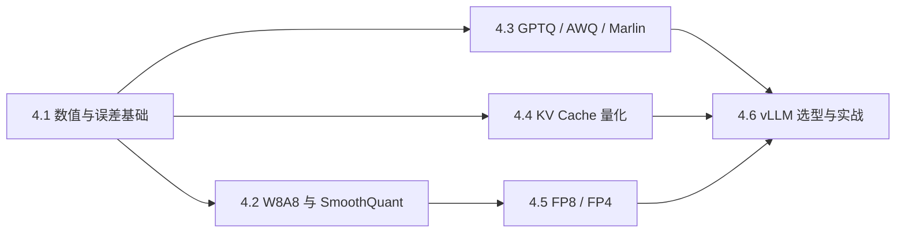

## 本章简介

量化不是把模型文件从 FP16 换成 INT4 就结束了。它同时改变数值表示、校准流程、权重布局、运行时元数据和 GPU Kernel；同一种 bit 数，在不同硬件和负载上可能得到完全不同的延迟与质量。

本章按“数值基础 → 主流算法 → 被量化的对象 → 硬件格式 → 线上验证”展开。每个主题都是独立教程，可以单独阅读，也可以按顺序完成一套从原理到部署的学习路径。

## 本章小节

- **4.1 量化基础与误差分析**：scale、zero-point、粒度、校准、PTQ/QAT，以及为什么低 bit 不等于高性能。
- **4.2 W8A8 与 SmoothQuant**：激活离群值、等价变换、平滑参数、校准和 INT8 Kernel。
- **4.3 Weight-only INT4**：GPTQ、AWQ、group size、Marlin 与权重显存账本。
- **4.4 KV Cache 量化**：KV 内存公式、K/V 非对称分布、在线 scale 与 Attention Kernel。
- **4.5 FP8、NVFP4 与 MXFP4**：浮点编码、缩放策略、硬件支持与块浮点格式。
- **4.6 vLLM 量化选型与实战**：格式兼容、启动参数、质量门槛、压测矩阵和故障排查。

## 建议学习方法

先为目标模型建立 BF16/FP16 基线，再逐项改变一个变量。每次实验至少记录模型格式、量化粒度、校准数据、GPU、驱动、CUDA、推理引擎版本、TTFT、TPOT、吞吐、峰值显存和任务质量。没有这些条件的“加速百分比”无法复现。

> 本章中的命令用于解释实验方法。量化格式和 Kernel 演进很快，实际部署前必须以当前版本的模型卡、推理引擎文档和 `--help` 输出为准。
