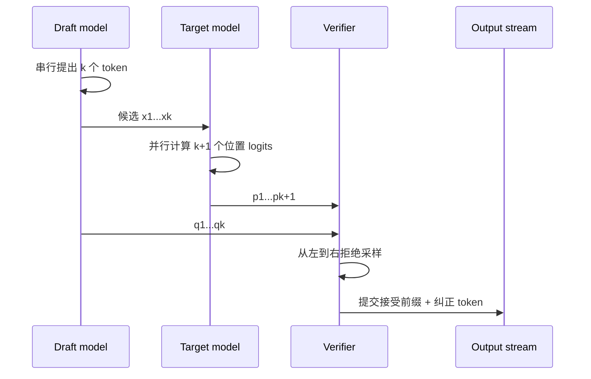
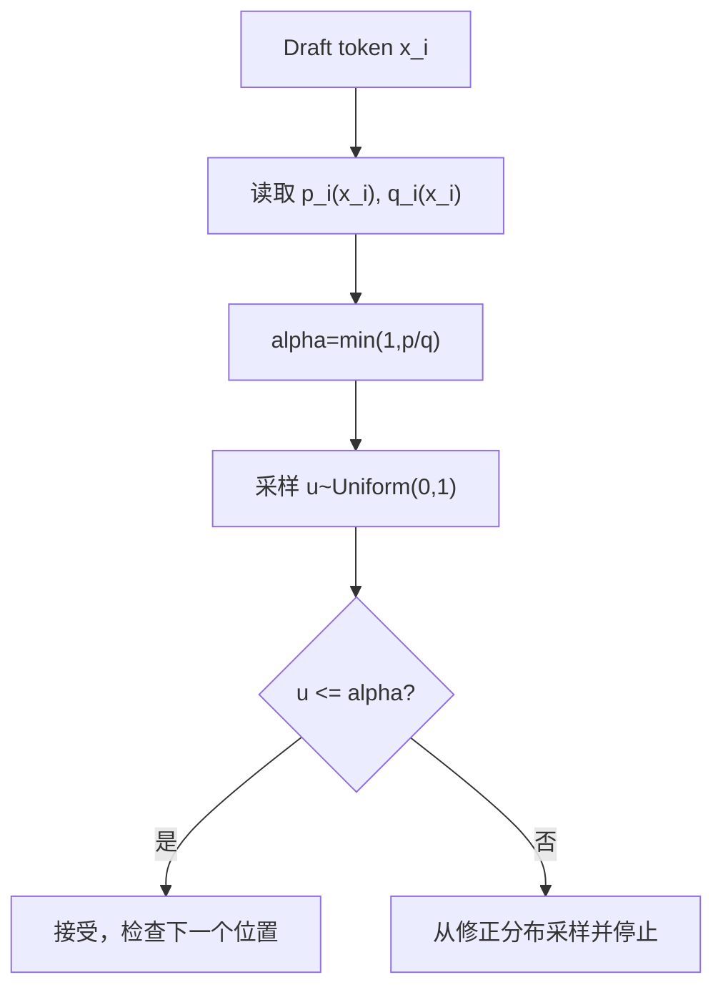
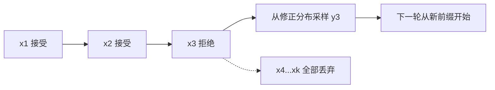
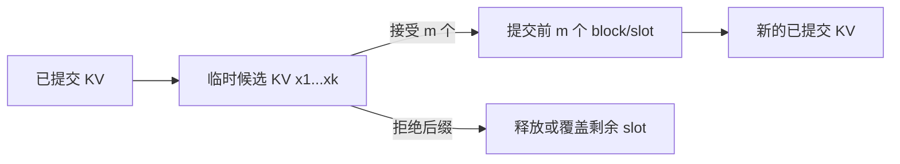

普通自回归 Decode 每次 Target 前向只提交一个 token。投机解码让便宜的 Draft 先提出多个候选，再用 Target 一次前向并行计算这些位置的 logits；验证器从左到右决定能提交多长的前缀。

## 1. 一轮 Draft + Verify



Target 的一次前向仍然遵守因果 mask：位置 $i$ 只能看到候选前缀 $x_{<i}$。GPU 可以并行计算所有位置，是因为完整候选序列已经由 Draft 给出。

## 2. 接受概率

设 Draft 与 Target 在位置 $i$ 的分布分别为 $q_i(x)$、$p_i(x)$，Draft 采样出 $x_i$。接受概率为：

$$
\alpha_i=\min\left(1,\frac{p_i(x_i)}{q_i(x_i)}\right)
$$

如果 $p_i(x_i)\ge q_i(x_i)$，候选总是接受；如果 Draft 对该 token 赋予的概率比 Target 高，则只按比例接受。



## 3. 拒绝后的修正分布

若候选被拒绝，不能简单地从 $p_i$ 再采一次，否则已经发生的拒绝事件会改变最终分布。正确做法是从正差分布采样：

$$
p_i'(x)=\frac{[p_i(x)-q_i(x)]_+}{\sum_y[p_i(y)-q_i(y)]_+}
$$

其中 $[z]_+=\max(z,0)$。接受分支贡献 $\min(p,q)$，拒绝分支补上 $[p-q]_+$，两部分相加恢复 $p$。

## 4. 为什么只提交最长接受前缀

一旦位置 $i$ 被拒绝，后续候选是基于错误前缀生成的，不能继续提交。因此验证必须从左向右，在第一个拒绝位置停止。



并行计算的是 logits，提交顺序仍然是严格自回归的。

## 5. 全部接受时的额外 token

Target 验证 $k$ 个候选时，通常能同时得到第 $k+1$ 个位置的 logits。如果 $x_1...x_k$ 全部接受，可以直接从 $p_{k+1}$ 采样一个额外 token，因此一轮最多提交 $k+1$ 个 token。

这也是为什么统计指标应区分：

- draft tokens：Draft 提出的数量；
- accepted draft tokens：被接受的候选数；
- emitted tokens：实际提交数，可能多一个 Target token；
- target verification tokens：Target 本轮计算的 token 数。

## 6. Greedy 与采样模式

在 greedy decoding 中，可把验证简化为检查 Draft token 是否等于 Target argmax；但温度、top-k、top-p、min-p、presence penalty 等采样处理必须在 Draft 和 Target 两侧以一致顺序应用。

如果 Draft 在原始 logits 上采样，而 Target 在 temperature/top-p 后验证，拒绝采样的分布假设就被破坏。生产实现必须明确 logits processor 的位置。

## 7. Tokenizer 和停止条件

独立 Draft 通常要求与 Target 使用相同 tokenizer 和词表。即使文本看起来相同，不同 token 分割也无法逐位置验证。

还要对齐：

- BOS/EOS 与特殊 token；
- chat template；
- stop token 和 stop string；
- bad words/allowed tokens；
- grammar 或 JSON 约束；
- repetition/presence/frequency penalty。

结构化输出场景中，约束状态也必须随接受前缀同步推进。

## 8. 一轮成本模型

设 Draft 生成 $k$ 个候选的时间为 $T_d(k)$，Target 验证时间为 $T_v(k)$，调度与采样开销为 $T_o$，平均提交 token 数为 $E[A]$：

$$
\text{time per emitted token}=\frac{T_d(k)+T_v(k)+T_o}{E[A]}
$$

相对普通 Decode 单 token 时间 $T_t(1)$ 的理论加速为：

$$
S=\frac{E[A]\,T_t(1)}{T_d(k)+T_v(k)+T_o}
$$

必要条件是 $E[A]$ 足够大，并且验证 $k$ 个位置没有接近 $k$ 次普通 Decode 的成本。

## 9. 接受率与接受长度

单 token acceptance rate 不足以描述性能。连续前缀长度才决定每轮能提交多少 token。

如果每个位置独立以概率 $r$ 接受，最多 Draft 长度为 $k$，接受前缀期望值近似：

$$
E[L]=\sum_{i=1}^{k}r^i
$$

真实接受事件并不独立，但公式说明随着深度增加，边际收益会快速下降。盲目把 $k$ 从 4 增到 16，可能只增加 Target 验证成本。

## 10. KV Cache 怎样更新

Target 验证会为候选位置生成 KV。接受前缀的 KV 可以直接提交；拒绝位置之后的 KV 必须丢弃或回滚。



Paged KV Cache、Prefix Cache 和跨请求调度会让这一步更复杂，必须避免把未接受候选暴露给下一轮。

## 11. 最小验证伪代码

```python
def verify(draft_tokens, draft_probs, target_probs, uniforms):
    accepted = []
    for token, q, p, u in zip(draft_tokens, draft_probs, target_probs, uniforms):
        alpha = min(1.0, p[token] / q[token])
        if u <= alpha:
            accepted.append(token)
            continue

        residual = (p - q).clip(min=0)
        residual /= residual.sum()
        accepted.append(sample(residual))
        return accepted

    accepted.append(sample(target_probs[len(draft_tokens)]))
    return accepted
```

代码省略了数值稳定、logits processor、分布退化、EOS、batch 和随机数状态，仅用于说明控制流。

## 12. 正确性测试

1. 在小词表模型上枚举分布并比较经验频率；
2. 固定随机数流，比较基线采样与投机采样；
3. 覆盖第一个 token 拒绝、全部接受和中途拒绝；
4. 测试 EOS、stop string 和最大长度；
5. 测试 top-k/top-p/temperature 组合；
6. 测试 batch 内请求在不同位置拒绝。

## 小结

投机解码的正确性来自拒绝采样：接受分支使用 Draft 候选，拒绝分支补齐 Target 与 Draft 的概率差。并行验证只减少 Target 前向次数，不改变从左到右提交前缀的规则。

## 参考资料

- [Fast Inference from Transformers via Speculative Decoding](https://arxiv.org/abs/2211.17192)
- [Accelerating Large Language Model Decoding with Speculative Sampling](https://arxiv.org/abs/2302.01318)
- [Hugging Face Assisted Generation](https://huggingface.co/docs/transformers/generation_strategies#speculative-decoding)
- [vLLM Speculative Decoding](https://docs.vllm.ai/en/latest/features/spec_decode.html)
