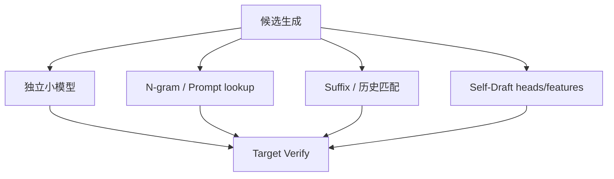
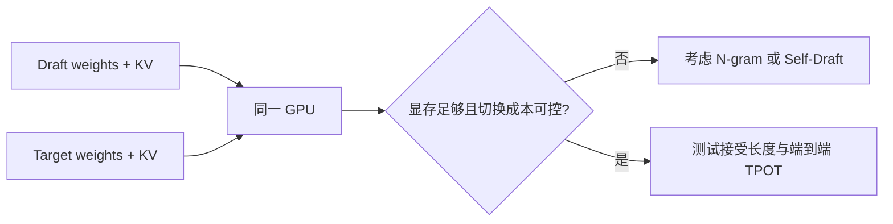
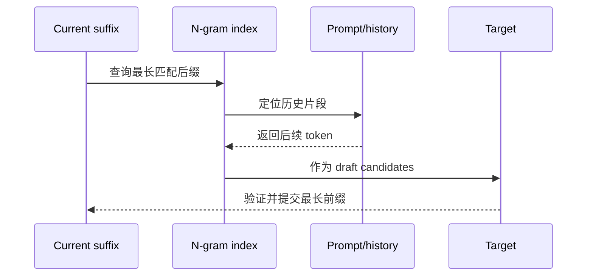
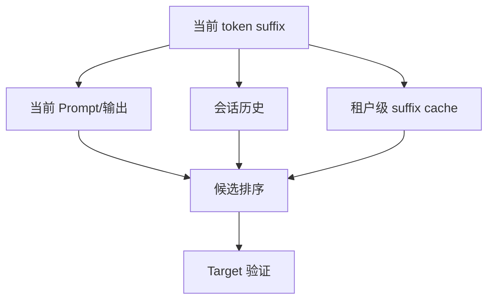
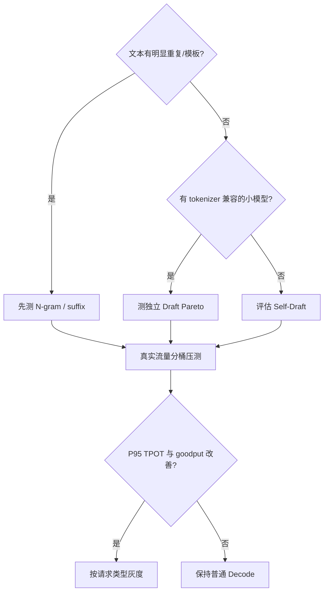

验证算法决定分布正确性，Draft 方法决定候选质量和成本。最强的候选不一定最好：如果 Draft 本身太慢，即使接受率很高也可能没有端到端收益。

## 1. 候选生成方法全景



本节聚焦不修改 Target 的三类方案；Medusa/EAGLE 等 Self-Draft 在下一节展开。

## 2. 独立 Draft 模型

独立 Draft 是一个更小、更便宜的自回归模型。它连续生成 $k$ 个 token，再把候选交给 Target。

### 2.1 兼容条件

- tokenizer 和词表相同；
- special token 定义一致；
- chat template 和输入前缀一致；
- 支持相同的 logits processor；
- 模型在目标领域有相似的局部预测分布。

参数量小不等于适合。一个极小但分布差异大的 Draft 会快速拒绝，浪费自身前向和 Target 的宽验证。

### 2.2 Draft 成本

Draft 还会占用：

- 权重显存；
- 自己的 KV Cache；
- Kernel launch 与调度时间；
- 多模型切换的 cache/TLB 影响；
- 多卡环境中的放置与通信资源。



## 3. 怎样选择 Draft 大小

Draft 越大，通常预测越接近 Target，但单步更慢。应测量一条 Pareto 曲线，而不是寻找固定参数比例。

| Draft 候选 | 需要记录 |
|---|---|
| 极小模型 | Draft 延迟低，但拒绝是否过多 |
| 同系列小模型 | tokenizer/领域兼容通常较好 |
| 蒸馏模型 | 局部分布可能更接近 Target |
| 量化 Draft | 显存小，但误差是否降低接受率 |

最终指标是 $(T_d+T_v+T_o)/E[A]$，而不是 Draft perplexity 单独最小。

## 4. N-gram Prompt Lookup

N-gram 方法不运行额外模型。它在 Prompt 或已生成文本中查找与当前后缀相同的片段，把历史中紧随其后的 token 作为候选。



代码补全、复制编辑、模板化 JSON、文档引用和重复对话常有较高命中；开放域创作和新知识问答命中可能很低。

## 5. 索引数据结构

简单实现可以为固定 $n$ 建立从 token n-gram 到后续位置的哈希表。更复杂实现会同时维护多个 $n$，优先选择更长匹配。

```python
from collections import defaultdict

def build_ngram_index(tokens, n):
    index = defaultdict(list)
    for start in range(len(tokens) - n):
        key = tuple(tokens[start:start + n])
        index[key].append(start + n)
    return index
```

生产实现还要限制索引大小、处理跨请求隔离、避免过期位置，并高效维护流式追加。

## 6. Suffix Decoding

Suffix decoding 可以在更大的语料或历史请求缓存中寻找当前后缀的延续。与只查当前 Prompt 相比，它可能提高命中，但引入内存、隐私和租户隔离问题。



跨用户共享文本索引前必须评估数据泄漏。更稳妥的默认是请求内或同一会话内匹配。

## 7. 匹配长度与 Draft 长度

匹配到很长片段不代表应一次验证全部。Target 验证成本随候选长度增加，且历史文本可能只在开头相似。

可以根据以下信号动态选择 $k$：

- n-gram 长度；
- 同一后缀在历史中出现次数；
- 多个候选后续是否一致；
- 请求类型（代码/JSON/聊天）；
- 最近几轮的接受率；
- 当前 batch 的 token budget。

## 8. 接受率指标

至少区分：

$$
\text{token acceptance}=\frac{\text{accepted draft tokens}}{\text{proposed draft tokens}}
$$

$$
\text{effective tokens/step}=\frac{\text{emitted tokens}}{\text{target verification steps}}
$$

还应观察接受长度直方图。相同平均接受率下，“多数请求稳定接受 3 个”和“少数请求接受很长、多数立即拒绝”会产生不同尾延迟。

## 9. 真实负载分桶

按请求类型分别统计，而不是只算全局平均：

| 请求桶 | 预期候选来源 | 重点指标 |
|---|---|---|
| 代码补全 | Prompt/历史代码 suffix | 接受长度、缩进和停止符 |
| JSON/模板 | 已出现结构 | Schema 有效率 |
| RAG 引用 | Prompt 文档片段 | 引用复制命中 |
| 开放问答 | 独立 Draft | 分布相似度 |
| 短回答 | 任意 | 初始化成本是否可摊平 |

## 10. 与量化结合

量化 Draft 可以降低成本和显存，但数值误差可能改变候选分布，降低接受率。量化 Target 则同时改变验证分布与基线输出。

正确实验顺序：

1. 高精度 Target 普通 Decode；
2. 高精度 Target + 高精度 Draft；
3. 只量化 Draft；
4. 只量化 Target；
5. 最后组合。

这样才能区分速度和接受率变化来自哪一侧。

## 11. 选择流程



## 12. 常见失败模式

- tokenizer 相同但 chat template 不一致；
- Draft 只在公开 benchmark 接受率高，真实 Prompt 低；
- N-gram 索引构建时间被漏算；
- Draft 占用显存导致 Target batch 反而变小；
- 高并发下 Draft 与 Target 相互抢占；
- 平均 TPOT 改善，但低接受率请求的 P99 恶化；
- 跨租户 suffix cache 造成隐私风险。

## 小结

候选生成是成本与预测质量的平衡。独立 Draft 适合有兼容小模型的场景，N-gram/suffix 适合重复性强的文本；最终应按真实请求类型比较每轮有效 token、Draft 成本和尾延迟。

## 参考资料

- [Fast Inference from Transformers via Speculative Decoding](https://arxiv.org/abs/2211.17192)
- [Prompt Lookup Decoding](https://github.com/apoorvumang/prompt-lookup-decoding)
- [vLLM Speculative Decoding](https://docs.vllm.ai/en/latest/features/spec_decode.html)
- [SGLang Speculative Decoding](https://docs.sglang.ai/advanced_features/speculative_decoding.html)
