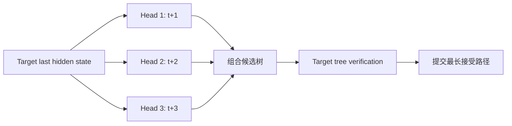
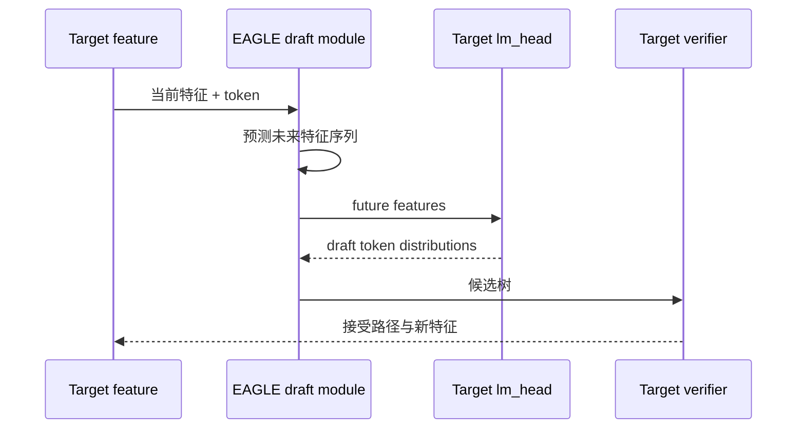
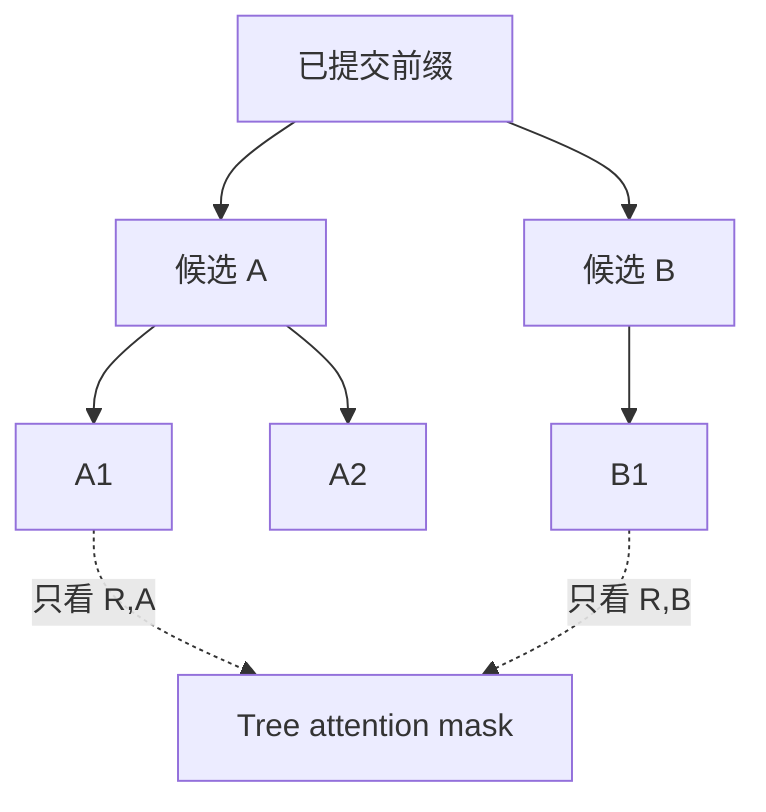
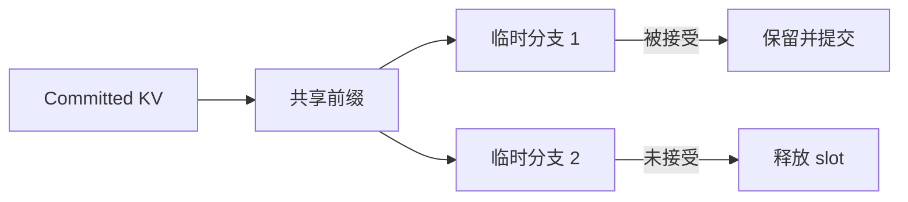

本节不重复复述论文全文。先按顺序阅读官方资料，再用后半部分补齐几篇资料之间没有集中说明的工程连接点。

## 推荐原文

1. [Medusa 论文](https://arxiv.org/abs/2401.10774)：先读方法图和 tree attention，理解多个预测头如何提出未来 token。
2. [Medusa 官方仓库](https://github.com/FasterDecoding/Medusa)：看训练、模型适配和推理入口，确认论文概念怎样落到代码。
3. [EAGLE 论文](https://arxiv.org/abs/2401.15077)：重点读 feature uncertainty，理解为什么只预测 token 会丢失 Target 的中间特征信息。
4. [EAGLE 官方仓库](https://github.com/SafeAILab/EAGLE)：查看支持模型、训练权重和推理配置。
5. [vLLM Speculative Decoding 文档](https://docs.vllm.ai/en/latest/features/spec_decode.html)：最后核对当前服务端支持方法和限制。

若目标只是理解算法，论文与官方仓库已经覆盖主要原理；下面只补充跨实现都需要面对的候选树、位置编码、KV 和批处理问题。

## Medusa 的数据流

<figure id="medusa-pipeline" class="source-figure source-figure--compact">
  
  <figcaption>Medusa 官方流程：多个 Head 从同一 last hidden state 预测不同未来偏移的 top-k token，组合候选后由模型验证最长可接受前缀。<a href="https://github.com/FasterDecoding/Medusa/blob/e2a5d20c048a9b0a4092e6933c34313687422518/assets/medusa_pipeline.jpg">图源</a>（Apache-2.0）</figcaption>
</figure>

多个 head 并不是独立自回归模型，它们从同一 Target 特征预测不同偏移。优点是没有另一套完整权重与 KV；代价是需要为具体 Target 训练并维护额外 head。

## EAGLE 为什么预测特征

EAGLE 认为下一个 token 的不确定性会让纯 token Draft 难以准确预测更远位置，因此训练轻量模型从当前 token 和 Target 特征预测下一步特征，再通过原模型的 lm_head 得到 token。

EAGLE-2 等后续工作进一步根据候选置信度动态展开树，不再为每个请求使用完全固定的宽度和深度。

## 候选树为什么需要 Tree Attention

若每条候选路径都单独运行 Target，大量公共前缀会被重复计算。Tree Attention 把公共节点合并到一个扁平 token 序列，通过定制 attention mask 保证每个节点只看到自己的祖先。

扁平化顺序、position id、causal mask 和还原路径必须完全一致；否则 Target 验证的上下文不再等于候选树定义。

## KV Cache 的临时分支

验证候选树会为多个未提交节点产生 KV。实现通常需要：

- 从已提交前缀共享只读 KV；
- 为候选节点分配临时 slot；
- 接受路径上的 KV 转为正式状态；
- 释放其他分支；
- 保证 Prefix Cache 不记录未接受节点。

## 动态 batch 的形状问题

不同请求会生成不同大小的候选树。将它们放进同一 batch 时，需要 padding、分组或 ragged 表示；形状变化也可能降低 CUDA Graph 命中率。

实际服务应记录：

- 每个请求的树节点数；
- 最大/平均树深；
- Target 验证 token 数；
- 接受路径长度；
- 临时 KV 峰值；
- CUDA Graph 命中或回退次数。

## 训练与权重匹配

Medusa head 或 EAGLE Draft 模块与 Target checkpoint 强绑定。以下变化都可能需要重新训练或至少重新验证：

- Target 权重版本更新；
- tokenizer/chat template 改变；
- Target 被量化或剪枝；
- RoPE/上下文配置改变；
- lm_head 权重不再相同；
- LoRA adapter 改变输出分布。

不能把某个 7B 模型上的公开接受率直接迁移到另一个同系列模型。

## 选择建议

| 条件 | 更适合的方向 |
|---|---|
| 无法训练额外组件 | N-gram 或独立 Draft |
| 没有兼容小模型 | Medusa/EAGLE |
| 显存非常紧张 | Self-Draft 优先于双模型 |
| 模型版本经常更新 | 独立 Draft/N-gram 维护成本可能更低 |
| 请求类型差异大 | 支持动态树和按请求路由 |

## 最小实验

同时保留普通 Decode、固定 Draft 长度、动态 Draft 三组。固定 Prompt、采样参数和并发，比较 TPOT P50/P95、有效 tokens/verification step、Target 验证 token 数、临时 KV 和质量。

若动态树只提升平均值却让树形极端请求拖高 P99，应限制最大节点数或按请求类型关闭。

## 小结

Medusa 用多预测头直接提出未来 token，EAGLE 用 Target 特征训练轻量 Draft；二者最终都要解决候选树的 mask、位置、KV 分支和动态 batch。原理以论文和官方仓库为准，本页补充的是把它们接入生产引擎时共同面对的接口。

## 延伸资料

- [Medusa 官方项目](https://github.com/FasterDecoding/Medusa)
- [EAGLE 官方项目](https://github.com/SafeAILab/EAGLE)
- [SpecInfer: Accelerating LLM Serving with Tree-based Speculative Inference](https://arxiv.org/abs/2305.09781)
- [SGLang Speculative Decoding](https://docs.sglang.ai/advanced_features/speculative_decoding.html)
