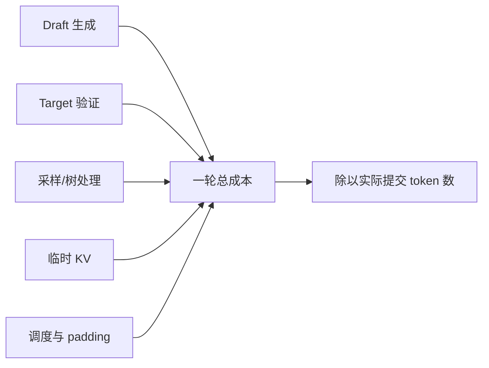
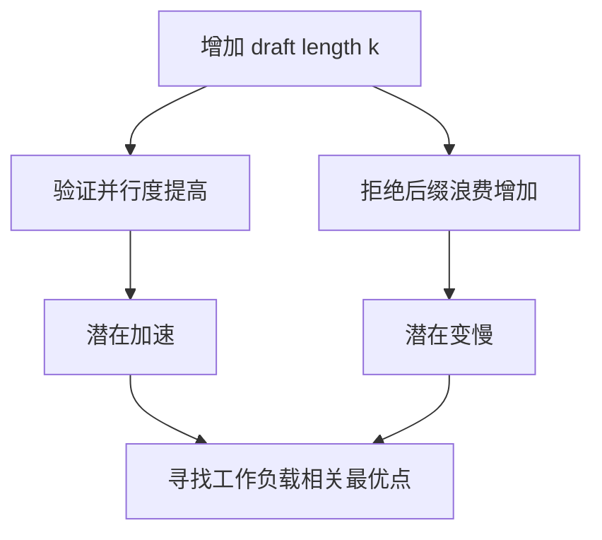
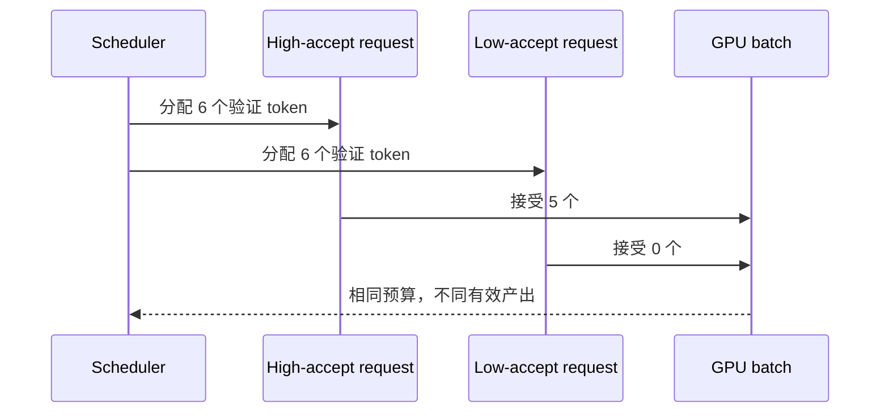
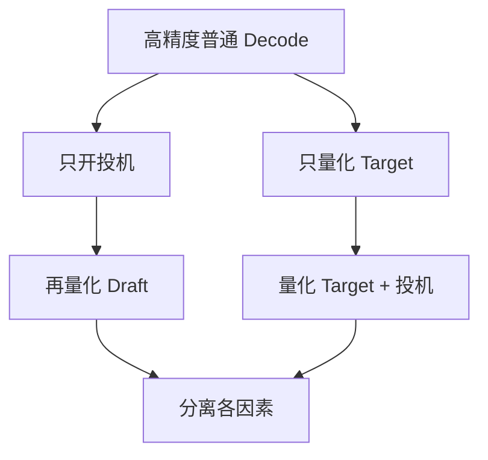

## 推荐原文

1. [Speculative Decoding 原始论文](https://arxiv.org/abs/2211.17192)：正确性与理论加速。
2. [Speculative Sampling](https://arxiv.org/abs/2302.01318)：另一套独立提出的采样与实验结果。
3. [vLLM Speculative Decoding 文档](https://docs.vllm.ai/en/latest/features/spec_decode.html)：当前实现支持与兼容限制。
4. [DistServe 论文](https://arxiv.org/abs/2401.09670)：虽然主题是 P/D 解耦，但其 goodput/SLO 视角适合评估投机方案。

论文主要讨论算法和受控实验，服务文档主要列支持状态；下面补充的是两者之间的生产成本账本。

## 1. 必须比较的成本



投机解码只在“一轮平均提交多个 token”带来的收益大于以上全部额外成本时成立。

## 2. Roofline 视角

普通 Decode 常受权重带宽限制。Target 一次验证多个 token 会把矩阵的 M 维增大，算术强度提高，更容易利用 Tensor Core。这是投机解码的主要硬件机会。

但当 $k$ 太大时：

- Target 验证计算量上升；
- 未接受后缀的计算被浪费；
- 临时 KV 与 attention token 增加；
- batch 形状更不稳定。



## 3. 接受率不是唯一指标

需要同时看：

- token acceptance rate；
- accepted prefix length 分布；
- emitted tokens per target step；
- verification tokens / emitted tokens；
- Draft ms、Target verify ms、调度 ms；
- 请求 P50/P95/P99 TPOT。

两个方案可能有相同接受率，但一个稳定接受 3 个，另一个多数立即拒绝、少数接受很长，后者尾延迟通常更差。

## 4. 短回答为什么难获益

短回答会放大以下固定成本：Draft 初始化、模型切换、首轮候选、调度状态和指标采集。即使每轮很快，可能还没摊平开销请求就结束了。

因此应按输出长度分桶，而不是只报告整体平均：`1-16`、`17-64`、`65-256`、`256+`。

## 5. 高并发下的相互影响

普通 continuous batching 可以把许多请求的单 token Decode 合在一起。投机解码把每个请求变成不同宽度的验证块，可能：

- 提高单请求矩阵规模；
- 降低同一 batch 可容纳请求数；
- 增加 token budget 波动；
- 让低接受率请求占用更多无效 token；
- 干扰 CUDA Graph shape。



调度器应依据历史接受率或请求类型估计验证 token 的“有效产出”，而不是一律给相同 $k$。

## 6. Draft 与 Target 的资源竞争

独立 Draft 若与 Target 在同一 GPU 上，会争抢显存带宽、L2 cache 和 SM；若分到不同 GPU，又引入候选传输和跨设备同步。

应分别测试：

- 同 GPU 顺序执行；
- 同 GPU stream overlap；
- Draft CPU/小 GPU，Target 大 GPU；
- 多实例并行；
- Draft 权重常驻与按需路由。

硬件拓扑改变后，接受率不变，端到端结果仍可能完全不同。

## 7. 与量化叠加

量化 Target 可能让普通 Decode 已经更快，从而降低投机的相对收益；量化 Draft 可能减小成本，也可能降低接受率。



不要只比较“量化 + 投机”与原始 BF16，否则无法判断收益来自哪一项。

## 8. 质量与分布一致性

严格实现应保持 Target 分布，但工程优化可能引入偏差：

- logits processor 顺序不同；
- 随机数流处理不一致；
- grammar 状态没有同步；
- 浮点精度和量化改变接受判断；
- EOS/stop 在候选中间处理错误；
- 近似验证跳过概率修正。

质量验证应覆盖概率分布测试和业务任务，不应只比较几条肉眼输出。

## 9. Goodput 而不是峰值吞吐

定义 SLO 内完成的 token 或请求为 goodput。投机方案若提高总 tokens/s，但让 P95 TTFT/TPOT 超标，生产价值可能为负。

建议报告：

| 指标 | 原因 |
|---|---|
| 输出 tokens/s | 总体吞吐 |
| Goodput | 满足 SLO 的有效吞吐 |
| TPOT P50/P95/P99 | 用户流式体验 |
| TTFT | Draft 初始化是否影响首 token |
| acceptance histogram | 收益稳定性 |
| verification waste ratio | GPU 无效计算 |

## 10. 在线自适应

可以按最近若干轮接受率调整 $k$：

```text
高接受率且验证仍高效 -> 逐步增加 k
连续低接受率          -> 减少 k 或关闭
短输出/接近 max tokens -> 限制 k
batch token budget 紧张 -> 优先高预期产出请求
```

自适应策略需要上限、冷启动默认值和抖动控制，避免每轮在多个形状之间反复切换。

## 11. 不适合开启的情况

- 输出很短；
- 开放式高温采样导致 Draft 与 Target 易分叉；
- Draft 占用显存使主服务 batch 显著缩小；
- 约束解码实现无法保持分布一致；
- 高并发下普通 batching 已充分利用 GPU；
- 目标后端的多 token 验证 Kernel 效率低；
- P99 比均值更重要且低接受率长尾明显。

## 小结

投机解码的收益是工作负载函数。应把接受长度、验证浪费、Draft/Target 时间、batch token 预算和尾延迟放在同一张账表中，以 SLO 内 goodput 决策，而不是追求单个接受率数字。

## 延伸资料

- [vLLM Speculative Decoding](https://docs.vllm.ai/en/latest/features/spec_decode.html)
- [SGLang Speculative Decoding](https://docs.sglang.ai/advanced_features/speculative_decoding.html)
- [SpecInfer](https://arxiv.org/abs/2305.09781)
- [DistServe](https://arxiv.org/abs/2401.09670)
