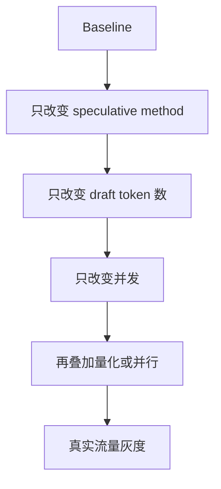
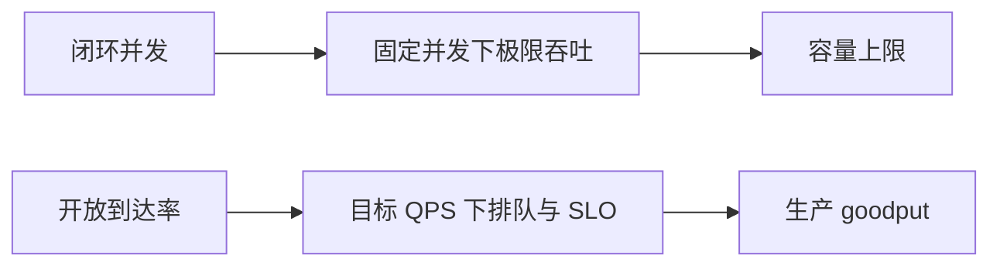
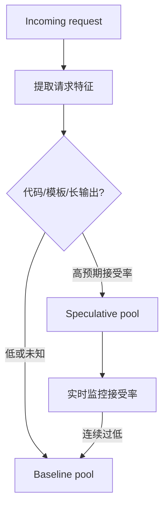

## 先读这些官方入口

1. [vLLM Speculative Decoding](https://docs.vllm.ai/en/latest/features/spec_decode.html)：支持的方法、兼容限制和当前配置入口。
2. [vLLM Serve CLI](https://docs.vllm.ai/en/latest/cli/serve/)：以安装版本为准核对参数。
3. [vLLM Benchmark CLI](https://docs.vllm.ai/en/latest/cli/bench/)：选择 serve/latency/throughput 基准。
4. [vLLM Metrics](https://docs.vllm.ai/en/latest/design/metrics.html)：明确 TTFT、ITL、E2E 等定义。

官方文档已经覆盖参数表；本页只提供如何构造不会误判的实验和上线流程。

## 1. 固定环境

```bash
python -m pip show vllm torch > versions.txt
nvidia-smi -q > gpu.txt
vllm serve --help > serve-help.txt
vllm bench --help > bench-help.txt
```

模型和 tokenizer 固定 commit，保存 chat template、采样参数和输入数据哈希。CLI 可能随版本变化，下面命令只是结构示意。

## 2. 建立普通 Decode 基线

```bash
vllm serve <target-model> \
  --dtype bfloat16 \
  --max-model-len 8192 \
  --seed 42
```

确认日志中的 Attention backend、并行配置、CUDA Graph 和 KV Cache 容量。先保存固定 Prompt 的 greedy 输出，作为功能基线。

## 3. 创建候选实验

```bash
# 示例结构；字段名以当前 vLLM 文档为准
vllm serve <target-model> \
  --speculative-config '{"method":"ngram","num_speculative_tokens":5}'
```

候选至少包括：

1. Target 普通 Decode；
2. N-gram/Prompt lookup；
3. 独立 Draft（若有兼容模型）；
4. Medusa/EAGLE（若有匹配权重）；
5. 动态与固定 draft length。

## 4. 单变量实验顺序



每一步只改变一个变量。直接把新模型、量化、并行度和投机同时打开，会让结果无法归因。

## 5. 输入数据集

构造分桶数据而不是随机 Prompt 混合：

| 桶 | 输入特点 | 目的 |
|---|---|---|
| 代码补全 | 重复上下文、固定语法 | 验证 suffix/N-gram |
| JSON/工具 | 结构强 | 验证约束与停止条件 |
| 开放问答 | 分布发散 | 观察低接受率 |
| RAG | Prompt 含答案片段 | 验证复制型候选 |
| 短回答 | 输出 1-32 token | 固定成本边界 |
| 长回答 | 输出 256+ token | 稳态收益 |

每个桶单独报告，不让高收益代码请求掩盖开放问答回归。

## 6. 压测模式



闭环模式适合比较资源效率，开放到达率更接近生产排队。两者都需要，不能用一个替代另一个。

## 7. 指标

除了标准延迟与吞吐，必须增加投机专属指标：

```yaml
speculative_metrics:
  proposed_draft_tokens: 0
  accepted_draft_tokens: 0
  emitted_tokens: 0
  target_verification_steps: 0
  verification_tokens: 0
  acceptance_length_histogram: {}
  draft_time_ms: 0
  verify_time_ms: 0
  scheduling_time_ms: 0
```

派生指标包括 token acceptance、effective tokens/step、verification waste 和每个 emitted token 的 Draft/Verify 时间。

## 8. 正确性门禁

### 8.1 Greedy

在 temperature=0 或 greedy 条件下，若实现声称精确，应与基线逐 token 一致。差异通常意味着 logits processor、tokenizer、stop 或 KV 状态问题。

### 8.2 Sampling

采样输出不会逐条相同，应比较分布统计、任务质量和格式成功率。固定 seed 只在随机数消费顺序一致时可直接对比。

### 8.3 结构化与工具调用

单独测试 grammar、JSON schema、tool choice、stop string 和 streaming chunk。候选中跨越 EOS/stop 的处理必须正确。

## 9. 性能门禁

示例门槛：

```yaml
gates:
  quality_regression_max: 0.5%
  p50_tpot_improvement_min: 10%
  p95_tpot_regression_max: 0%
  p99_e2e_regression_max: 3%
  goodput_improvement_min: 5%
  gpu_memory_increase_max: 10%
```

数值应根据业务设置。关键是门槛在实验前确定，避免看到结果后挑指标。

## 10. 观察 GPU 时间

Profiler 中区分：

- Draft forward；
- Target multi-token verify；
- sampling/rejection Kernel；
- tree mask 或候选整理；
- KV copy/free；
- CPU scheduler gap；
- collective communication。

若 GPU timeline 出现大量小间隙，算法接受率再高也可能被 CPU 调度抵消。

## 11. 按请求路由



特征可以包括路由模型、Prompt 类型、长度、sampling temperature 和最近接受率。默认应可快速回退普通 Decode。

## 12. 灰度上线

1. 离线数据集通过正确性和性能门禁；
2. 影子流量只计算不返回；
3. 1% canary，对比同类型基线；
4. 按请求桶逐步扩大；
5. 监控 P95/P99、接受长度和错误率；
6. 达到回滚条件自动切回普通 Decode。

## 13. 回滚条件

- 结构化输出或工具调用失败率上升；
- P95/P99 TPOT 超过门槛；
- acceptance 连续低于阈值；
- GPU OOM 或 KV 临时分支异常；
- Draft 模型加载/健康检查失败；
- 新版本导致输出分布或性能漂移。

## 14. GPU 实验的现实约束

消费级 12GB GPU 可以验证控制流、指标采集和小模型相对趋势，但不能外推到 H100/B200 的 Tensor Core、带宽、并发和多卡调度。实验报告必须明确 GPU、模型规模和软件版本。

## 小结

vLLM 实验应从官方文档确认版本支持，再以普通 Decode 为基线，按请求类型和输出长度分桶，记录投机专属指标，并以质量与 SLO 内 goodput 决定是否灰度。无法解释收益来源的峰值 tokens/s 不足以上线。

## 延伸资料

- [vLLM Speculative Decoding](https://docs.vllm.ai/en/latest/features/spec_decode.html)
- [vLLM Bench CLI](https://docs.vllm.ai/en/latest/cli/bench/)
- [vLLM Metrics](https://docs.vllm.ai/en/latest/design/metrics.html)
- [NVIDIA Nsight Systems](https://docs.nvidia.com/nsight-systems/)
