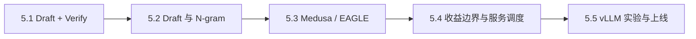

## 本章简介

投机解码用便宜的候选生成换取 Target 模型的一次并行验证。它能否加速，不由“每轮猜几个 token”决定，而由接受长度、Draft 成本、Target 验证效率和服务调度共同决定。

## 本章小节

- **5.1 Draft + Verify 与拒绝采样**：为什么并行验证仍保持 Target 分布。
- **5.2 Draft 模型、N-gram 与 Suffix Decoding**：候选从哪里来，怎样计算接受率。
- **5.3 Medusa、EAGLE 与树形验证**：Self-Draft、候选树、KV 分支和动态深度。
- **5.4 收益边界与调度**：成本模型、低接受率、批处理、量化与尾延迟。
- **5.5 vLLM 实验与上线**：参数核对、指标采集、灰度策略和回滚。

学习时请始终保留普通 Decode 基线。投机解码的收益高度依赖工作负载，不存在对所有模型、Prompt 和并发都成立的固定加速倍数。
