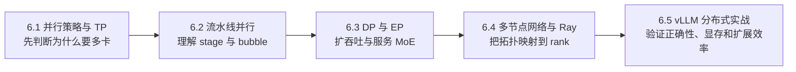

分布式推理不是简单地“多放几张卡”。不同并行方法切分的是权重、层、请求或 Expert，通信模式、延迟目标和故障边界也完全不同。本章先建立完整逻辑，再回到 vLLM 的实际部署与验证。

## 学习路线

## 本章小节

- **6.1 并行策略与张量并行**：从模型是否装得下出发，理解 row/column parallel、集合通信和 TP 的收益边界。
- **6.2 流水线并行**：理解 stage、micro-batch、pipeline bubble，以及为什么推理和训练的 PP 取舍不同。
- **6.3 数据并行与专家并行**：区分请求级副本和 token 级 Expert 路由，学习 MoE 的负载不均问题。
- **6.4 多节点网络与 Ray**：理解 NVLink、PCIe、InfiniBand/RoCE、NCCL 和 Ray 分别负责什么。
- **6.5 vLLM 分布式实战**：从单机 TP 到跨节点部署，建立可复现的启动、压测和排障流程。

## 主线教程

[Harvard Kempner Institute：Large Language Model Distributed Inference Workshop](https://handbook.eng.kempnerinstitute.harvard.edu/_static/workshop/Kempner_LLM_Distributed_Inference_Workshop.pdf) 是本章的外部主线：43 页 workshop 讲义从模型内存、TP/PP 一直讲到练习，图多、顺序完整，适合先通读。它没有充分覆盖 Expert Parallel、Ray 编排和生产故障，因此这些缺口由本章 6.3--6.5 基于官方实现资料补齐。

每节把资料分成主教程、官方参考和深入阅读。参数手册只用于核对当前版本，不作为学习入口；论文只在需要追溯原理时阅读。
